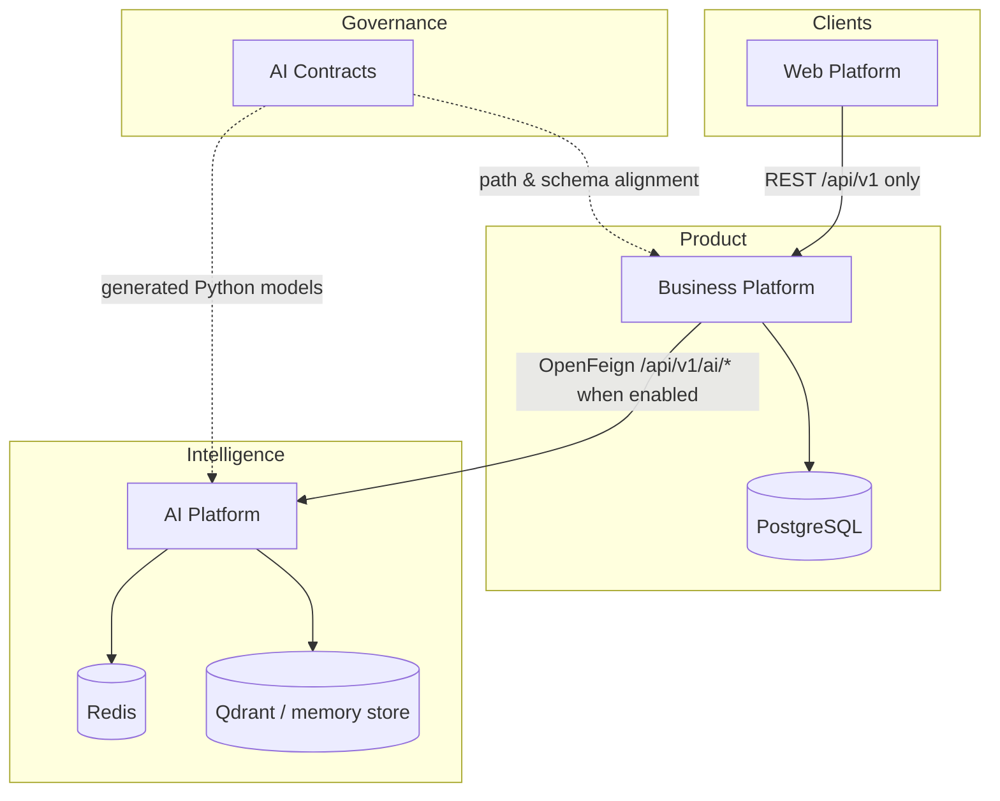

# Platform Overview

This document explains **what each platform is responsible for** and **how they interact**. It does not describe class-level implementation.

---

## Ecosystem map

---

## Business Platform

**Repository:** `architect-career-operating-system`  
**Runtime:** Spring Boot modular monolith on port **8080**

### Responsibilities

- Own product domains: Auth, Knowledge, Learning, Portfolio, Career, Dashboard
- Persist domain state in PostgreSQL (`acos` schema) via JPA + Flyway
- Authenticate users (JWT access + opaque refresh tokens)
- Expose versioned REST under `/api/v1/**` with `ApiResponse` envelope
- Isolate outbound AI calls behind an **AI Integration Layer** (facades, gateways, Feign, resilience)
- Publish **in-process** Spring application events (for example knowledge indexing hooks)

### Interaction boundaries

- **Inbound:** Web (and future server clients) via HTTP
- **Outbound:** AI Platform via OpenFeign when `ai.platform.enabled=true`
- **Does not:** host React UI, run LangGraph, store vectors as the primary RAG store, or broker Kafka events today

---

## Web Platform

**Repository:** `architect-career-web`  
**Runtime:** React SPA (Vite) on port **5173** (dev)

### Responsibilities

- Present Auth, Dashboard, Knowledge, Learning, Portfolio, Career, and AI UX
- Call **only** the Business Platform (`/api/v1/**`)
- Manage client session (Bearer token + refresh) and UI state
- Provide PWA offline affordances for non-API assets

### Interaction boundaries

- **Inbound:** Browser users
- **Outbound:** Business Platform only (dev proxy to `:8080`)
- **Does not:** call the AI Platform, hold AI provider keys, or own business transactions

### Important honesty note

The Web AI feature includes clients for `/api/v1/integration/ai/**`. On the Business Platform, the public AI REST surface today is primarily **health**. Capability POSTs are coded on the Web ahead of BFF controllers — treat full Web→AI product flows as **Future roadmap** until those controllers exist.

---

## AI Platform

**Repository:** `architect-career-ai-platform`  
**Runtime:** FastAPI on port **8090**

### Responsibilities

- Provide domain-agnostic AI HTTP APIs aligned to contracts (`/api/v1/ai/**`)
- Run Knowledge RAG (ingest → chunk → embed → store → retrieve → summarize)
- Run agentic workflows (chat, resume, interview, quiz, portfolio review, etc.)
- Apply enterprise AI middleware (policy, guardrails, routing, cost, evaluation, audit, resilience)
- Integrate optional Redis, Qdrant, LangFuse, and LLM providers via adapters

### Interaction boundaries

- **Inbound:** Business Platform Feign (intended primary consumer); local/dev direct calls for platform testing
- **Outbound:** LLM providers, embeddings, vector DB, Redis, optional LangFuse/OTEL exporters
- **Does not:** own career/learning/portfolio CRUD, issue end-user JWTs as the identity provider, or render UI

---

## AI Contracts

**Repository:** `architect-career-ai-contracts`  
**Runtime:** Maven/Node generation project (not a serving runtime)

### Responsibilities

- Own OpenAPI 3.1 aggregate and domain specs for AI REST
- Own AsyncAPI 3.0 event channels for AI/domain lifecycle signals
- Generate Java Feign, Python, and TypeScript SDK artifacts
- Validate specs in CI

### Interaction boundaries

- **Consumed by:** AI Platform (vendored Python models), Business Platform (path/DTO alignment; Feign hand-written today), future direct clients
- **Does not:** execute business logic or host services

### Future roadmap

- Broker bindings and actual publishers/consumers for AsyncAPI channels
- Publishing generated packages to an artifact registry as a standard consume path
- Wiring generated SDKs into Web/Business Platform builds

---

## How repositories communicate

| From | To | Mechanism | Status |
| --- | --- | --- | --- |
| Web → Business Platform | HTTP REST `/api/v1/**` | Implemented |
| Business Platform → PostgreSQL | JPA / Flyway | Implemented |
| Business Platform → AI Platform | OpenFeign `/api/v1/ai/**` | Implemented behind feature flag (default off) |
| Business Platform → AI (events) | In-process Spring events | Implemented locally; not a message broker |
| Contracts → AI Platform | Generated Python models vendored under `third_party/` | Implemented |
| Contracts → Business Platform | Spec path alignment / generation available | Partial (Feign clients are hand-maintained) |
| Domain ↔ AI via AsyncAPI bus | Kafka/Pulsar/etc. | **Future roadmap** (specs exist) |

---

## Responsibility summary

| Concern | Owner |
| --- | --- |
| User identity & sessions | Business Platform |
| Domain invariants & persistence | Business Platform |
| UI/UX | Web Platform |
| Model routing, RAG, agents, AI governance | AI Platform |
| AI API/event schema truth | AI Contracts |
| Architecture narrative | This showcase |

---

## What this overview intentionally omits

- Package diagrams and class design → later repository chapters  
- ADR text → Chapter 03  
- Runbooks and deployment topology details → Chapters 08 / 12  
