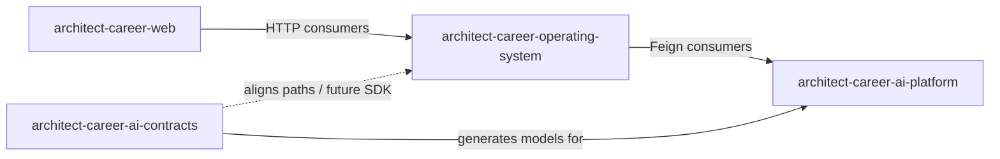

# Repository Overview

Factual snapshot of the four primary ACOS repositories. Sibling repos such as `architect-career-api-sdk` or `architect-career-infrastructure` may exist in the workspace but are outside this chapter’s scope unless wired into the runtime path described here.

---

## 1. `architect-career-operating-system` (Business Platform)

### Purpose

Product backend for ACOS: authentication and domain APIs for knowledge, learning, portfolio, career, and dashboard, plus the Java-side AI integration boundary.

### Responsibilities

- REST API under `/api/v1/**`
- PostgreSQL persistence and Flyway migrations
- JWT security filter chain
- Domain services/repositories/controllers per package
- AI facades/gateways/Feign clients with Resilience4j
- Actuator health/info/metrics (including AI platform health indicator)

### Technology

- Java 21, Spring Boot 3.5, Spring Security, Spring Data JPA
- Spring Cloud OpenFeign + Resilience4j
- PostgreSQL, Flyway, springdoc OpenAPI
- MapStruct, JJWT
- Testcontainers-based integration tests; Maven quality plugins

### Key architectural decisions (evidenced)

- **Modular monolith** by domain package (`auth`, `knowledge`, `learning`, `portfolio`, `career`, `integration`, …) rather than multi-module microservices
- **AI anti-corruption layer** so domain code does not depend on Python types
- **Feature-flagged AI** (`ai.platform.enabled`, default `false`)
- **In-process domain events** instead of an external broker (current stage)

### Consumers

- `architect-career-web` (primary)
- Local/API explorers via SpringDoc

### Dependencies

- PostgreSQL
- Optional AI Platform at `ai.platform.base-url` (default `http://localhost:8090`)
- No Maven dependency on the contracts JAR in the current tree (Feign DTOs/paths maintained in-repo)

### Future evolution

- AI BFF controllers for Web `/integration/ai/**` capability routes
- Stronger method-level authorization usage
- Live dashboard/analytics (packages/APIs currently placeholder or stub)
- App container image / CI pipeline in-repo (Compose today is DB-focused)

---

## 2. `architect-career-web` (Web Platform)

### Purpose

Browser application for ACOS users: feature-based React SPA with PWA support.

### Responsibilities

- Screens and navigation for all product pillars
- Axios API clients for Business Platform
- Auth session handling and protected routes
- AI UX shell and capability catalog
- Client-side caching (TanStack Query) and lightweight stores (Zustand)

### Technology

- React 19, TypeScript 5.8, Vite 6, MUI 7
- React Router 7, Axios, TanStack Query, Zustand
- React Hook Form + Zod
- Vitest, Playwright, vite-plugin-pwa

### Key architectural decisions (evidenced)

- **Feature-sliced** `src/features/*` with thin `pages/`
- **Single backend dependency** — never call AI Platform from the browser (documented and enforced by architecture)
- Dev **Vite proxy** `/api` → Business Platform
- AI capabilities explicitly labeled `planned` / `coming_soon` where backends are incomplete

### Consumers

- End users / demo audiences / interview walkthroughs

### Dependencies

- Business Platform (`VITE_API_BASE_URL` / proxy target, default `:8080`)
- No npm dependency on generated `@acos/ai-contracts` today

### Future evolution

- Activate AI capability POSTs when Business Platform BFF exists
- Prefer httpOnly cookie session over localStorage tokens
- Wire generated TypeScript SDK if/when published
- CI packaging for the frontend

---

## 3. `architect-career-ai-platform` (AI Platform)

### Purpose

Reusable, domain-agnostic AI runtime for ACOS: Knowledge RAG, agentic workflows, and enterprise AI middleware.

### Responsibilities

- Contract-aligned FastAPI endpoints under `/api/v1/ai/**`
- System liveness/readiness/metrics endpoints
- RAG pipeline and vector/embedding provider adapters
- Agentic workflows + LangGraph engine
- Enterprise pipeline (policy, guardrails, routing, cost, eval, audit, resilience)
- Optional Redis/Qdrant/LangFuse/LLM provider integrations

### Technology

- Python ≥3.13, FastAPI, Uvicorn, Pydantic Settings
- dependency-injector, LangGraph, Redis, Qdrant client
- OpenAI / Azure OpenAI / Ollama adapters
- structlog, Prometheus client, optional OpenTelemetry SDK / LangFuse
- pytest, ruff, black, mypy, GitHub Actions CI, Docker Compose

### Key architectural decisions (evidenced)

- **Clean / hexagonal layering:** `api` → `orchestration` → `intelligence` ports ← `infrastructure` adapters
- **Pipelined facades** so every AI request crosses enterprise middleware
- **Vendored contracts package** under `third_party/acos_ai_contracts`
- **Config-driven providers** (embeddings/vector store can run in hashing/memory mode for local tests)

### Consumers

- Business Platform Feign clients (intended production path)
- Direct callers for platform development/testing

### Dependencies

- `acos-ai-contracts` (file dependency / synced generated models)
- Optional Redis, Qdrant, LLM provider credentials

### Future evolution

- Replace MCP/A2A stubs with networked implementations
- Broker-backed event emission matching AsyncAPI
- Harden default auth for non-dev environments
- Distributed rate limiting and deeper OTEL instrumentation usage

---

## 4. `architect-career-ai-contracts` (AI Contracts)

### Purpose

Contract-first source of truth for AI Platform REST and event schemas; multi-language SDK generation.

### Responsibilities

- Maintain OpenAPI 3.1 domain + aggregate specs
- Maintain AsyncAPI 3.0 channels for AI/domain lifecycle events
- Generate Java Feign, Python, and TypeScript artifacts
- Validate specs in CI

### Technology

- Maven (Java 21), OpenAPI Generator 7.x
- Node 20 tooling for lint/format of specs
- GitHub Actions `validate-and-generate` workflow

### Key architectural decisions (evidenced)

- **Specs are authored, not reverse-engineered from services**
- **Transport-agnostic AsyncAPI** (no Kafka binding mandated yet)
- **Modular domain YAML** composed into v1 aggregates
- Security schemes for bearer JWT and service API key documented at the contract layer

### Consumers

- AI Platform (Python models)
- Business Platform / future SDK consumers
- Documentation and generators

### Dependencies

- None at runtime (generation-time toolchain only)

### Future evolution

- Publish artifacts to GitHub Packages / internal registry
- Add broker bindings when eventing is implemented
- Expand consumer set (mobile/CLI) against the same contracts

---

## Repository relationship diagram

---

## Comparison matrix

| Dimension | Business Platform | Web | AI Platform | AI Contracts |
| --- | --- | --- | --- | --- |
| Serves users directly | Via API | Yes | No | No |
| Owns domain DB | Yes | No | No | No |
| Owns AI models/RAG | No | No | Yes | No |
| Owns AI schema truth | Partial (local DTOs) | No | Consumes | Yes |
| Default local port | 8080 | 5173 | 8090 | n/a |
