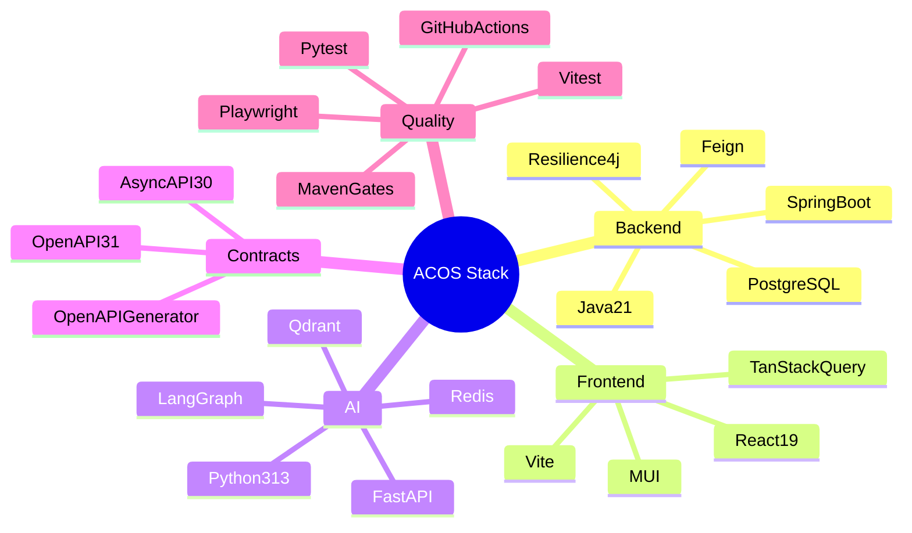

# Technology Stack

Organized by category. Entries reflect **technologies present in the four primary repositories**. Alternatives and trade-offs are recorded as architectural rationale, not as speculative rewrites.

---

## Backend

| Technology | Where | Why selected | Alternative considered | Trade-offs |
| --- | --- | --- | --- | --- |
| Java 21 | Business Platform | Modern LTS, enterprise familiarity for domain APIs | Kotlin; non-LTS Java | Verbose vs Kotlin; strong ecosystem |
| Spring Boot 3.5 | Business Platform | Security, data, actuator, cloud integrations included | Quarkus, Micronaut | Heavier runtime; fast modular-monolith delivery |
| Spring Security + JJWT | Business Platform | Stateless API security with explicit filter chain | Keycloak-only / session cookies | Refresh rotation complexity |
| Spring Data JPA + Flyway | Business Platform | Productive mapping + versioned SQL migrations | jOOQ, Liquibase | ORM impedance trade-off |
| OpenFeign | Business Platform | Declarative clients for many AI endpoints | WebClient-only | Proxy magic; clear for Feign-heavy boundaries |
| Resilience4j | Business Platform | Retry/CB/timelimiter/bulkhead around AI | Failsafe, custom | More configuration |
| MapStruct | Business Platform | Compile-time DTO mapping | ModelMapper | Build plugin overhead |
| springdoc | Business Platform | Live OpenAPI for `/api/v1` | Springfox | Annotation-coupled docs |

---

## Frontend

| Technology | Where | Why selected | Alternative considered | Trade-offs |
| --- | --- | --- | --- | --- |
| React 19 + TypeScript | Web | Component model + types for large feature surface | Angular, Vue | Ecosystem churn |
| Vite 6 | Web | Fast DX, PWA plugin support | CRA, Webpack-only | Rapid tooling change |
| MUI 7 | Web | Enterprise UI primitives | Chakra, fully custom | Bundle weight |
| TanStack Query | Web | Server-state cache and invalidation | RTK Query | Second state paradigm beside Zustand |
| Zustand | Web | Small auth/theme stores | Redux | Less structure |
| React Hook Form + Zod | Web | Performant forms + schema validation | Formik + Yup | Parallel API type maintenance |
| Axios | Web | Auth/correlation interceptors | fetch wrappers | Extra dependency |
| vite-plugin-pwa | Web | Offline shell / update prompts | Manual Workbox | `/api/**` stays network-only |

---

## AI

| Technology | Where | Why selected | Alternative considered | Trade-offs |
| --- | --- | --- | --- | --- |
| Python 3.13 | AI Platform | AI/ML ecosystem fit | Keep AI in Java | Dual-language ops cost |
| FastAPI | AI Platform | Async APIs + Pydantic + OpenAPI alignment | Flask, Django Ninja | Different ops culture than Spring |
| Pydantic Settings | AI Platform | Typed env-based config | Dynaconf | Strict empty-value edge cases |
| dependency-injector | AI Platform | Explicit ports/adapters composition | Manual wiring | Learning curve |
| LangGraph | AI Platform | Explicit agent graph control flow | Ad-hoc chains only | Additional abstraction |
| OpenAI / Azure OpenAI / Ollama adapters | AI Platform | Multi-provider enterprise reality | Single-provider lock-in | More factories/config |
| Hashing embeddings + memory store | AI Platform | Local/test mode without cloud keys | Always require OpenAI+Qdrant | Not production retrieval quality |

---

## Vector database

| Technology | Where | Why selected | Alternative considered | Trade-offs |
| --- | --- | --- | --- | --- |
| Qdrant | AI Platform (+ Compose) | Simple local ops, filtered vector search | pgvector, OpenSearch, Pinecone | Extra infrastructure |
| In-memory vector store | AI Platform | Default/dev/test path | Always Qdrant | Non-durable |

---

## Database

| Technology | Where | Why selected | Alternative considered | Trade-offs |
| --- | --- | --- | --- | --- |
| PostgreSQL 17 | Business Platform | Relational integrity for career/learning/portfolio | MySQL, MongoDB | Operational ownership |

The AI Platform does not own the business domain database.

---

## Messaging

| Technology | Where | Why selected | Alternative considered | Trade-offs |
| --- | --- | --- | --- | --- |
| Spring Application Events | Business Platform | Simple after-commit hooks without broker ops | Kafka immediately | No cross-process replay |
| AsyncAPI 3.0 specs | AI Contracts | Define event contracts early | Code-first later | Specs can outpace publishers |

**Future roadmap:** broker bindings (Kafka/Pulsar/etc.) for AsyncAPI channels.

---

## Observability

| Technology | Where | Why selected | Alternative considered | Trade-offs |
| --- | --- | --- | --- | --- |
| Actuator + Prometheus | Business Platform | Standard JVM ops surface | Vendor APM only | Harden exposure in prod |
| structlog | AI Platform | Structured contextual logs | stdlib logging | Convention required |
| Prometheus client | AI Platform | `/api/v1/system/metrics` | APM-only | Some series still placeholder-labeled |
| LangFuse (optional) | AI Platform | LLM trace/eval hooks | Helicone, custom | Extra dependency |
| OpenTelemetry SDK (optional) | AI Platform | Vendor-neutral tracing | Vendor agents only | Auto-instrumentation packages not fully wired in app code |

---

## Security

| Technology | Where | Why selected | Alternative considered | Trade-offs |
| --- | --- | --- | --- | --- |
| JWT + hashed refresh tokens | Business Platform | Stateless access + revocable refresh | Opaque access only | Rotation complexity |
| BCrypt | Business Platform | Standard password hashing | Argon2 | Adequate for current model |
| Optional JWT / API key / internal token | AI Platform | Service auth readiness | Always-on mTLS | Defaults off locally |
| In-memory rate limit | AI Platform | Basic abuse control | Redis-backed limiter | Not multi-instance safe |
| Heuristic guardrails | AI Platform | Injection/PII baseline | External moderation only | Limited precision |

---

## Testing

| Technology | Where | Why selected | Alternative considered | Trade-offs |
| --- | --- | --- | --- | --- |
| JUnit + Testcontainers | Business Platform | Real Postgres tests | H2-only | Heavier CI |
| Spotless/Checkstyle/PMD/SpotBugs/JaCoCo | Business Platform | `verify` quality gates | Review-only | Coverage gate currently permissive |
| Vitest + RTL | Web | Fast unit/component loop | Jest | — |
| Playwright | Web | Auth/navigation e2e | Cypress | Browser install cost |
| pytest + asyncio | AI Platform | Async API tests | unittest | — |
| ruff / black / mypy | AI Platform | Lint/format/types | flake8+isort | mypy still advisory in CI |

---

## DevOps

| Technology | Where | Why selected | Alternative considered | Trade-offs |
| --- | --- | --- | --- | --- |
| Docker Compose (Postgres/pgAdmin) | Business Platform | Fast local DB | Always-cloud DB | App image not in that repo yet |
| Docker + Compose (app/Redis/Qdrant) | AI Platform | Local AI deps | Fully managed services | Local/prod drift |
| GitHub Actions | AI Platform + Contracts | Test/generate pipelines | Jenkins-only | Web/Business CI absent in-repo today |
| Maven Wrapper / npm scripts | Business / Web | Reproducible commands | Global tools only | Bootstrap maintenance |
| Locust / k6 scaffolds | AI Platform | Future load baselines | Gatling | Not packaged as core deps |

---

## Developer Experience

| Technology | Where | Why selected | Alternative considered | Trade-offs |
| --- | --- | --- | --- | --- |
| Domain/feature packages | Business / Web | Navigate by product area | Technical layers only | Cross-cutting discipline required |
| Ports & factories | AI Platform | Swap providers without rewriting use cases | Conditional imports | More types/files |
| OpenAPI Generator | AI Contracts | Multi-language clients from one SoT | Handwritten SDKs only | Generator quirks; publish flow maturing |
| Env-based config | All runtimes | 12-factor | Hardcoded profiles | Secrets must stay out of git |

---

## Stack principles in practice

1. **Boring technology for transactional domains** — Spring + PostgreSQL.
2. **AI-native runtime for models** — Python + FastAPI + LangGraph.
3. **Language-agnostic contracts** — OpenAPI / AsyncAPI.
4. **Optional infrastructure** — Business runs with AI off; AI runs with hashing/memory providers for tests.
