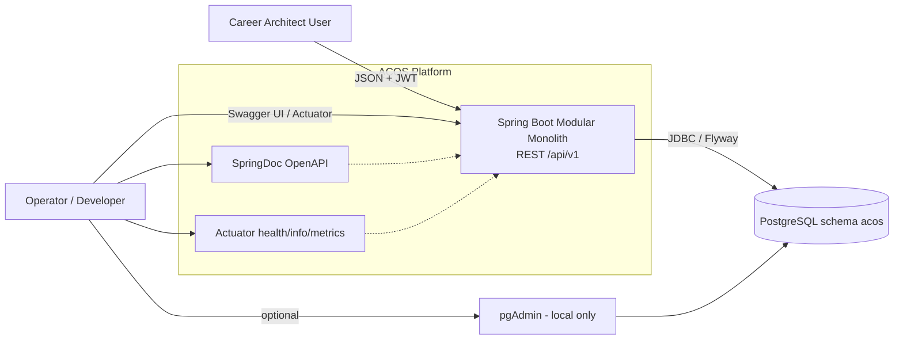
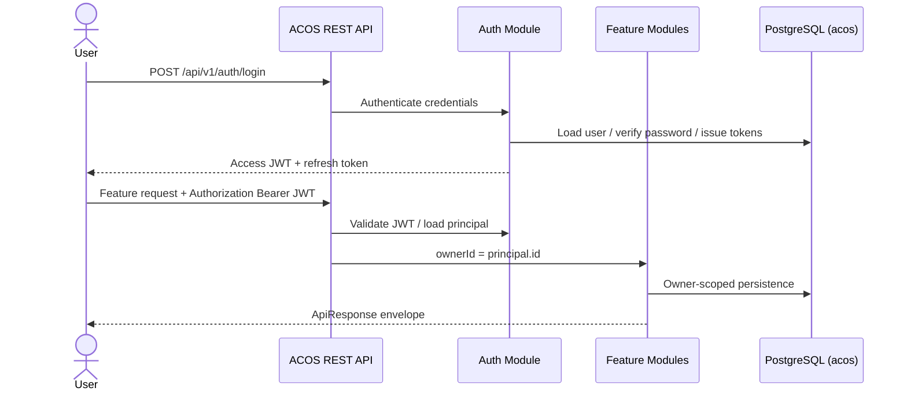

# System Context

## Purpose

ACOS is a backend platform that helps an authenticated user manage career-related work: authentication and profile identity, knowledge notes, learning plans, portfolio artifacts, job applications, and dashboard summaries.

## Context diagram

## Actors

| Actor | Interaction |
| --- | --- |
| Career Architect User | Registers/logs in, then calls protected feature APIs with a Bearer JWT |
| Operator / Developer | Uses Actuator health/info, Swagger UI, and local Postgres/pgAdmin |

## System boundary

Inside ACOS:

- Auth, Knowledge, Learning, Portfolio, Career, Dashboard feature modules
- Shared API envelope, exception handling, correlation logging, persistence base
- JWT security filter chain
- Flyway migrations and JPA repositories

Outside ACOS (as implemented today):

- PostgreSQL process
- Optional Docker Compose services (`postgres`, `pgadmin`)
- Any future browser SPA, notification, analytics, or AI consumers (not implemented as separate deployables in this repository)

## Primary external interfaces

| Interface | Path / mechanism | Auth |
| --- | --- | --- |
| Auth API | `/api/v1/auth/**` | Public for register/login/refresh; protected for `/me` and logout |
| Feature APIs | `/api/v1/{knowledge\|learning\|portfolio\|career\|dashboard}/**` | JWT required |
| OpenAPI | `/v3/api-docs`, `/swagger-ui.html` | Public |
| Actuator | `/actuator/health/**`, `/actuator/info` (public); metrics/prometheus exposed by config | Health/info public |

## Request flow (context level)

