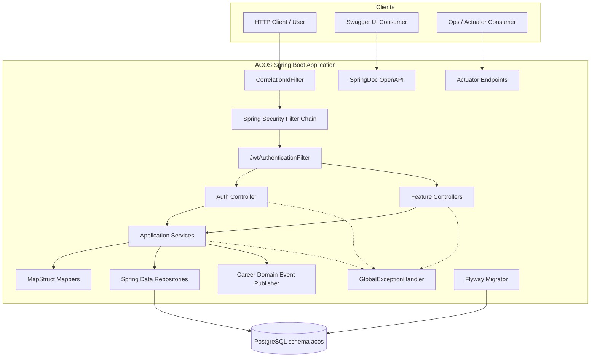
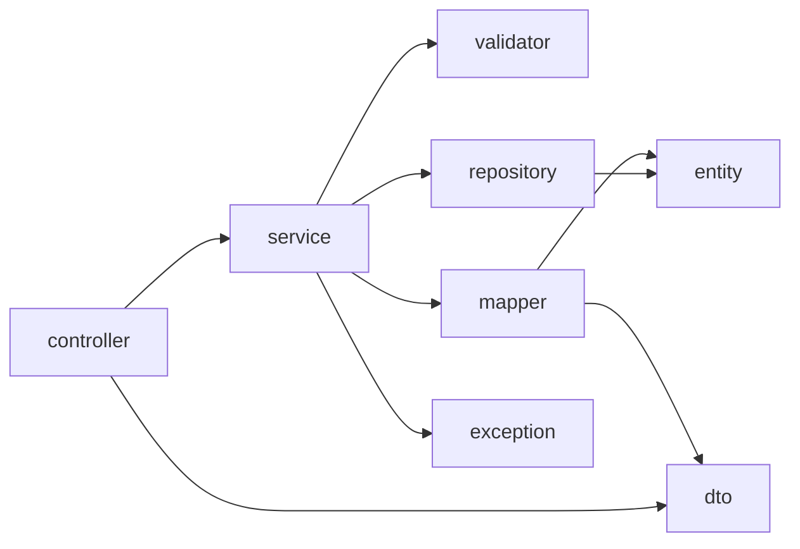
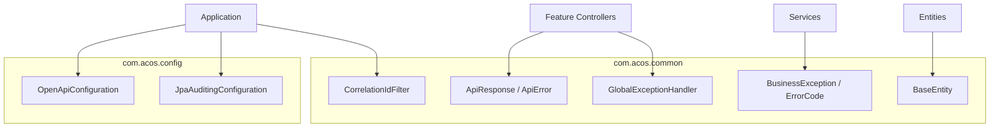

# Component Diagram

## Purpose

This diagram shows the major runtime components inside the single ACOS Spring Boot process and their relationships to PostgreSQL.

## Component overview

## Component responsibilities

| Component | Responsibility |
| --- | --- |
| CorrelationIdFilter | Propagates `X-Correlation-Id` into MDC |
| Spring Security + JWT filter | Authenticates requests; permits public auth/docs/health paths |
| Controllers | Thin HTTP adapters under `/api/v1`; return `ApiResponse` |
| Application Services | Ownership checks, transactions, domain orchestration |
| MapStruct Mappers | Entity ↔ DTO conversion |
| Repositories | JPA persistence boundary |
| GlobalExceptionHandler | Maps exceptions to `ApiResponse` failures |
| CareerDomainEventPublisher | Publishes career domain events after commit |
| Flyway | Applies SQL migrations at startup |
| Actuator / SpringDoc | Ops and API documentation endpoints |

## Layering inside a feature

Career additionally includes `state`, `specification`, and `event` components used by career services.

## Cross-cutting components

