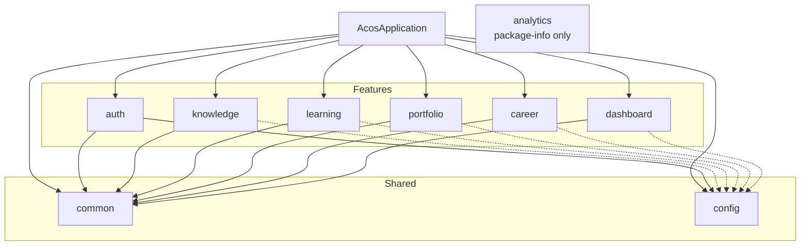
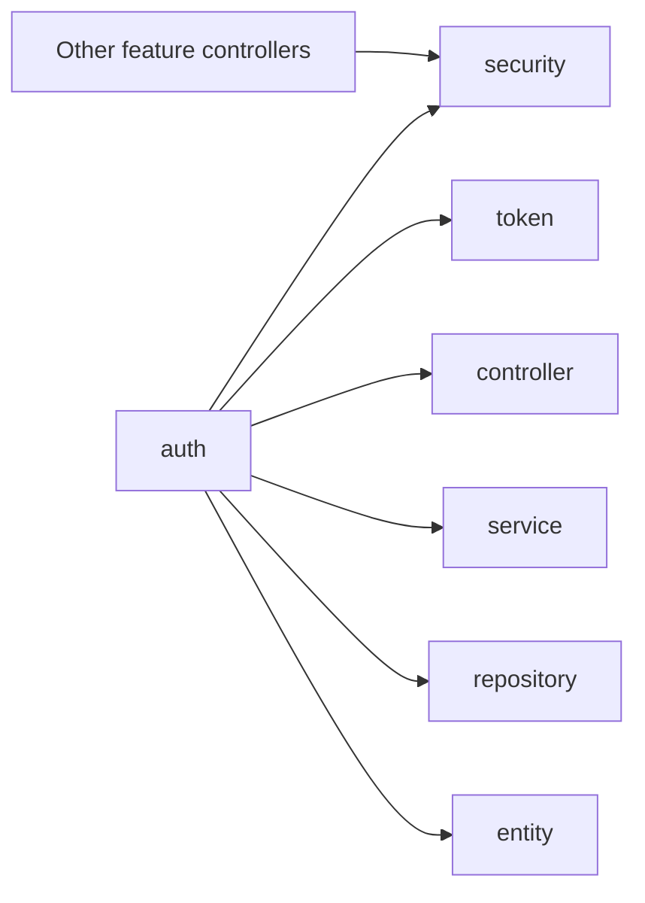
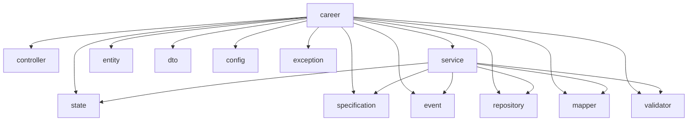

# Module Diagram

## Purpose

ACOS is a modular monolith. Modules are Java packages under `com.acos`, not separate Maven artifacts.

## Module map



## Dependency rules reflected by the code

1. Feature modules depend on `common` for API envelope, exceptions, logging, and `BaseEntity`.
2. Feature modules do not expose JPA entities through controllers.
3. Features are largely isolated; they share identity through Auth JWT/`AcosUserDetails` and ownership ids.
4. `config` hosts platform OpenAPI and JPA auditing configuration.
5. `analytics` is reserved and currently empty of runtime code.

## Auth as the security module



All protected feature controllers rely on the Auth security filter chain and principal type.

## Career internal modules



## Package-by-feature template

Most implemented features follow:

```text
com.acos.<feature>
  config
  controller
  dto
  entity
  exception
  mapper
  repository
  service
  validator
```
