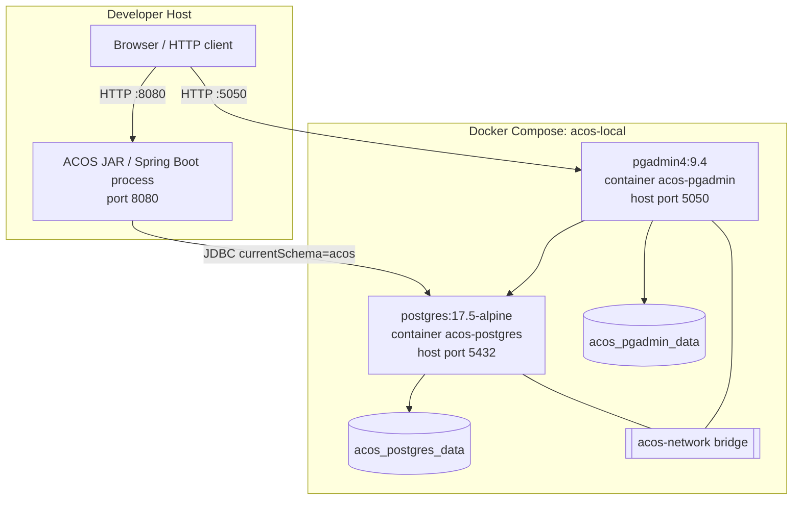
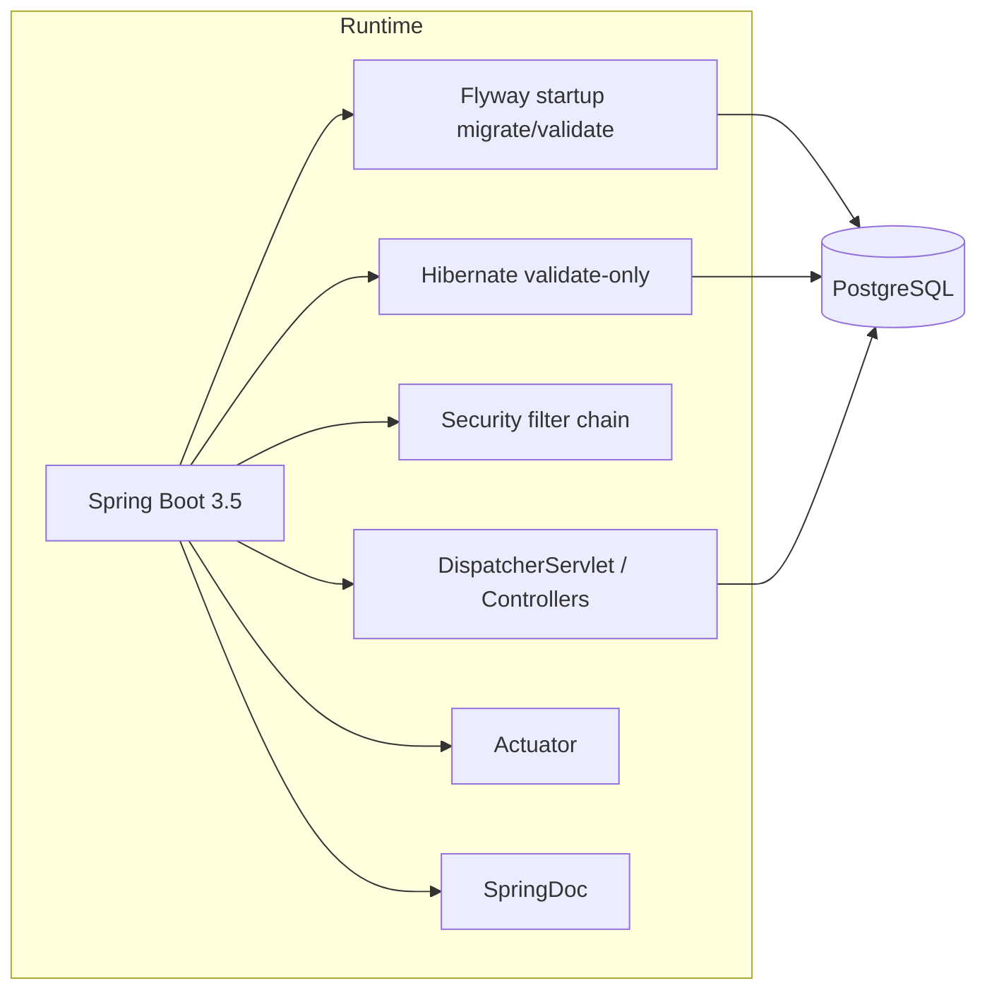
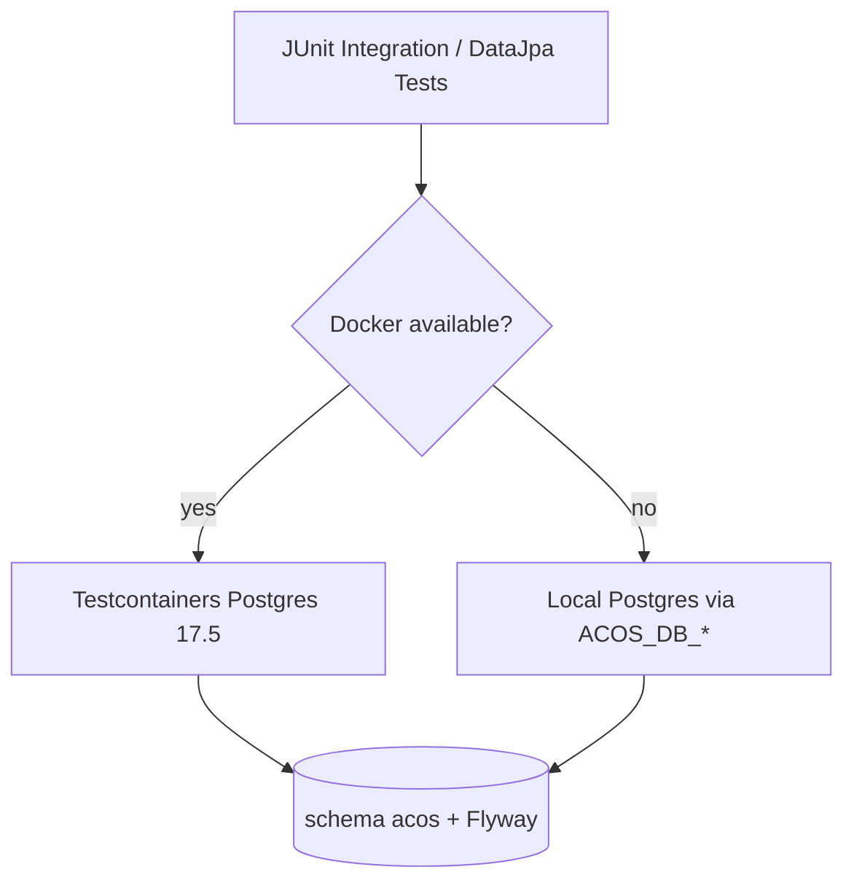

# Deployment Diagram

## Purpose

This documents the **local/runtime deployment topology** that exists in the repository today: one Spring Boot application process plus Docker Compose-managed PostgreSQL (and optional pgAdmin).

## Local deployment

## Process view

## Deployment notes (as implemented)

| Item | Implementation |
| --- | --- |
| Application packaging | Single Maven JAR (`architect-career-operating-system`) |
| Default app port | `8080` (`application.yml`) |
| Database | PostgreSQL 17.5 via Compose image `postgres:17.5-alpine` |
| DB schema | `acos` created/managed by Flyway |
| Hibernate DDL | `validate` only |
| Local admin UI | pgAdmin on port `5050` (Compose) |
| Profiles | Default `local`; tests use `test` |
| Cloud/K8s charts | Not present in this repository |

## Test runtime variant

Integration/repository tests use either:

1. Testcontainers PostgreSQL `postgres:17.5-alpine`, or
2. Local Postgres fallback via `ACOS_DB_*` environment variables

## Evidence

- `infrastructure/docker/docker-compose.yml`
- `src/main/resources/application.yml`
- `src/main/resources/application-local.yml`
- `src/test/java/com/acos/testsupport/PostgresTestSupport.java`
- `pom.xml` (single Spring Boot packaging)
