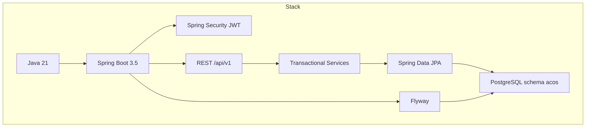

# Technology Stack

## Platform baseline

| Layer | Choice | Version / notes |
| --- | --- | --- |
| Language | Java | 21 |
| Application framework | Spring Boot | 3.5.16 |
| Web | spring-boot-starter-web | Servlet MVC |
| Security | Spring Security 6 | Stateless JWT filter chain |
| Persistence | Spring Data JPA + Hibernate | `ddl-auto=validate`, OSIV off |
| Database | PostgreSQL | 17.5 (Compose/Testcontainers image) |
| Migrations | Flyway | SQL migrations in `db/migration` |
| Validation | Jakarta Bean Validation | spring-boot-starter-validation |
| Mapping | MapStruct | 1.6.3, Spring component model, unmapped = ERROR |
| API docs | SpringDoc OpenAPI | 2.8.17 |
| Ops | Spring Boot Actuator | health, info, metrics, prometheus |
| JWT library | JJWT | 0.12.6 |

## Architecture style



## Supporting libraries and build tooling

| Concern | Tooling |
| --- | --- |
| Formatting | Spotless + Google Java Format |
| Static analysis | Checkstyle, PMD (+ CPD), SpotBugs |
| Dependency/policy | Maven Enforcer |
| Coverage scaffolding | JaCoCo |
| Unit/integration tests | JUnit 5, Mockito, Spring Boot Test, MockMvc |
| DB test infra | Testcontainers PostgreSQL + local fallback |
| Local infra | Docker Compose (`postgres`, `pgadmin`) |

## Configuration namespaces

Runtime feature configuration is bound under:

```text
acos.jwt.*
acos.dashboard.*
acos.knowledge.*
acos.learning.*
acos.portfolio.*
acos.career.*
```

## Explicitly not in the implemented backend stack

The following appear in broader product vision docs but are **not** implemented as runtime components in this repository:

- React / frontend SPA deployable
- Separate AI microservice
- Message broker / event bus infrastructure
- Kubernetes manifests
- Dedicated analytics service

Career publishes in-process Spring domain events after commit, without deployed listeners.

## Evidence

- `pom.xml`
- `src/main/resources/application.yml`
- `infrastructure/docker/docker-compose.yml`
- `src/test/java/com/acos/testsupport/PostgresTestSupport.java`
