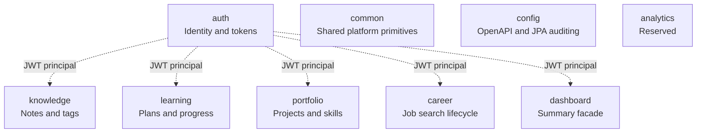
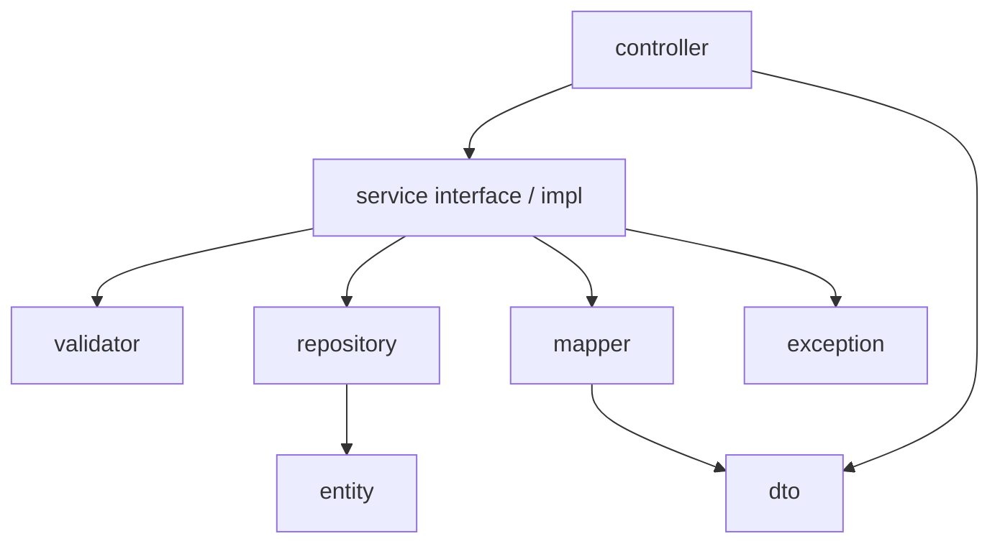

# Module Responsibilities

## Overview

## auth

**Responsibility:** User registration/login, JWT access tokens, hashed refresh-token lifecycle, password hashing, and the Spring Security filter chain.

| Area | Owns |
| --- | --- |
| APIs | `/api/v1/auth/**` |
| Entities | `User`, `Role`, `RefreshToken` |
| Security | `SecurityConfiguration`, `JwtAuthenticationFilter`, JSON auth entry/denied handlers |
| Tokens | `JwtTokenProvider`, `TokenService` |
| Principal | `AcosUserDetails` used by all protected controllers |

## knowledge

**Responsibility:** Owner-scoped knowledge notes with categories/tags, validation limits, and search.

| Area | Owns |
| --- | --- |
| APIs | `/api/v1/knowledge/**` |
| Core entity | `KnowledgeNote` (+ related category/tag model as migrated) |
| Config | `acos.knowledge.*` |

## learning

**Responsibility:** Owner-scoped learning plans, milestones, topics, and progress tracking.

| Area | Owns |
| --- | --- |
| APIs | `/api/v1/learning/**` |
| Entities | Learning plan / milestone / topic hierarchy |
| Config | `acos.learning.*` |

## portfolio

**Responsibility:** Owner-scoped portfolio projects and related catalog entities (technologies, skills, achievements, certifications).

| Area | Owns |
| --- | --- |
| APIs | `/api/v1/portfolio/**` |
| Entities | Portfolio project and related portfolio tables |
| Config | `acos.portfolio.*` |

## career

**Responsibility:** End-to-end job-search tracking for the authenticated user.

| Area | Owns |
| --- | --- |
| APIs | `/api/v1/career/**` including companies, recruiters, applications, interviews, offers, dashboard, search, status transition, history, timeline |
| Entities | Company, Recruiter, JobApplication, Interview, Offer, ApplicationStatusHistory, CareerAuditLog |
| Domain controls | Application status state machine, soft archive, Specifications search |
| Integration hooks | After-commit domain event publishing (no listeners yet) |
| Config | `acos.career.*` |

## dashboard

**Responsibility:** Authenticated dashboard summary API for the platform home view.

| Area | Owns |
| --- | --- |
| APIs | `/api/v1/dashboard` |
| Config | `acos.dashboard.*` |
| Notes | Career also exposes `/api/v1/career/dashboard` for career-specific aggregates |

## common

**Responsibility:** Cross-cutting primitives reused by every feature.

| Area | Owns |
| --- | --- |
| API envelope | `ApiResponse`, `ApiError` |
| Exceptions | `BusinessException`, `ErrorCode`, shared helpers |
| Handling | `GlobalExceptionHandler` |
| Logging | `CorrelationIdFilter` |
| Persistence | `BaseEntity` (UUID, auditing timestamps, `@Version`) |

## config

**Responsibility:** Platform Spring configuration that is not feature-owned.

| Area | Owns |
| --- | --- |
| OpenAPI | `OpenApiConfiguration` (`bearer-jwt` scheme) |
| JPA auditing | `JpaAuditingConfiguration` |

## analytics

**Responsibility:** Package reserved for future analytics work.

Current state: `package-info.java` only; no controllers, services, or tables.

## Responsibility matrix

| Concern | Owning module |
| --- | --- |
| Authentication / token issuance | auth |
| HTTP security filter chain | auth |
| Uniform response envelope | common |
| Exception → HTTP mapping | common |
| Schema migrations | platform Flyway scripts (`db/migration`) consumed by all modules |
| Knowledge content | knowledge |
| Learning plans | learning |
| Portfolio artifacts | portfolio |
| Job applications lifecycle | career |
| Home dashboard summary | dashboard |
| Career analytics-ready aggregates | career dashboard service |

## Internal feature layering (all implemented features)

Services own transactions and ownership enforcement. Controllers remain HTTP adapters.
