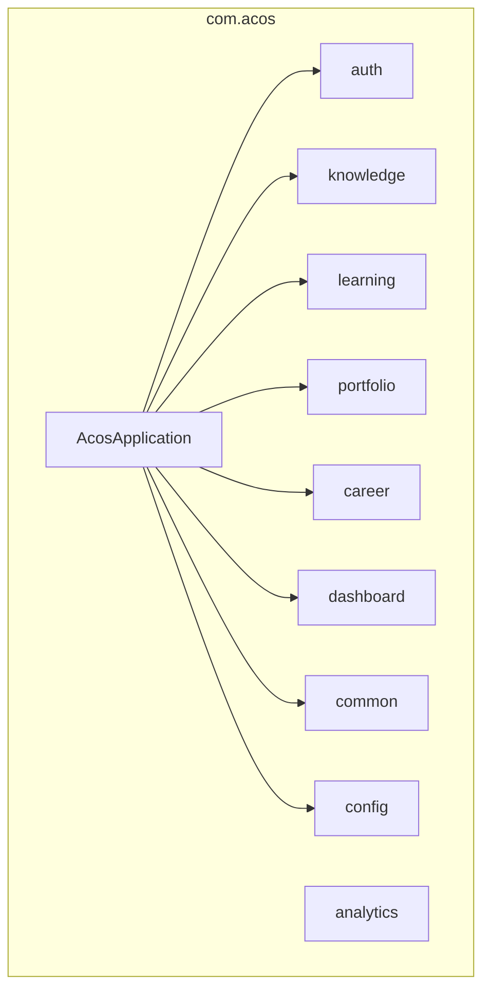
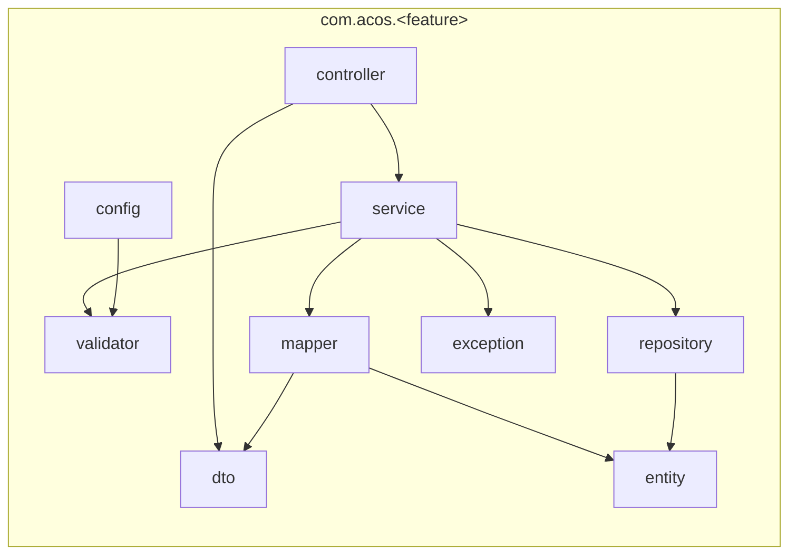
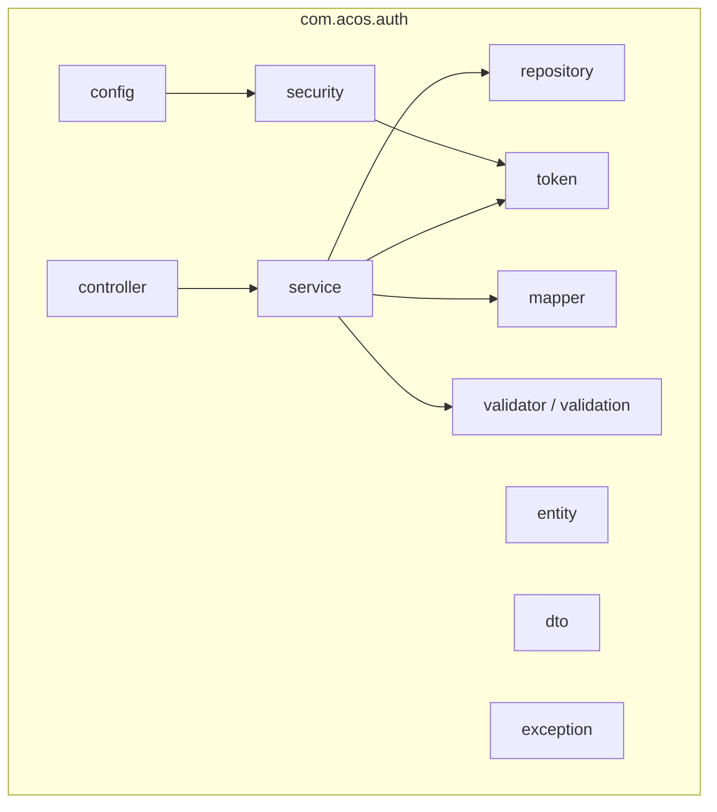
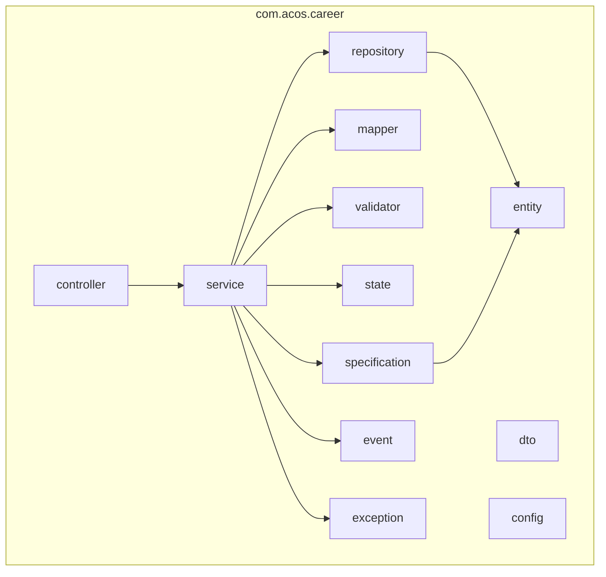
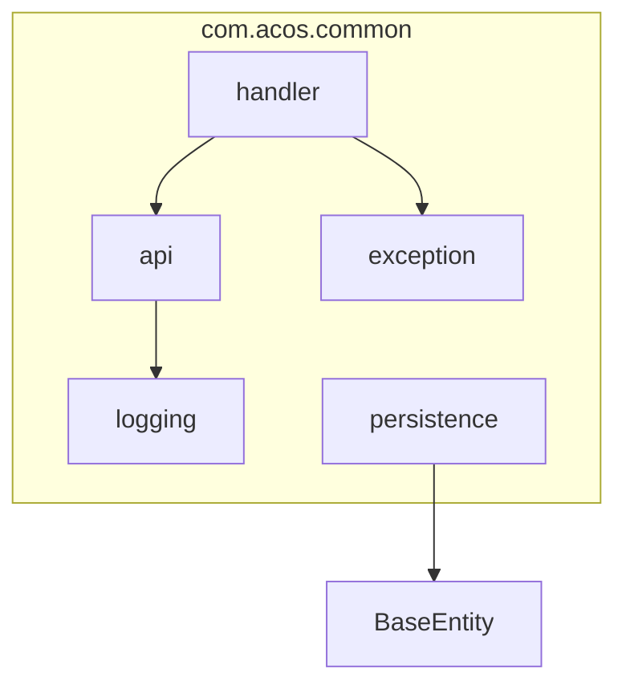
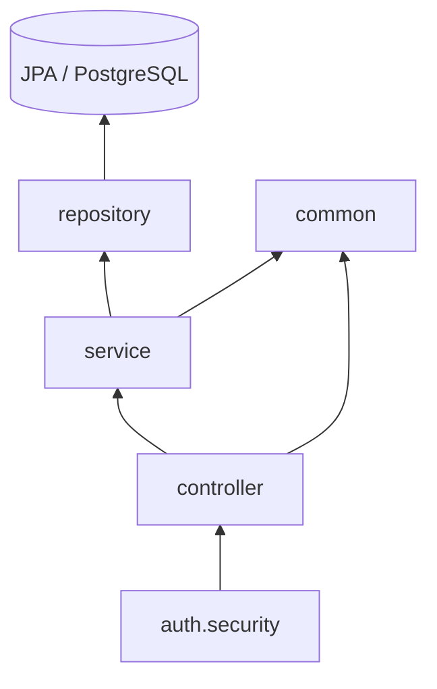

# Package Diagram

## Platform packages

## Canonical feature package template

## Auth packages

## Career packages

## Common packages

## Package dependency direction

Controllers depend on service interfaces and shared API types. Services depend on repositories, mappers, validators, and (in career) state/specification/event collaborators.
