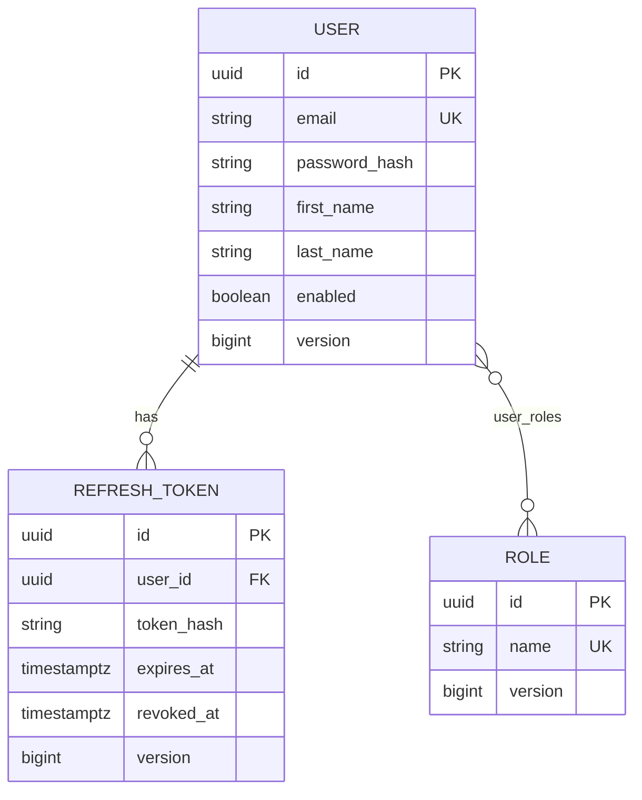
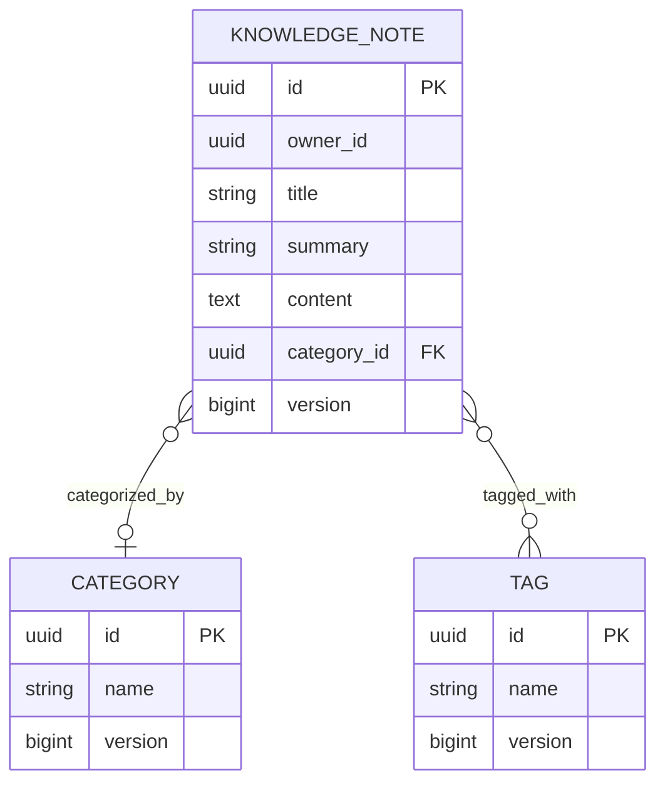
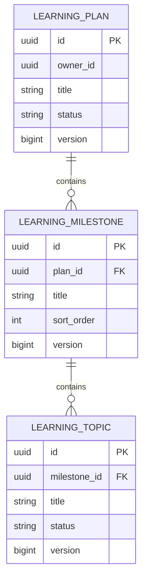
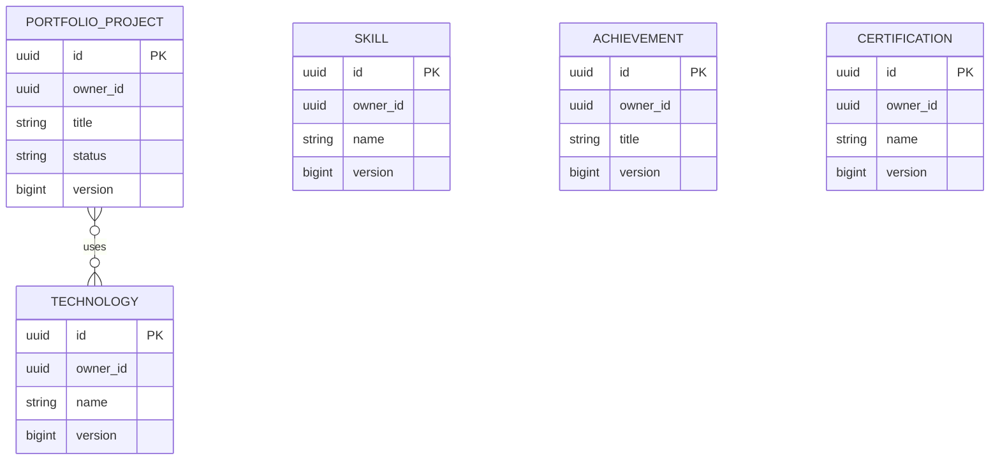
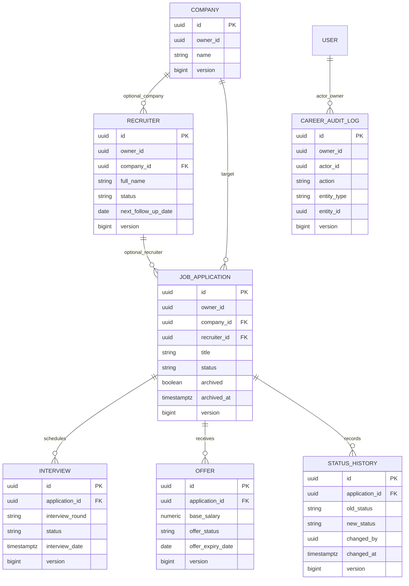

# Entity Relationships

All entities extend `BaseEntity` (`id`, `createdAt`, `updatedAt`, `version`) and map into PostgreSQL schema `acos`.

## Auth domain

## Knowledge domain

## Learning domain

## Portfolio domain

Portfolio skills, achievements, and certifications are owner-scoped entities; project↔technology is the primary many-to-many association used by project APIs.

## Career domain

## Ownership pattern

Most user data entities store `owner_id` (UUID referencing `users.id`) and are queried with owner-scoped repository methods. Relationship enforcement is application-level (service + repository), not database RLS.

## Evidence

- Entity classes under `src/main/java/com/acos/*/entity`
- Flyway migrations `V2`–`V9` under `src/main/resources/db/migration`
- `src/main/java/com/acos/common/persistence/BaseEntity.java`
