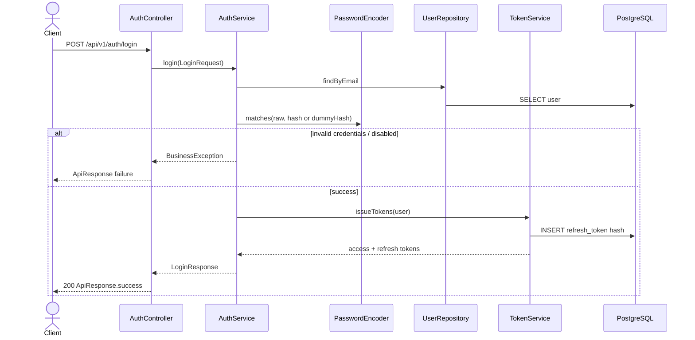
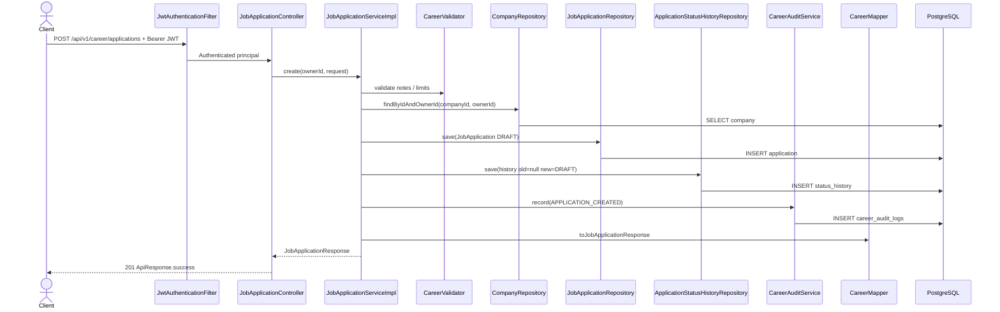
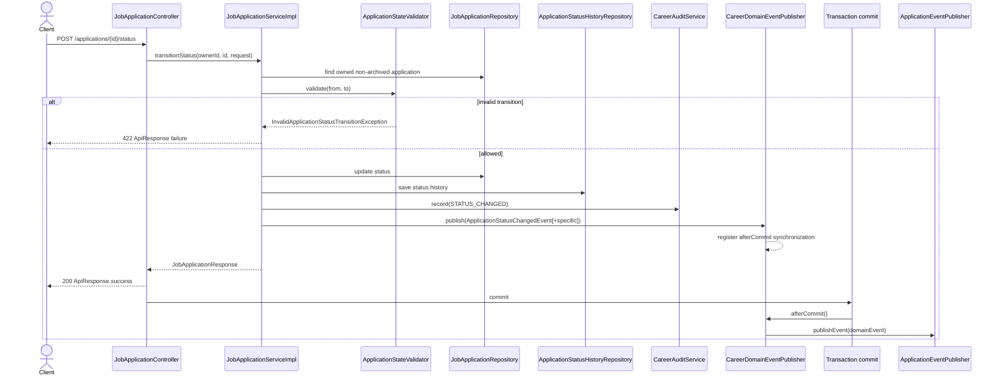
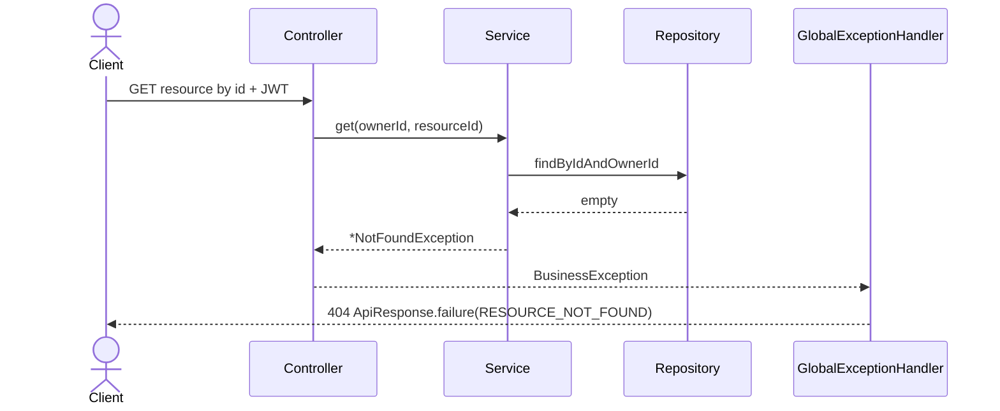
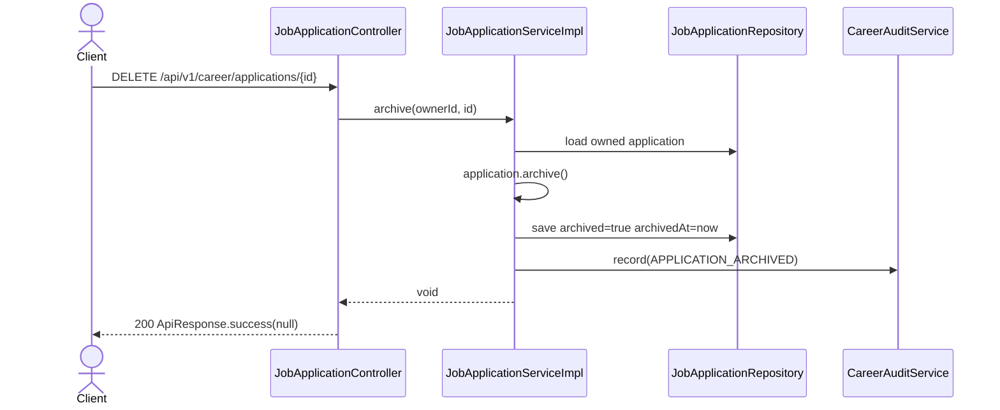

# Sequence Diagrams

## Login

## Create job application

## Status transition

## Protected read with ownership miss

## Soft-archive application

These sequences mirror the implemented auth and career flows. Other features follow the same controller → service → repository → mapper shape without career-specific state/event/audit steps.
