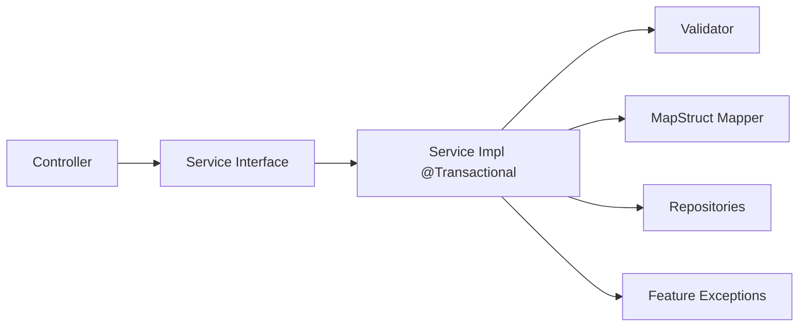
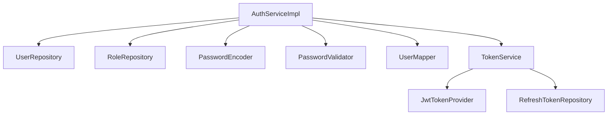
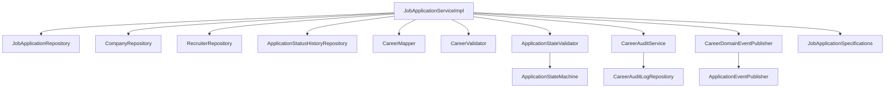
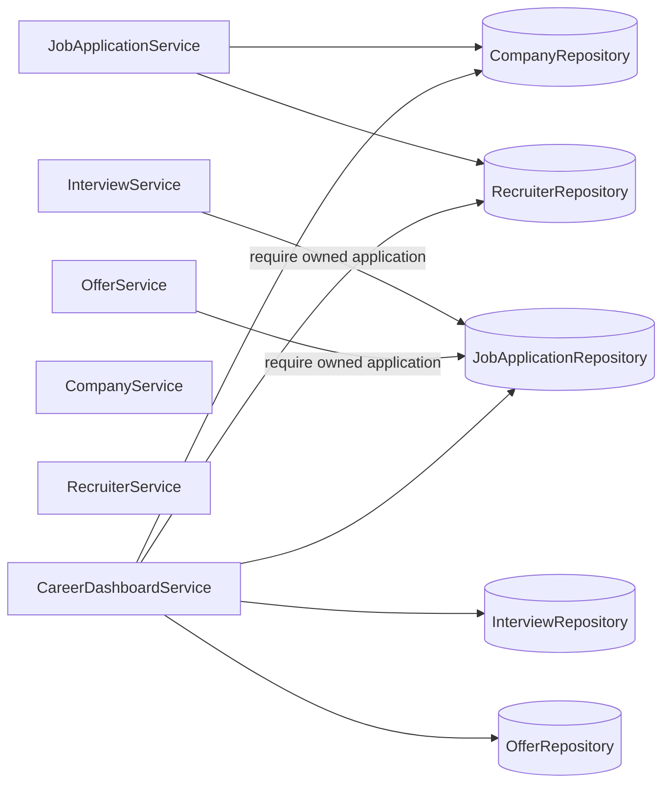
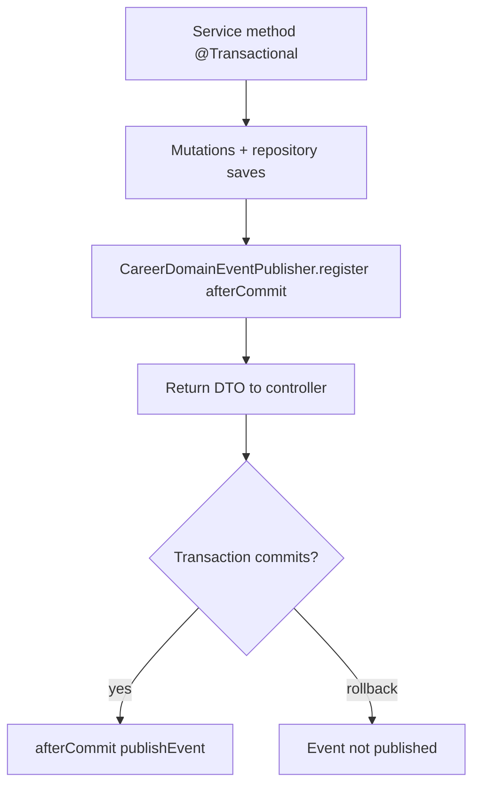
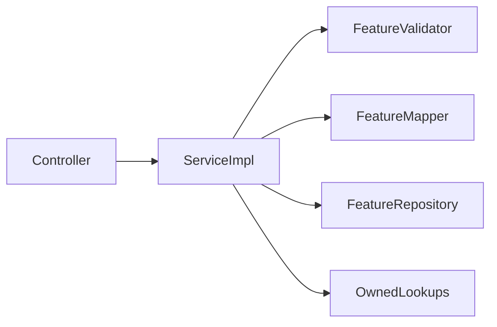

# Service Interaction

## Standard service collaboration

Services are the orchestration boundary. They:

1. Accept `ownerId` + DTO/command inputs
2. Validate business/limit rules
3. Load owned aggregates through repositories
4. Mutate entities
5. Persist through repositories
6. Map entities to response DTOs

## Auth service collaborators

## Career job-application service collaborators

## Cross-service interaction inside career

Interview and offer services do not call `JobApplicationService` as a remote API; they resolve the parent application through repositories and ownership checks, matching the implemented code.

## Transaction and event timing

## Knowledge / learning / portfolio pattern

These features use the same interaction style without career state machine, audit log, or after-commit event publisher.

## Evidence

- `com.acos.auth.service.AuthServiceImpl`
- `com.acos.career.service.JobApplicationServiceImpl`
- `com.acos.career.service.InterviewServiceImpl`
- `com.acos.career.service.OfferServiceImpl`
- `com.acos.career.service.CareerDashboardServiceImpl`
- Knowledge/learning/portfolio `*ServiceImpl` classes
