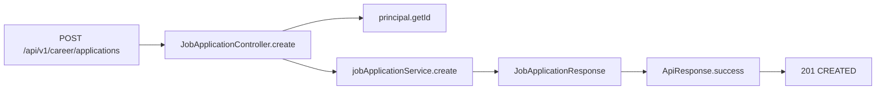
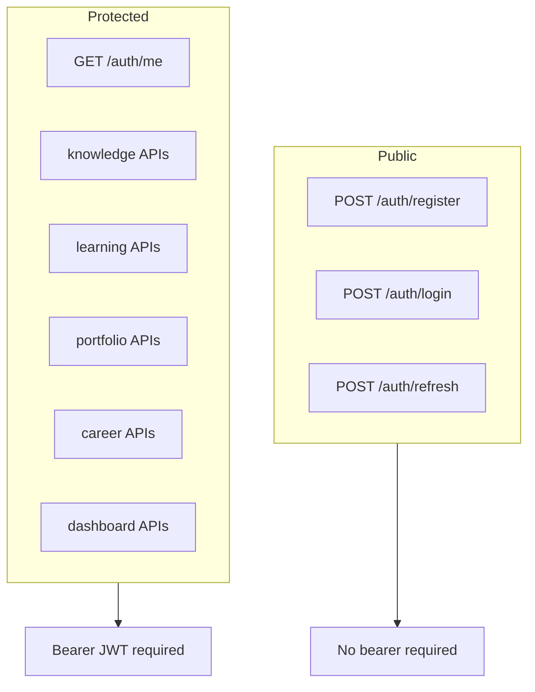
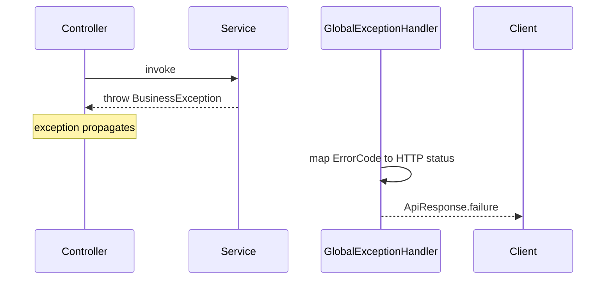

# Controller Flow

## Standard protected endpoint flow

```mermaid
flowchart TB
    A[HTTP request] --> B[CorrelationIdFilter]
    B --> C[SecurityFilterChain]
    C --> D{Public path?}
    D -->|yes auth/docs/health| E[Controller without JWT]
    D -->|no| F[JwtAuthenticationFilter]
    F --> G{Valid Bearer JWT?}
    G -->|no| H[401 ApiResponse via JsonAuthenticationEntryPoint]
    G -->|yes| I[Set SecurityContext AcosUserDetails]
    I --> J[Controller method]
    J --> K[@Valid request body / params]
    K --> L[service.method principal.getId ...]
    L --> M[ApiResponse.success]
    M --> N[ResponseEntity 200/201]
    L -.-> O[BusinessException]
    K -.-> P[MethodArgumentNotValidException]
    O --> Q[GlobalExceptionHandler]
    P --> Q
    Q --> R[ApiResponse.failure + HTTP status]
```

## Thin controller responsibilities

Controllers in ACOS:

1. Declare route, media type, and OpenAPI metadata
2. Read `@AuthenticationPrincipal AcosUserDetails` when protected
3. Apply `@Valid` to request DTOs
4. Call one service method
5. Wrap the result in `ApiResponse`
6. Choose success status (`CREATED` or `OK`)

They do **not**:

- Open transactions
- Call repositories
- Map entities
- Encode business rules

## Example: create application



## Example: list with paging

```mermaid
flowchart LR
    REQ[GET /api/v1/career/applications] --> CTRL[list]
    CTRL --> PAGE[@PageableDefault Pageable]
    CTRL --> ARCH[archived query param]
    CTRL --> SVC[service.list ownerId pageable archived]
    SVC --> DTO[JobApplicationPageResponse]
    DTO --> ENV[ApiResponse.success]
```

## Public vs protected controllers



## Error path from controller perspective



## Evidence

- `JobApplicationController`
- `CompanyController`
- `AuthController`
- Other feature controllers under `com.acos.*.controller`
- `CorrelationIdFilter`, `SecurityConfiguration`, `GlobalExceptionHandler`
