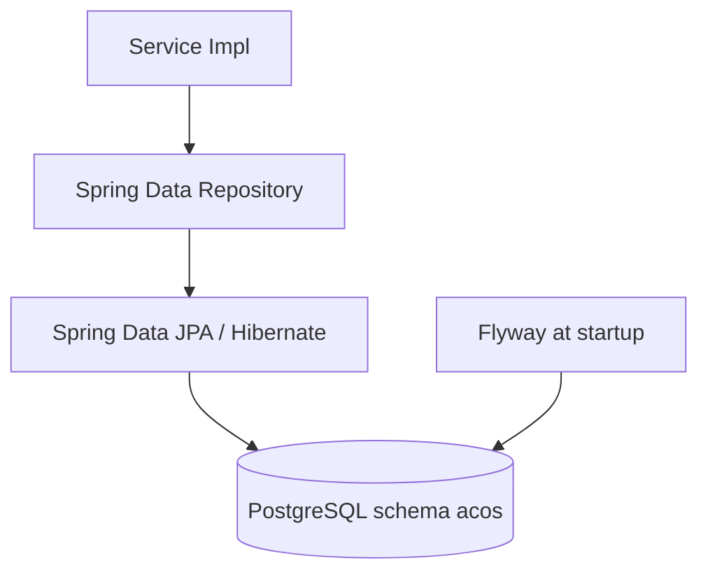
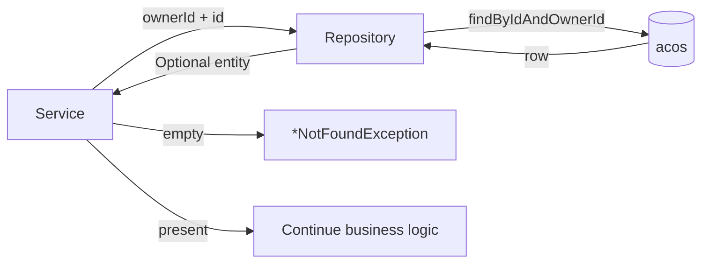
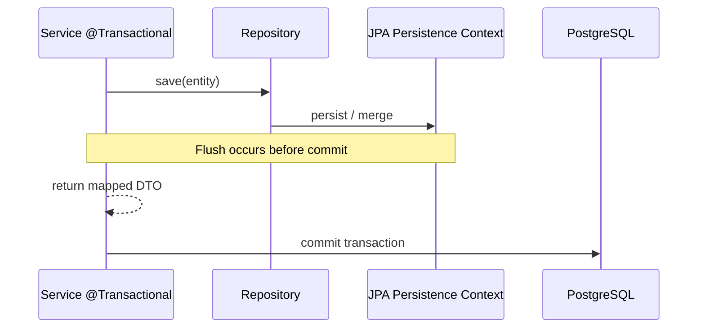
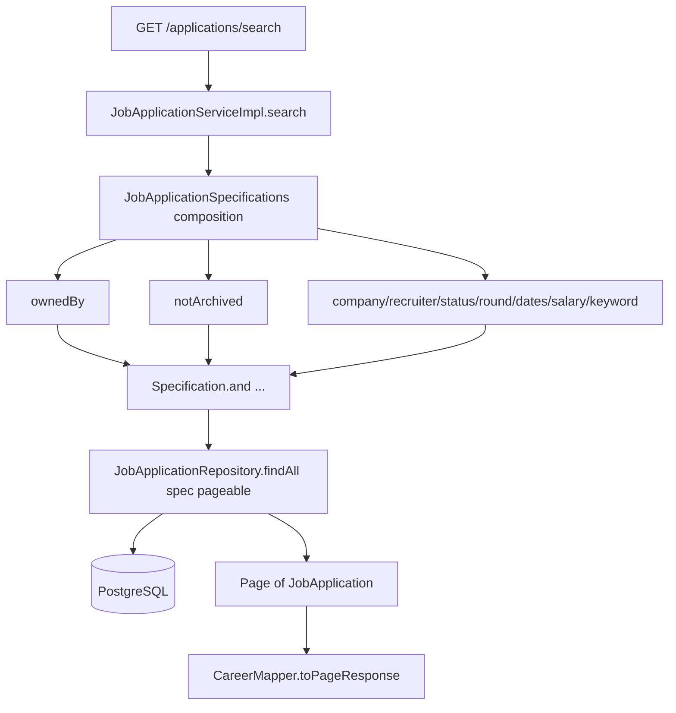
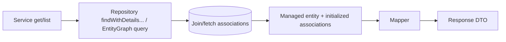
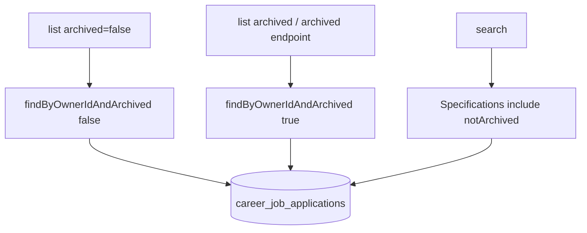
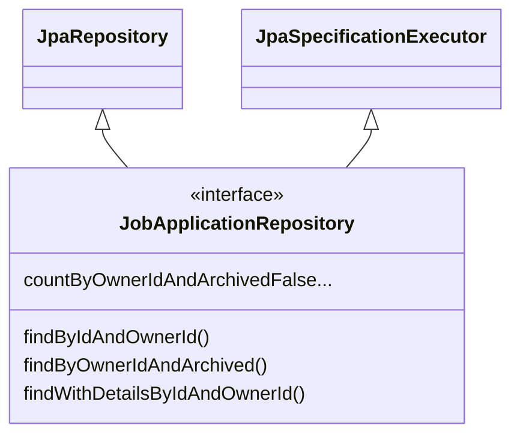

# Repository Flow

## Persistence access path

Controllers never participate in this path.

## Ownership query flow

## Create/update unit of work

Optimistic locking is enforced by `BaseEntity.version` (`@Version`). Concurrent updates that violate the version fail at flush/commit time through JPA optimistic-lock semantics.

## Career search via Specifications

## EntityGraph read flow

When responses need associations (company, recruiter, tags, milestones), repositories use `@EntityGraph` or equivalent fetch strategies because OSIV is disabled.

## Soft-archive query flow (career applications)

Physical delete is not used for job applications; `archive()` sets `archived` and `archivedAt`.

## Repository interface style

Most feature repositories extend only `JpaRepository`. Career application search additionally extends `JpaSpecificationExecutor`.

## Evidence

- Feature `*Repository` interfaces under `com.acos.*.repository`
- `JobApplicationSpecifications`
- `BaseEntity` `@Version`
- `application.yml` (`open-in-view: false`, `ddl-auto: validate`)
- Flyway migrations defining FK/indexes for repository-backed tables
