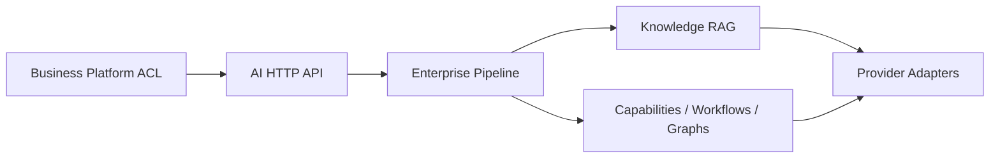
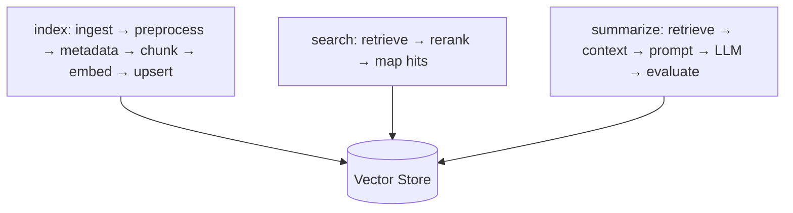
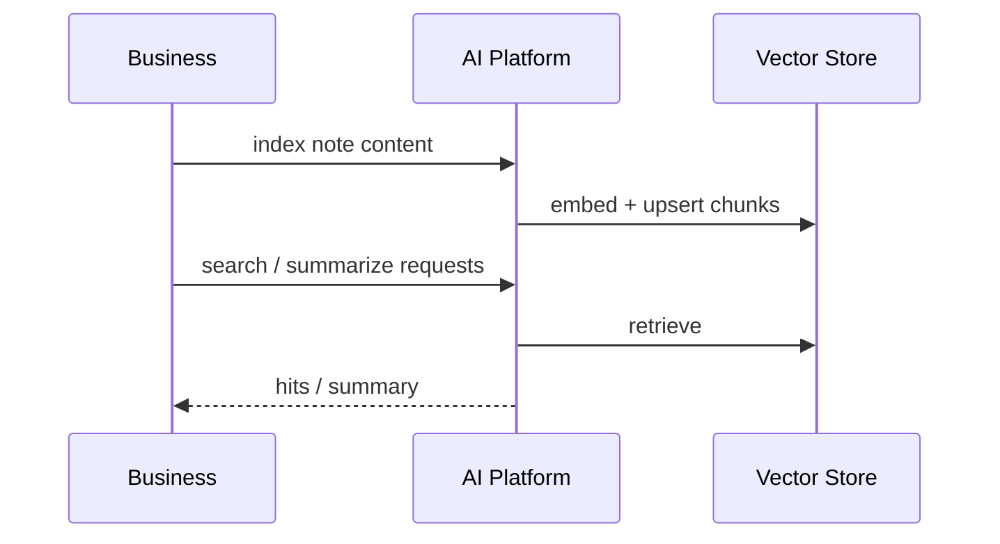

# AI System Architecture

Architectural view of the AI Platform and its Business integration. This is not a feature cookbook; it describes structure, control flow, and readiness boundaries.

## Placement in ACOS

AI Platform is domain-agnostic: it does not own career/learning CRUD tables.

---

## Capability registry

Agentic capabilities and workflows are registered in infrastructure factories and executed through orchestration services.

**Registered workflows (implemented names):**

`question_answering`, `summarization`, `retrieval`, `reasoning`, `resume`, `interview`, `quiz`, `portfolio_review`, `skill_gap`, `recommend_topic`, `progress_evaluation`, `cover_letter`

**LangGraph graphs registered:** `capability_sequential`, `capability_conditional`, `capability_parallel`

Default workflow setting: `question_answering`.

---

## Enterprise RAG

Knowledge path is orchestrated by `KnowledgeService`:

Defaults favor local determinism (`hashing` embeddings + `memory` vectors). Qdrant/OpenAI/etc. are adapter-selected via settings.

Business participates by sending content through Feign index/search/summarize APIs—not by sharing DB access.

---

## LangGraph

LangGraph powers explicit graph orchestration for capability demo graphs and agentic control flow inside the AI runtime. Checkpoints are in-memory in the current implementation profile.

**Future enhancement:** durable checkpointing and richer domain-specific graphs beyond capability orchestration demos.

---

## Prompt management

- File-backed prompt registries under `prompts/knowledge` and `prompts/agentic`
- Enterprise **prompt governance**: resolve/version/approve/deprecate/rollback/audit
- Pipeline resolves named prompts into payload metadata when `prompt_name` is provided
- `prompt_require_approved` is configurable (default false for local DX)

---

## Guardrails

Heuristic guardrails run in the enterprise pipeline:

- Input validation / length limits
- Prompt injection / jailbreak heuristics
- PII detection + redaction
- Content moderation heuristics
- Output validation + masking

Knowledge mutating/read workflows intentionally avoid soft-fallback masking of failures so errors surface honestly.

---

## Evaluation

Enterprise evaluator records quality/cost-oriented metrics (faithfulness/groundedness/context precision/recall/answer relevance/retriever quality + latency/tokens/cost/prompt/model/provider metadata) and optionally emits LangFuse traces when enabled.

Agentic evaluation adapters also exist for workflow scoring hooks.

---

## Model router

`ModelRouterPort` + policy-driven router selects provider/model using configurable policies (lowest cost/latency, highest quality, preferred provider, capability-specific, context length, availability, fallback).

Candidates come from enabled providers; otherwise router returns configured fallback (often extractive).

---

## MCP readiness

**Implemented:** ports + in-memory transport/tool/resource registries + `StubMcpClient`  
**Not implemented:** external MCP servers / network MCP protocol integration

Treat as an extension point.

---

## A2A readiness

**Implemented:** in-memory agent registry + local delegation  
**Not implemented:** networked agent-to-agent protocols

Treat as an extension point.

---

## Knowledge flow across repositories

Interactive Web AI tools still require Business BFF completion for full product UX.

---

## Enterprise pipeline (control plane)

Architectural stages actually executed:

1. Tenant + capability policy  
2. Sanitize + input guardrails  
3. Prompt governance (optional)  
4. Semantic cache (skipped for knowledge index/search/summarize)  
5. Model route + model/execution policy  
6. Resilient handler execution  
7. Output guardrails + mask  
8. Cost + evaluation + metrics + audit  

Correlation/trace IDs are ambient request-context, not a separate pipeline plugin stage.

---

## Interview discussion

### Why a pipeline around every AI call?

Cross-cutting AI governance (policy, safety, cost, audit) must not be re-implemented per workflow.

### Alternatives

- Per-endpoint middleware only — drifts quickly
- External AI gateway product — possible later; current code owns an in-process pipeline

### Trade-offs

- Pipeline complexity vs safety defaults
- Heuristic guardrails ≠ full moderation suite
- Stubs can be mistaken for production MCP/A2A if docs are careless

### Evolution

External policy services, durable eval stores, networked tool/agent ecosystems, stronger auth defaults, Redis-backed rate limits.

### Scale

- Separate API and worker deployments for embedding/LLM
- Cache retrieval answers carefully with invalidation on reindex
- Tenant quotas via policy/cost layers
- Circuit-break provider outages without cascading into Business thread pools

### Common questions

1. **Is LangChain required?** `langchain-core` is a dependency; app orchestration centers on ports + LangGraph engine.
2. **Where do prompts live?** Versioned files + governance service—not hardcoded in controllers.
3. **Does RAG require Qdrant?** No—memory store works; Qdrant is the durable adapter option.
