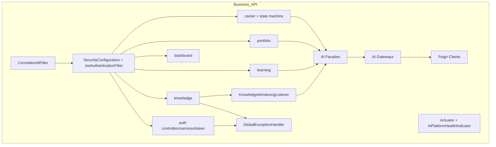
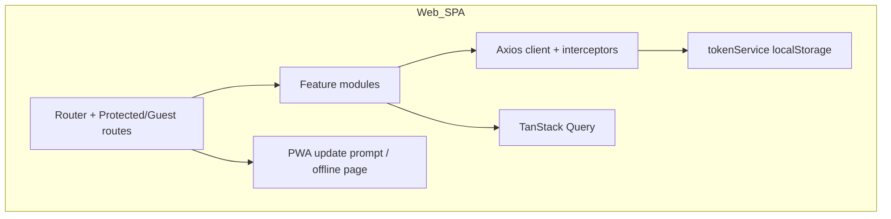
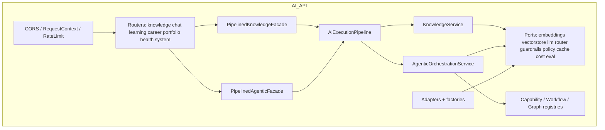

# C4 Component

C4 Level 3 — major components inside the primary application containers.

## Business Platform components

| Component | Responsibility |
| --- | --- |
| `JwtAuthenticationFilter` | Bearer JWT authentication |
| Domain modules | Product use cases + JPA persistence |
| `integration` facades/gateways/clients | Anti-corruption AI boundary |
| `KnowledgeAiIndexingListener` | Async after-commit indexing on create/update |
| `AiPlatformHealthIndicator` | Circuit-breaker-informed AI dependency health |
| `GlobalExceptionHandler` | Uniform `ApiResponse` errors |

**Not present as components:** analytics services; Web AI BFF controllers for capability POSTs.

---

## Web Platform components

| Component | Responsibility |
| --- | --- |
| Feature API modules | Hand-written clients for Business `/api/v1` |
| Interceptors | Correlation + auth + refresh rotation |
| AI feature | UI catalog + clients for `/integration/ai/**` (backend BFF incomplete) |

---

## AI Platform components

| Component | Responsibility |
| --- | --- |
| Enterprise pipeline | Tenant/capability policy, sanitize, guardrails, prompt governance, routing, execution policy, resilience, cost, eval, audit |
| KnowledgeService | RAG index/search/summarize orchestration |
| AgenticOrchestrationService | Workflow execution via registered capabilities/graphs |
| Provider factories | Select LLM/embedding/vector/rerank adapters from settings |
| MCP/A2A modules | **In-memory stubs / extension points only** |

---

## Contracts components (build-time)

| Component | Responsibility |
| --- | --- |
| Domain OpenAPI YAML | Knowledge/Learning/Career/Portfolio/Chat + common |
| Aggregate OpenAPI | `ai-platform-v1.yaml` |
| AsyncAPI aggregate | Event channel addresses |
| Generator configs | Java / Python / TypeScript |
| CI workflow | Validate + generate + upload artifacts |

---

## Interview discussion

### Why component diagrams differ by container?

Each container has a different architectural style: layered Spring modules, feature-sliced React, ports-and-adapters Python.

### Alternatives

Uniform hexagonal everywhere — attractive, but Business Platform prioritized delivery speed with classic Spring layering.

### Trade-offs

Web AI components currently encode endpoints that Business components do not yet expose.

### Evolution

Add Business `integration` REST controllers as first-class components; replace MCP/A2A stubs with networked adapters.

### Scale

Split AI pipeline workers from API components when CPU-bound embedding/LLM fan-out dominates.

### Common questions

1. **Where is the model router?** AI infrastructure enterprise router behind `ModelRouterPort`, invoked by the pipeline.
2. **Who indexes knowledge?** Business listener asynchronously calls Knowledge AI facade → Feign index API when AI enabled.
