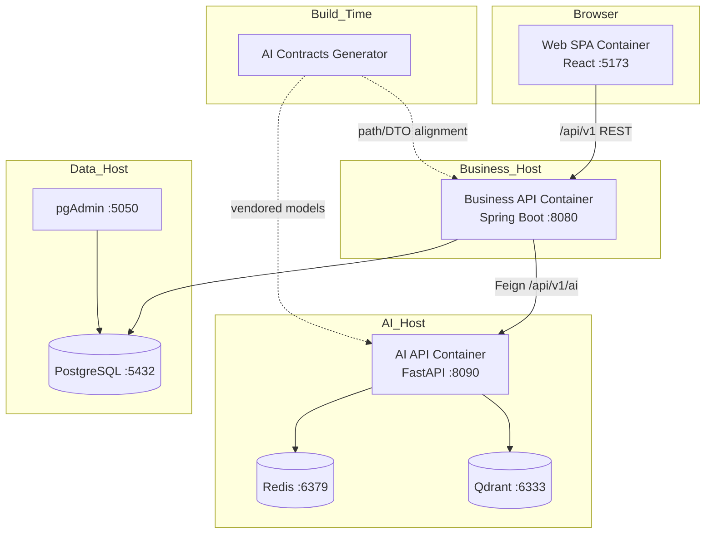

# C4 Container

C4 Level 2 — containers (deployable/runnable units) as implemented.

## Containers

| Container | Technology | Responsibility |
| --- | --- | --- |
| Web SPA | React/Vite static + dev server | UI |
| Business API | Spring Boot JAR/process | Domain APIs + AI ACL |
| AI API | FastAPI/Uvicorn process | AI HTTP + pipeline |
| PostgreSQL | postgres:17.5 | Business SoR |
| pgAdmin | optional local tool | DB admin UX |
| Redis | redis:7-alpine | AI cache/memory |
| Qdrant | qdrant:v1.12.5 | AI vectors (when selected) |
| Contracts Generator | Maven/Node job | Spec validation + SDK generation (CI/local) |

## Responsibilities and relationships

### Web SPA → Business API

- All product traffic
- Auth login/refresh/me and domain CRUD
- AI UX currently expects Business `/api/v1/integration/ai/**` BFF routes (**mostly future** — only AI health is publicly implemented on Business today)

### Business API → PostgreSQL

- Flyway-migrated schema
- JPA entities for auth/knowledge/learning/portfolio/career

### Business API → AI API

- OpenFeign clients for knowledge/learning/career/portfolio AI paths
- Conditional on `ai.platform.enabled`
- Resilience4j instance `ai-platform`
- Correlation header propagation

### AI API → Redis / Qdrant / LLM

- Redis when enabled for caches/memory
- Qdrant only if provider=`qdrant` and enabled; otherwise in-process memory vector store
- LLM/embedding providers per settings

### Contracts Generator

- Not in request path
- Produces Java/Python/TypeScript artifacts; AI vendors Python models

## Ports (developer topology)

| Container | Port |
| --- | --- |
| Web | 5173 (preview 4173) |
| Business | 8080 |
| PostgreSQL | 5432 |
| pgAdmin | 5050 |
| AI | 8090 |
| Redis | 6379 |
| Qdrant | 6333, 6334 |

## Health surfaces

| Container | Health |
| --- | --- |
| Business | `/actuator/health/**` (readiness includes `db`, `aiPlatform`) |
| AI | `/api/v1/system/liveness`, `/api/v1/system/readiness`, `/api/v1/ai/health` |
| Compose AI | curls liveness on `ai-platform` service |

---

## Interview discussion

### Why separate AI API container?

Blast radius, scaling profile, and language ecosystem differ from transactional APIs.

### Alternatives

Sidecar AI in the Business pod — possible later, but would weaken independent deployability.

### Trade-offs

Local Compose sprawl; Redis URL port defaults can diverge (6380 settings vs 6379 compose) and must be aligned via env.

### Evolution

Add API gateway/ingress container; add worker containers for async indexing; add OTel collector container (referenced but missing today).

### Scale

Duplicate Business and AI API containers horizontally; scale Redis/Qdrant as stateful services; keep SPA on CDN.

### Common questions

1. **Is pgAdmin part of production?** No — local tooling only.
2. **Is memory vector store a container?** No — in-process fallback inside AI API.
