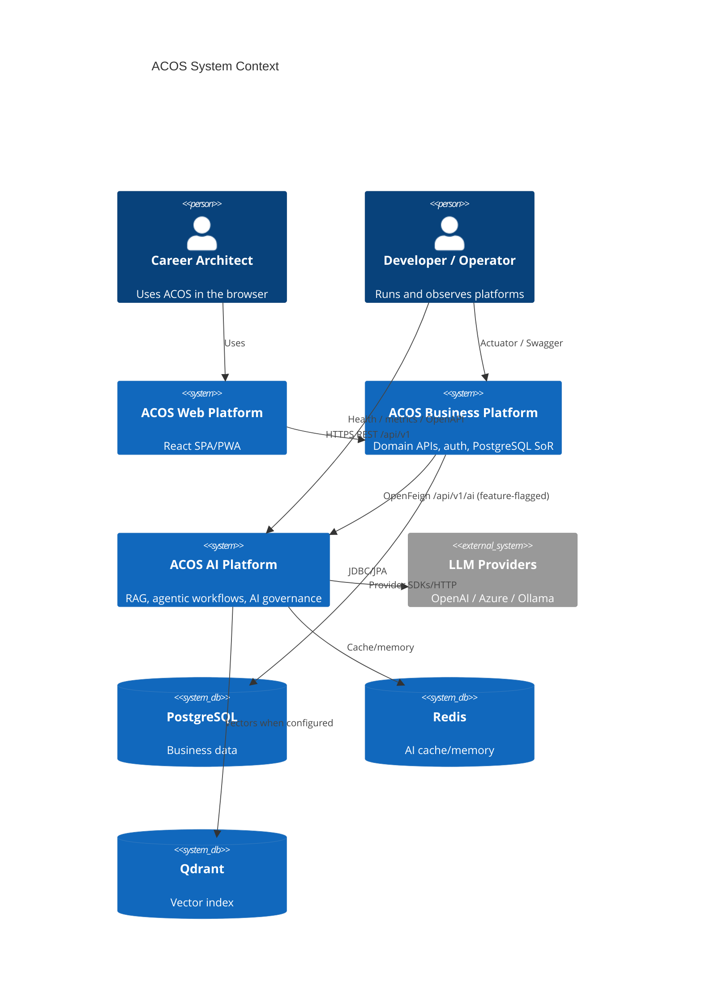
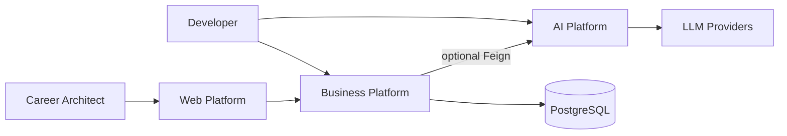

# C4 Context

C4 Level 1 — system context for ACOS as implemented.

## Actors

| Actor | Type | Interests |
| --- | --- | --- |
| Career Architect (User) | Person | Manage career, knowledge, learning, portfolio; use AI assists when enabled |
| Platform Operator / Developer | Person | Run local stacks, observe health/metrics, configure AI providers |
| External LLM Providers | External System | OpenAI / Azure OpenAI / Ollama (when configured on AI Platform) |

## Software systems

| System | Description |
| --- | --- |
| ACOS Web Platform | Browser SPA/PWA |
| ACOS Business Platform | Spring Boot modular monolith — system of record for product domains |
| ACOS AI Platform | FastAPI AI runtime — RAG + agentic + enterprise middleware |
| ACOS AI Contracts | Spec/generation system (not a runtime traffic participant) |
| PostgreSQL | Business persistence |
| Redis | AI cache/memory (optional) |
| Qdrant | AI vectors (optional; memory store default) |

> If Mermaid C4 rendering is unavailable in a viewer, use the flowchart below.

## Relationships (runtime)

| From | To | Protocol | Auth |
| --- | --- | --- | --- |
| User → Web | Browser | Session via localStorage JWT |
| Web → Business | REST `/api/v1` | Bearer access token |
| Business → PostgreSQL | JDBC | DB credentials |
| Business → AI | REST via Feign | API key/JWT headers when configured; flag default off |
| AI → Providers | HTTPS/SDK | Provider secrets in AI settings |

## Out of context (not implemented as connected systems)

- Kafka/Pulsar event bus (AsyncAPI drafted only)
- Identity Provider / Keycloak as external IdP (Business issues JWTs itself)
- Object storage service
- Kubernetes cluster as documented deployed environment

---

## Interview discussion

### Why show contracts outside the runtime context?

Contracts shape integration but do not handle live traffic. They belong in container/component docs as a build-time system, not as a runtime node on every request.

### Alternatives

Drawing AI inside Business Platform context — rejected; it would hide the deliberate service boundary.

### Trade-offs

Context diagrams omit Feign ACL internals; those appear at container/component levels.

### Evolution

Add IdP, event bus, and CDN as external systems when implemented.

### Scale narrative

At millions of users, context stays similar; cardinality of LLM providers and data stores increases, and an event backbone may appear between Business and AI.

### Common questions

1. **Who is the identity provider?** Business Platform auth module.
2. **Can mobile talk to AI?** Not as designed; should go through Business Platform (future clients still expected to respect this boundary).
