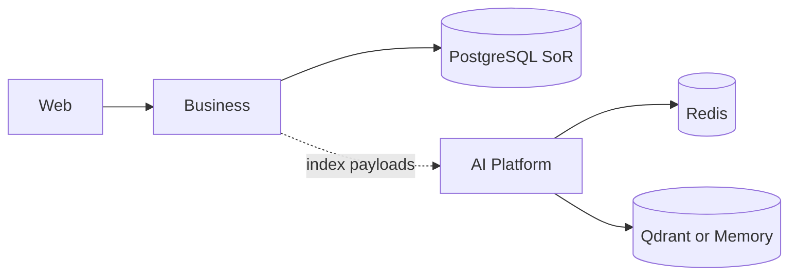
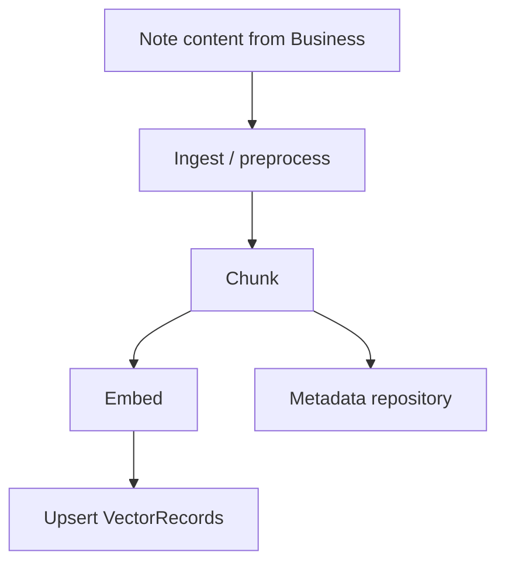

# Data Architecture

## Data stores in ACOS

| Store | Owner system | Purpose | Status |
| --- | --- | --- | --- |
| PostgreSQL | Business Platform | System of record for users, knowledge, learning, portfolio, career | Implemented |
| Redis | AI Platform | Semantic/RAG caches, agentic memory, readiness checks | Implemented (optional via flag) |
| Qdrant | AI Platform | Vector index for RAG chunks | Implemented (optional; default is in-memory) |
| Browser localStorage | Web Platform | Access/refresh tokens, AI chat session UX state | Implemented |
| Object storage (S3/etc.) | — | Documents/binaries | **Not implemented** |

---

## PostgreSQL (Business SoR)

### Ownership

Only the Business Platform writes product entities. AI Platform does not own career/learning tables.

### Persistence strategy

- Spring Data JPA + `ddl-auto: validate`
- Flyway migrations `V1–V12` evolving auth/knowledge/learning/portfolio/career
- Schema `acos` (local profile uses `currentSchema=acos`)

### Major domain data

| Domain | Examples |
| --- | --- |
| Auth | users, roles, refresh_tokens (hashed) |
| Knowledge | notes (+ categories/tags via model) |
| Tutorials | hierarchical topics, concept markdown, Q&A + FTS vectors |
| Learning | plans, milestones, topics |
| Portfolio | projects, technologies, skills, certifications, achievements |
| Career | companies, recruiters, applications, interviews, offers, status history |

### Local topology note

Docker Compose defaults (`DB/user/pass=acos`) can differ from `application-local.yml` (`postgres`/`postgres` + schema). Align intentionally when documenting onboarding.

---

## Redis (AI)

### Ownership

AI Platform infrastructure adapters.

### Usage

- Semantic cache / response cache backing
- Knowledge RAG cache adapter
- Knowledge metadata repository backing
- Agentic memory adapter
- Health/readiness ping when enabled

### Caching strategy

- Pipeline may cache AI responses semantically
- **Knowledge index/search/summarize workflows skip semantic cache** to avoid stale/incorrect index results
- Business Platform has **no Redis cache layer** today

---

## Vector storage

### Default

`vector_store_provider=memory` + `embedding_provider=hashing` for deterministic local/tests.

### Production-leaning option

`vector_store_provider=qdrant` with `qdrant_enabled=true`, collection `acos_knowledge`.

### Data flow (index)

Vectors are a **projection** of knowledge content for retrieval—not the authoritative note store.

---

## Data ownership matrix

| Data kind | Authoritative owner | Derived/projection |
| --- | --- | --- |
| User identity & refresh tokens | Business PostgreSQL | — |
| Notes/plans/projects/applications | Business PostgreSQL | — |
| Chunk embeddings | AI vector store | Derived from note content at index time |
| AI evaluation/cost records | AI in-process/enterprise components | Not Business SoR |
| UI tokens/chat draft session | Browser localStorage | Non-authoritative |

---

## Data flow between repositories

1. User creates note in Web → Business persists to PostgreSQL.
2. After commit, Business may emit in-process event → async Feign index → AI embeds/upserts vectors.
3. AI search/summarize reads vectors + optional LLM; Business note search still reads PostgreSQL.
4. Career/learning/portfolio AI tools send **request payloads** to AI; they do not grant AI direct DB access.

---

## Future enhancements

- Object storage for resume PDFs / portfolio media
- Tenant-partitioned Qdrant collections
- Durable AI evaluation/cost warehouse
- Outbox table in PostgreSQL for reliable index commands
- Brokered events for `knowledgeIndexed` / `indexFailed` (AsyncAPI already names channels)

---

## Interview discussion

### Why not store vectors in PostgreSQL only?

Possible with pgvector, but a dedicated vector store keeps AI scaling and lifecycle independent from transactional OLTP. Current code standardizes on Qdrant adapter + memory fallback.

### Alternatives

- pgvector in Business DB — fewer moving parts, tighter coupling
- Fully managed Pinecone — less ops, more vendor lock-in

### Trade-offs

Dual persistence models; indexing lag; local default memory store is non-durable.

### Evolution

Treat indexing as an eventually consistent projection pipeline with retries and idempotent upserts (delete_by_document already supports rebuild semantics).

### Scale to millions of users

- Partition hot PostgreSQL tables (applications/notes) by user
- Shard Qdrant; separate embedding workers
- Cache frequent RAG queries in Redis with strict invalidation on reindex
- Never let AI synchronous paths block core CRUD at peak

### Common questions

1. **Is Redis required to run Business Platform?** No.
2. **Can AI delete user notes?** No direct DB access; only processes content sent over APIs.
