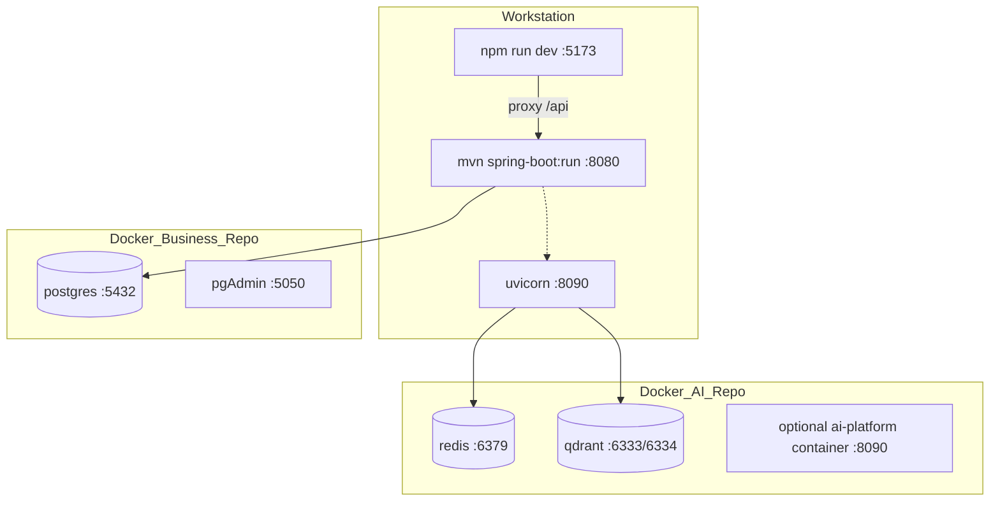
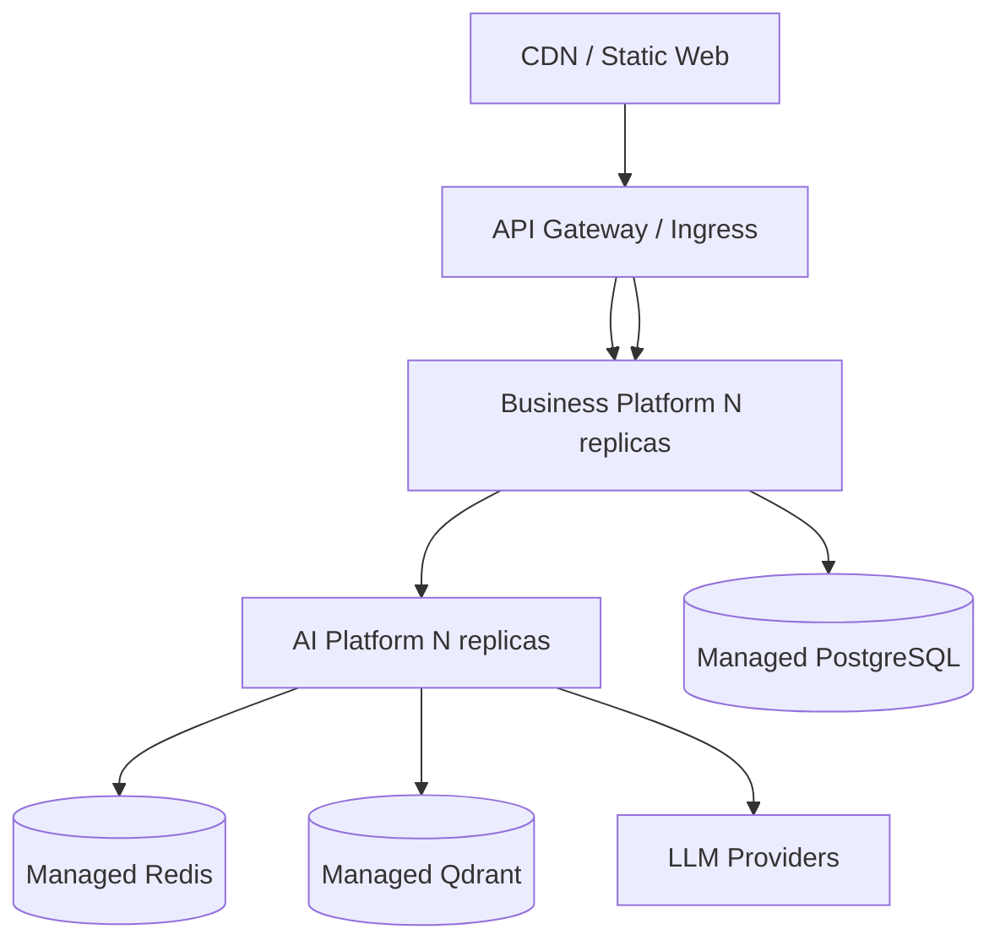

# Deployment Architecture

## Developer environment (implemented)

### Networking / ports

| Service | Port | Source |
| --- | --- | --- |
| Web Vite | 5173 | `vite.config.ts` |
| Web preview | 4173 | Vite preview |
| Business API | 8080 | `application.yml` |
| PostgreSQL | 5432 | Business Compose |
| pgAdmin | 5050 | Business Compose |
| AI API | 8090 | AI settings/Compose |
| Redis | 6379 | AI Compose |
| Qdrant HTTP/gRPC | 6333 / 6334 | AI Compose |

**Config caution:** AI settings default `redis_url` may use DB index host port `6380` while Compose publishes `6379`. Align with `.env` for local runs.

### Configuration

| App | Config |
| --- | --- |
| Business | `application.yml` + `application-local.yml` (default profile `local`) |
| Web | `VITE_API_BASE_URL`, `VITE_API_PROXY_TARGET`, `VITE_AI_PLATFORM_ENABLED` |
| AI | `.env` / environment mapped to `AppSettings` |
| AI enablement from Business | `ai.platform.enabled`, `ai.platform.base-url`, timeouts, API key |

### Health checks

| System | Endpoint |
| --- | --- |
| Business | `/actuator/health/**` (readiness group includes `db`, `aiPlatform`) |
| AI Compose | `curl` liveness `http://127.0.0.1:8090/api/v1/system/liveness` |
| AI readiness | `/api/v1/system/readiness` (Redis/Qdrant dependency checks when enabled) |

### What local Compose includes

- **Business repo Compose:** Postgres + pgAdmin only (not the Spring app image)
- **AI repo Compose:** `ai-platform` image + Redis + Qdrant
- **Web:** no Dockerfile/Compose in-repo

---

## Docker deployment (AI Platform)

Implemented in `architect-career-ai-platform`:

- `Dockerfile` builds Python 3.13 slim image, installs vendored contracts + package, exposes 8090
- `docker-compose.yml` wires app to Redis/Qdrant and sets production-ish env overrides for URLs

Business Platform application containerization is **not implemented** in-repo (DB Compose only).

Web containerization is **not implemented** in-repo.

---

## Production environment

**Status:** No complete multi-service production topology (ingress, K8s manifests, shared secrets manager wiring) is checked in across the four primary repositories.

A realistic production target consistent with current boundaries:

This diagram is an **evolutionary target**, not a claim of current manifests.

---

## Future Kubernetes deployment

**Future enhancement** candidates:

- Deployments/Services for `business-platform`, `ai-platform`
- Migration Job for Flyway
- Stateful/managed dependencies for Postgres/Redis/Qdrant
- Ingress routes: `/` → Web, `/api/v1` → Business, optional internal-only AI service (not public)
- NetworkPolicy: Web cannot reach AI; only Business can
- HPA on Business/AI CPU/RPS and AI queue depth
- OTel Collector Deployment (Compose currently references collector without defining it)

---

## Interview discussion

### Why AI is separately compose-able?

AI dependencies (Redis/Qdrant/models) differ from Business DB tooling; independent Compose files match team ownership.

### Alternatives

Single root Compose for all services — better DX eventually; not present as one unified file today.

### Trade-offs

Fragmented local startup; port/env mismatches possible; production packaging incomplete for Business/Web.

### Evolution

Unify developer Compose; add Business/Web images; introduce K8s overlays per environment.

### Scale

- Put Web on object storage + CDN
- Autoscale API pods
- Isolate AI on GPU/CPU node pools if self-hosting models (Ollama)
- Keep AI cluster-internal except through Business

### Common questions

1. **Is AI publicly exposed?** Locally it can be; production should keep it private behind Business.
2. **Where do secrets live today?** Env vars / `.env` / Spring config — not a dedicated vault integration in these repos.
