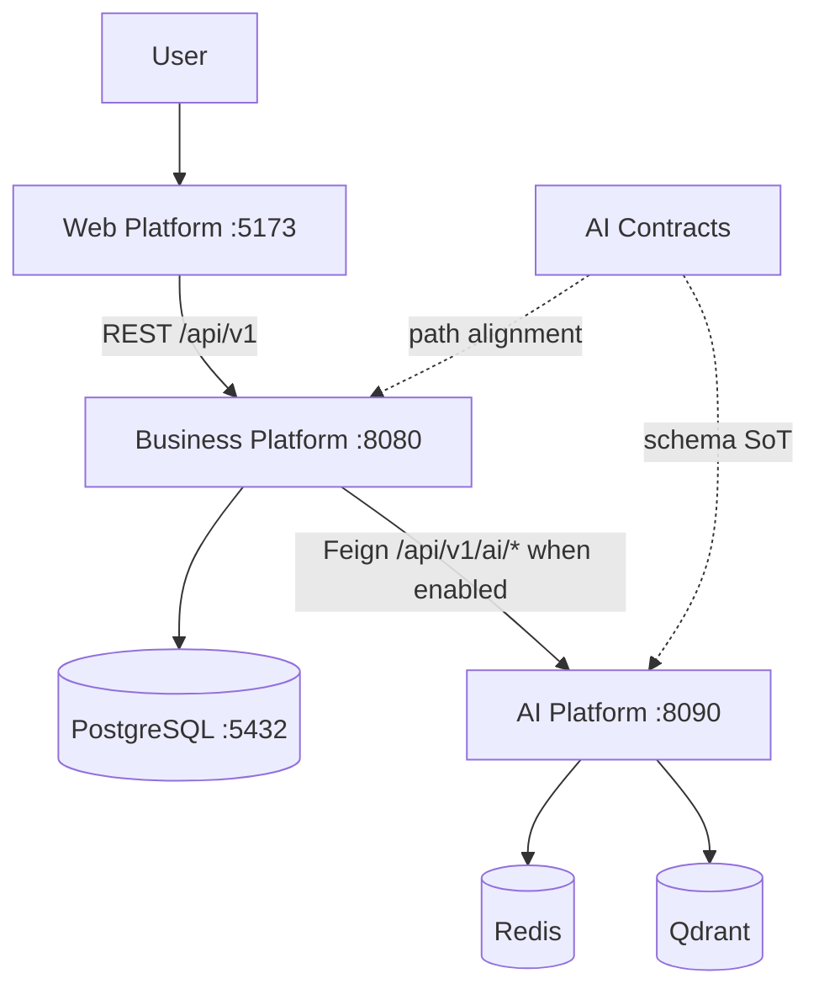
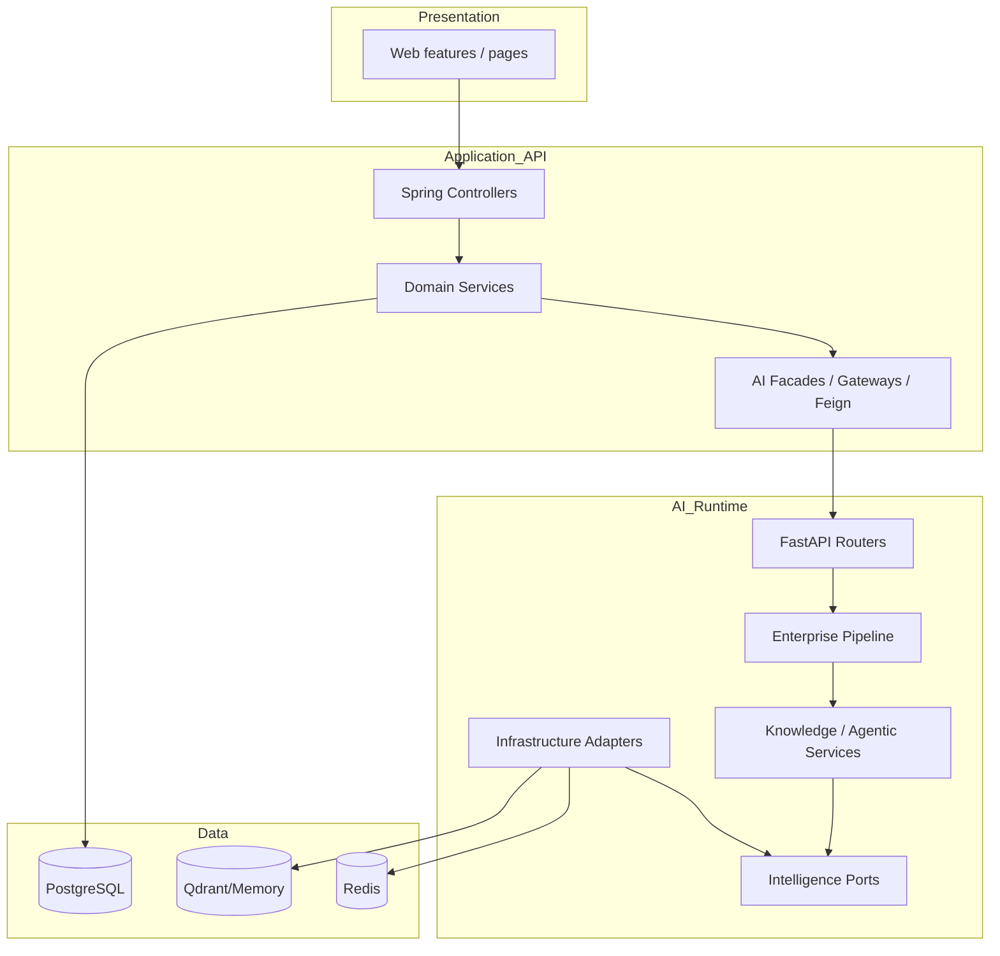

# High-Level Architecture

## Platform overview

ACOS is a multi-repository career operating system for software architects. The runtime product path is:

```text
Browser (Web Platform)
    → Business Platform (Spring Boot modular monolith)
        → PostgreSQL
        → AI Platform (FastAPI) [optional, feature-flagged]
            → Redis / Qdrant / LLM providers
AI Contracts (OpenAPI / AsyncAPI) govern the AI boundary schemas.
```

Chapter 01 describes *why* and *what*. This chapter describes *how the system is structured*.

---

## Major components

| Component | Repository | Role |
| --- | --- | --- |
| Web Platform | `architect-career-web` | React SPA/PWA; sole browser UI |
| Business Platform | `architect-career-operating-system` | Domain APIs, auth, persistence, AI ACL |
| AI Platform | `architect-career-ai-platform` | RAG, agentic workflows, enterprise AI middleware |
| AI Contracts | `architect-career-ai-contracts` | OpenAPI 3.1 + AsyncAPI 3.0 SoT + generators |
| PostgreSQL | local Compose / external | Business domain store (`acos` schema) |
| Redis | AI Compose / external | AI caches and agentic memory (when enabled) |
| Qdrant | AI Compose / external | Vector store when `vector_store_provider=qdrant` |



---

## Repository responsibilities

| Responsibility | Owner |
| --- | --- |
| Identity, sessions, domain CRUD | Business Platform |
| UI/UX, client routing, PWA shell | Web Platform |
| Model/RAG/agent execution + AI governance | AI Platform |
| AI REST/event schema truth | AI Contracts |
| Business data durability | PostgreSQL via Business Platform |
| Vector/cache durability for AI | Qdrant/Redis via AI Platform (optional) |

**Boundary rule (implemented):** the browser never calls the AI Platform directly.

---

## Technology boundaries

| Boundary | Technologies |
| --- | --- |
| Presentation | React 19, TypeScript, Vite, MUI, TanStack Query, Zustand |
| Product API | Java 21, Spring Boot 3.5, Security, JPA, Flyway, Feign, Resilience4j |
| AI runtime | Python 3.13, FastAPI, LangGraph, provider adapters |
| Contracts | OpenAPI 3.1, AsyncAPI 3.0, OpenAPI Generator |
| Data | PostgreSQL 17; Redis; Qdrant (or in-memory vectors) |

Dual-language split is intentional: transactional product domains stay on Spring; model-centric runtime stays on Python.

---

## Layered architecture (ecosystem)



---

## Request lifecycle (summary)

1. **Browser** issues Axios call to `/api/v1/**` (Vite proxies to `:8080` in dev).
2. **Business Platform** applies correlation filter, security filter, controller → service → repository.
3. For AI-assisted domain actions (when `ai.platform.enabled=true`), services call **AI facades** → Feign → AI Platform.
4. **AI Platform** applies CORS, request context, rate limit, then pipelined facade → enterprise pipeline → Knowledge/Agentic service → adapters.
5. Response returns as Business `ApiResponse` to Web, or AI Problem Details / contract models on the AI edge.

Detailed sequences: [Request-Flows.md](Request-Flows.md), [Runtime-Architecture.md](Runtime-Architecture.md).

---

## Deployment overview

**Developer environment (implemented):**

| Process | Port |
| --- | --- |
| Vite Web | 5173 |
| Spring Boot | 8080 |
| PostgreSQL | 5432 |
| pgAdmin | 5050 |
| AI Platform | 8090 |
| Redis | 6379 (Compose; app default URL may use 6380 — align via env) |
| Qdrant | 6333 / 6334 |

**Production:** no unified multi-repo Kubernetes manifests are implemented in these four repositories today. AI Platform has a Dockerfile + Compose; Business Platform Compose covers DB tooling; Web has no Dockerfile in-repo.

**Future enhancement:** Kubernetes deployment topology, service mesh, and shared ingress — see [Deployment-Architecture.md](Deployment-Architecture.md).

---

## What is intentionally out of HLA

- Class-level design → [Low-Level-Architecture.md](Low-Level-Architecture.md)
- C4 views → [C4-Context.md](C4-Context.md), [C4-Container.md](C4-Container.md), [C4-Component.md](C4-Component.md)
- Security deep dive → [Security-Architecture.md](Security-Architecture.md)
- AI internals → [AI-System-Architecture.md](AI-System-Architecture.md)

---

## Interview discussion

### Why this architecture?

Separates **product consistency** (modular monolith + PostgreSQL) from **AI volatility** (providers, RAG, graphs) while keeping a **contracted** integration edge. Web isolation prevents key leakage and keeps authorization centralized.

### Alternatives considered

| Alternative | Why not chosen (at this stage) |
| --- | --- |
| Single polyglot monolith (Java does AI) | AI ecosystem friction; slower model experimentation |
| Microservices per domain | Premature distribution for tightly related career data |
| Browser → AI Platform directly | Security and product-rule bypass risk |
| Shared DB between Business and AI | Couples schemas; violates AI platform independence |

### Trade-offs

- Two runtimes to operate (Java + Python)
- AI BFF for Web not fully complete (Web AI clients ahead of Java controllers)
- AsyncAPI exists without a broker implementation yet

### How would it evolve?

1. Complete Business AI BFF for Web capabilities.
2. Adopt generated SDKs from contracts.
3. Introduce broker-backed events for indexing/processing lifecycle.
4. Extract domains only when modular monolith seams prove hot.

### How would it scale to millions of users?

- Horizontally scale Business Platform (stateless JWT) behind a load balancer; PostgreSQL read replicas / partitioning for hot career tables.
- Horizontally scale AI Platform workers; move rate limit/cache to Redis; pin Qdrant clusters; isolate embedding/LLM quotas per tenant.
- Keep Web as a CDN-hosted SPA; never put LLM fan-out in browsers.
- Introduce async command/event paths for indexing so interactive APIs stay fast.

### Common Principal Architect questions

1. **Why not put RAG in Spring?**  
   Because embedding/model libraries, prompt iteration, and agent graphs change faster than domain schemas; ports-and-adapters in Python isolate that churn.

2. **Is this Clean Architecture?**  
   AI Platform: yes (ports/adapters). Business Platform: layered modular monolith—pragmatic, not strict hexagonal.

3. **Where is the system of record?**  
   PostgreSQL via Business Platform for product data. Vectors are an AI projection, not the career SoR.
