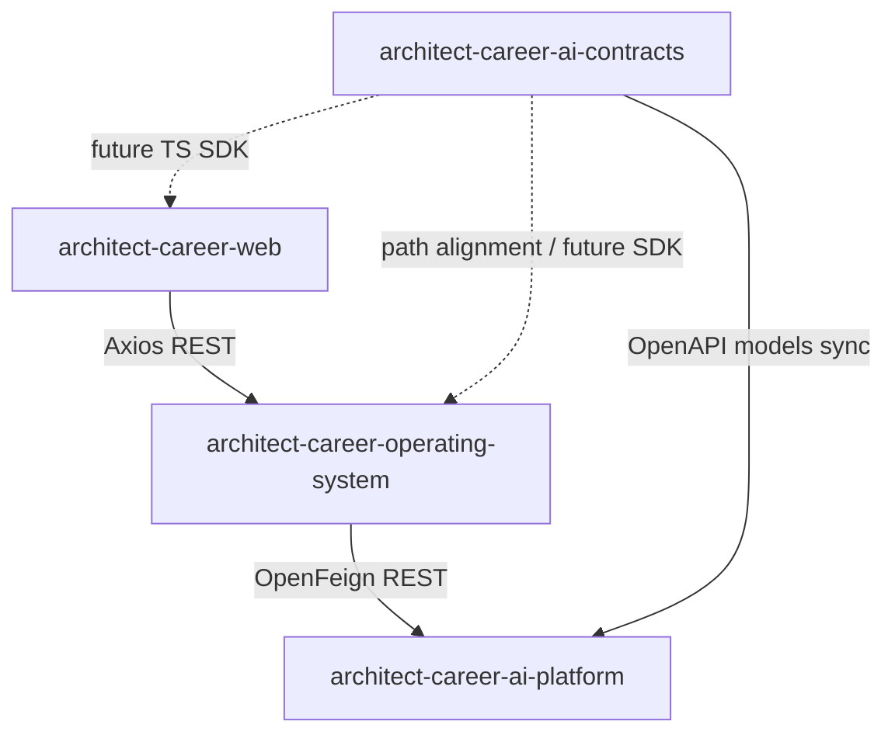
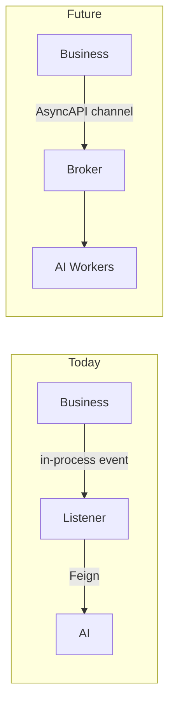

# Integration Architecture

## End-to-end integration path

```text
React Web
  -- REST /api/v1/** -->
Spring Boot Business Platform
  -- OpenFeign /api/v1/ai/** (optional) -->
Python AI Platform
     ^
     | vendored generated models / path SoT
AI Contracts (OpenAPI + AsyncAPI)
```



---

## REST (Web → Business)

| Aspect | Implementation |
| --- | --- |
| Style | Versioned REST under `/api/v1` |
| Envelope | Business `ApiResponse<T>` |
| Auth | Bearer JWT (+ refresh rotation) |
| Correlation | `X-Correlation-Id` |
| Client | Hand-written Axios feature clients |
| Dev proxy | Vite `/api` → `http://localhost:8080` |

Web does **not** integrate with AI Platform HTTP.

---

## OpenFeign (Business → AI)

| Aspect | Implementation |
| --- | --- |
| Clients | Knowledge/Learning/Career/Portfolio AI Feign interfaces |
| Activation | `@ConditionalOnProperty(ai.platform.enabled=true)` |
| Base URL | `ai.platform.base-url` (default `http://localhost:8090`) |
| Resilience | Resilience4j instance `ai-platform` (retry/CB/timelimiter/bulkhead) |
| ACL | Facade → Gateway → Feign |
| Fallbacks | Graceful facade fallbacks when disabled/degraded |

### Feign paths (implemented)

- `/api/v1/ai/knowledge/{index,search,summarize}`
- `/api/v1/ai/learning/{quiz/generate,topics/recommend-next,progress/evaluate}`
- `/api/v1/ai/career/{resume/generate,interview/analyze,cover-letter/generate}`
- `/api/v1/ai/portfolio/{review,skill-gap/analyze}`

**Gap:** Web calls `/api/v1/integration/ai/**` capability POSTs that are largely **not** implemented as Business controllers (health exists). That BFF layer is a **future enhancement**.

---

## OpenAPI (AI Contracts → AI Platform)

| Aspect | Implementation |
| --- | --- |
| Spec | `openapi/ai-platform-v1.yaml` + domain YAML |
| Security schemes | `bearerJwt`, `serviceApiKey` (`X-API-Key`) |
| AI consumption | Generated Pydantic models vendored under `third_party/acos_ai_contracts` |
| Compatibility check | `scripts/check_contract_compatibility.py` in AI CI |

Business Feign DTOs are currently **hand-maintained** to match contracts (generator available, not fully adopted as dependency).

---

## AsyncAPI (future event-driven integration)

| Aspect | Status |
| --- | --- |
| Spec | `asyncapi/ai-platform-events-v1.yaml` |
| Channels | processing lifecycle; knowledge/learning/career/portfolio AI events |
| Broker bindings | Explicitly out of scope in contracts today |
| Runtime publishers/consumers | **Not implemented** in Business/AI apps |

Current cross-cutting async behavior is **in-process Spring events** inside Business (e.g., knowledge indexing listener), not AsyncAPI transport.



---

## Boundary responsibilities

| Boundary | Allowed | Forbidden |
| --- | --- | --- |
| Web → Business | Product REST | Direct AI provider calls |
| Business → AI | Contracted AI commands/queries | Sharing JPA entities / DB |
| AI → Business | Not required for current flows | Reading Business DB |
| Contracts → runtimes | Schema/codegen | Runtime traffic |

---

## Interview discussion

### Why Feign instead of WebClient-only?

Declarative clients map cleanly onto many similarly shaped AI endpoints and integrate with Spring Cloud resilience patterns already adopted.

### Alternatives

- Backend-for-frontend in Next.js calling AI — rejected for secret/policy centralization
- Shared DB integration — rejected for coupling
- Sync-only indexing in request thread — rejected for latency

### Trade-offs

- Dual REST stacks and mapping layers
- Feature flag complexity
- Spec-first events ahead of broker reality

### Evolution

1. Implement Business AI BFF for Web.
2. Replace hand DTOs with generated Java SDK.
3. Introduce outbox + broker for AsyncAPI channels.
4. Optionally expose partner APIs still through Business, not AI.

### Scale

- Bulkhead Feign calls so AI latency cannot exhaust Business Tomcat/worker threads
- Queue index/analyze commands under load
- Prefer async for non-interactive AI work

### Common questions

1. **Is AsyncAPI live?** Spec yes; runtime bus no.
2. **Who owns API versioning for AI?** Contracts repo aggregate `v1`.
