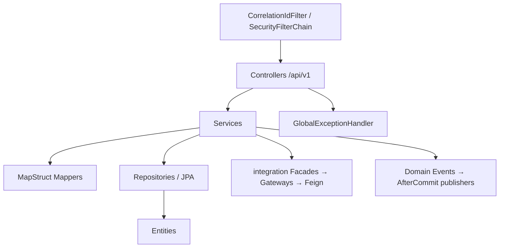
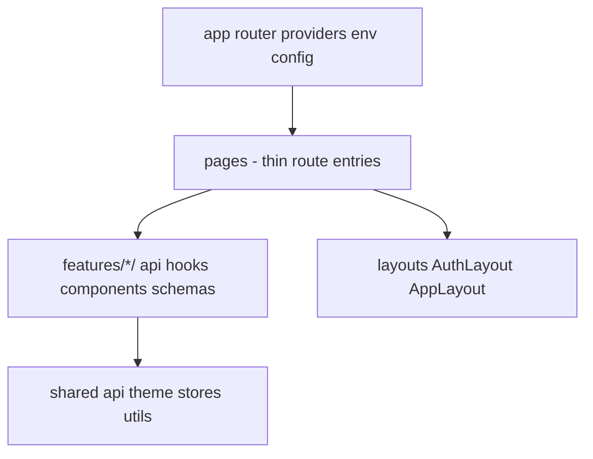
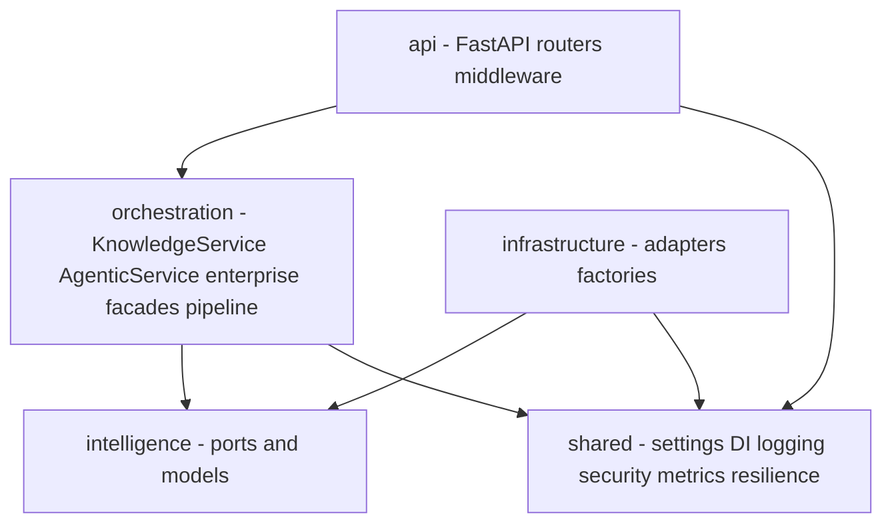
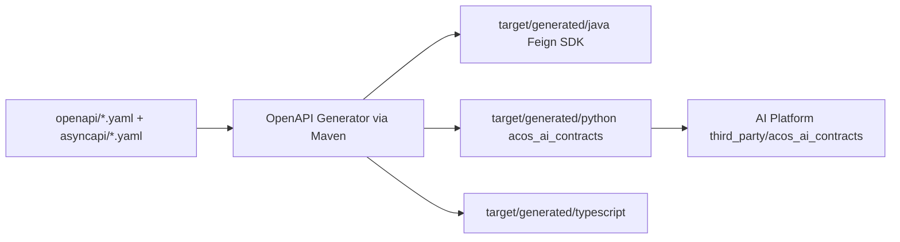

# Low-Level Architecture

## Backend layers (Business Platform)

### Package structure (`com.acos`)

| Package | Responsibility |
| --- | --- |
| `auth` | Register/login/refresh/logout/me, JWT, refresh tokens |
| `knowledge` | Notes CRUD/search + AI indexing hooks |
| `learning` | Plans / milestones / topics |
| `portfolio` | Projects, skills, technologies, certifications, achievements |
| `career` | Companies, recruiters, applications, interviews, offers, state machine |
| `dashboard` | Overview API (placeholder metrics today) |
| `integration` | AI ACL, Feign, resilience, AI health, indexing listener |
| `common` | `ApiResponse`, exceptions, correlation logging, persistence base |
| `config` | Async, JPA auditing, OpenAPI |
| `analytics` | **Stub only** (`package-info`) — future enhancement |

Typical domain folders: `controller`, `service`, `repository`, `entity`, `dto`, `mapper`, `validator`, `exception`, often `event` / `ai`.

### Dependency direction

Controllers depend on services; services depend on repositories and integration facades. Feign clients are registered only when `ai.platform.enabled=true`.

---

## Frontend layers (Web Platform)

### Feature modules

`ai`, `auth`, `career`, `dashboard`, `knowledge`, `learning`, `portfolio`

### HTTP stack

- Axios instance + interceptors (`X-Correlation-Id`, Bearer attach, single-flight refresh on 401)
- Tokens in **localStorage** (`tokenService`) — httpOnly cookies are documented as future migration
- TanStack Query for server state; Zustand for auth/theme

### Routing

- `GuestRoute` for login/register
- `ProtectedRoute` for app shell (supports roles, but route table does not currently pass role requirements)

---

## AI Platform layers

Documented dependency rule: domains/orchestration do not import vendor SDKs; intelligence ports stay vendor-free; DI container wires adapters.

### Enterprise execution path

API → `PipelinedKnowledgeFacade` / `PipelinedAgenticFacade` → `AiExecutionPipeline` → domain service handler → adapters.

---

## Contract generation

- Aggregate REST: `openapi/ai-platform-v1.yaml`
- Aggregate events: `asyncapi/ai-platform-events-v1.yaml`
- CI workflow: `Validate Contracts and Generate`
- Generated code is build output (not committed under `target/`)
- **Future enhancement:** publish to GitHub Packages; wire generated SDKs into Business/Web builds

---

## Configuration

| System | Mechanism | Notes |
| --- | --- | --- |
| Business Platform | `application.yml` + profile `local` | Default profile `local`; port 8080; `ai.platform.*` |
| Web | Vite env `VITE_*` | `.env.example`; proxy target defaults to `http://localhost:8080` |
| AI Platform | Pydantic Settings + `.env` | Project-root `.env` resolution; auth/AI flags default permissive for local |

Important defaults:

- `ai.platform.enabled=false` on Business Platform
- AI `embedding_provider=hashing`, `vector_store_provider=memory` for local/test without cloud

---

## Caching

| Cache | Owner | Status |
| --- | --- | --- |
| TanStack Query client cache | Web | Implemented |
| Spring/Redis business cache | Business | **Not implemented** (no Redis in Business deps) |
| Redis semantic / RAG / agentic memory | AI | Implemented when `redis_enabled` |
| Semantic response cache in pipeline | AI | Implemented; **skipped** for knowledge index/search/summarize |

---

## Error handling

| Edge | Approach |
| --- | --- |
| Business Platform | `GlobalExceptionHandler` → `ApiResponse` / `ApiError` |
| Web | Axios error handling + session-expired event on failed refresh |
| AI Platform | RFC 9457 Problem Details (`application/problem+json`) with correlation/request/trace extensions |

---

## Logging

| System | Approach |
| --- | --- |
| Business | Pattern includes MDC `correlationId` from `CorrelationIdFilter` (`X-Correlation-Id`) |
| AI | structlog JSON logs; pipeline/audit events |
| Web | Correlation header propagation; browser console not a platform log sink |

Feign interceptor propagates correlation to AI calls.

---

## Tracing

| Capability | Status |
| --- | --- |
| Correlation / request / trace IDs on AI HTTP context | Implemented (`RequestContextMiddleware`) |
| OpenTelemetry TracerProvider + OTLP exporter bootstrap | Implemented when `otel_enabled` |
| Application span instrumentation (`get_tracer` usage / FastAPIInstrumentor) | **Not wired in app code** — future enhancement |
| Compose reference to `otel-collector` | Env present; **collector service not defined** in Compose — future enhancement |
| LangFuse traces | Optional; used from evaluators when enabled |

---

## Interview discussion

### Why this layering?

Keeps UI, product transactions, and AI runtime independently evolvable while preserving a narrow integration surface.

### Alternatives considered

- Shared “core” library across Java/Python — rejected; contracts repo is the shared language.
- Backend-for-frontend inside Web (Next.js API routes calling AI) — rejected to keep secrets/policy in Business Platform.

### Trade-offs

- Hand-maintained Web/Business AI clients vs generated SDKs
- LocalStorage tokens vs httpOnly cookies
- OTel exporter without deep span coverage yet

### Evolution

1. Adopt generated Feign/TS clients from contracts.
2. Complete Web AI BFF on Business Platform.
3. Add Redis rate limiting and distributed tracing spans.
4. Replace in-process events with broker when cross-service fan-out is required.

### Scale to millions of users

- Stateless Business nodes; DB pooling/replicas.
- AI horizontal scale with Redis-backed rate limits and cache.
- Avoid synchronous LLM work on user-critical CRUD paths; move indexing to async workers.

### Common questions

1. **Where do DTOs live?** Business DTOs in Java packages; AI request/response models from contracts in AI handlers; Web maintains TS types/clients today.
2. **Why Problem Details on AI but ApiResponse on Business?** Different edge conventions; integration ACL maps AI failures into Business-friendly facade results/fallbacks.
