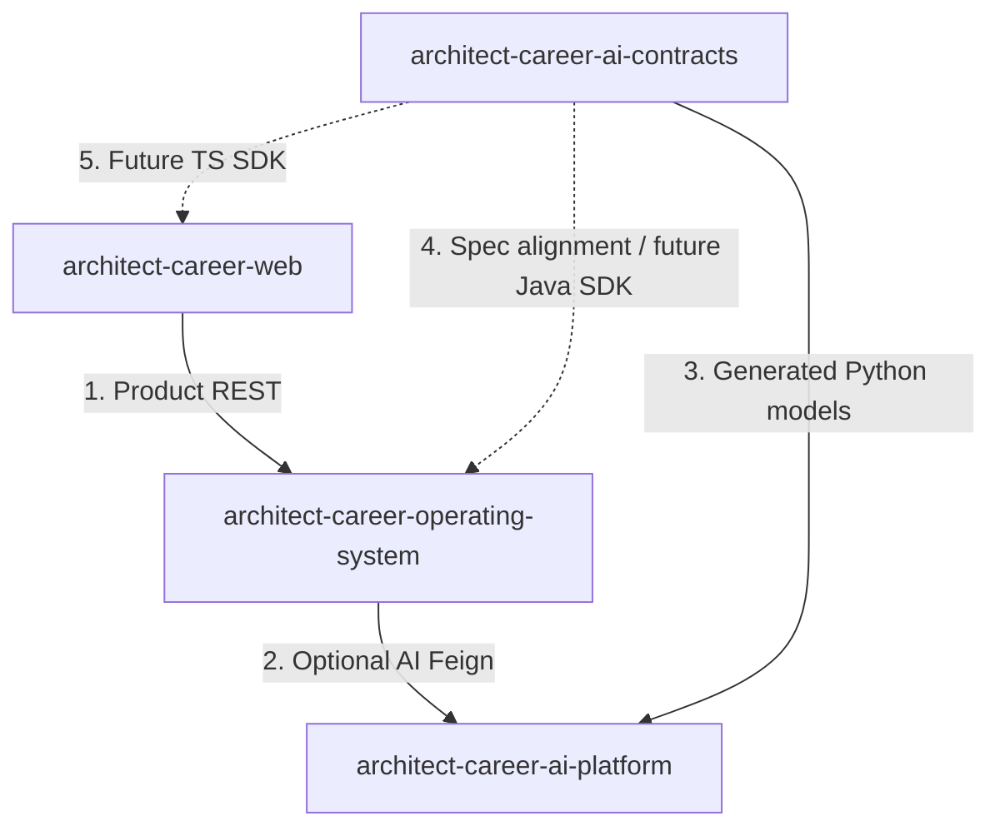
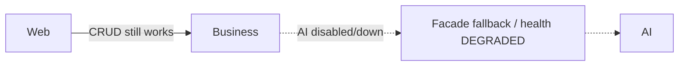
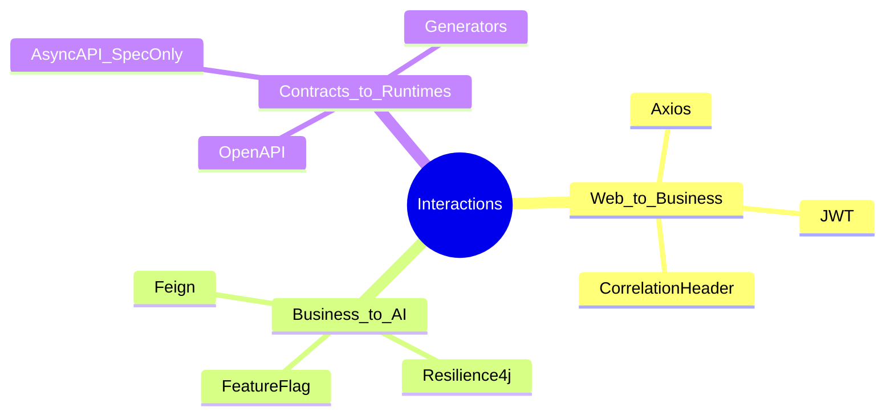

# Repository Interaction

## Interaction map

## Interaction catalog

| # | From → To | Mechanism | Implemented? |
| --- | --- | --- | --- |
| 1 | Web → Business | Axios `/api/v1/**` | Yes |
| 2 | Business → AI | OpenFeign `/api/v1/ai/**` | Yes (flag default off) |
| 3 | Contracts → AI | Generated models vendored/synced | Yes |
| 4 | Contracts → Business | Path/DTO alignment | Partial (hand Feign DTOs) |
| 5 | Contracts → Web | TS SDK | Future |
| 6 | Web → AI | Direct HTTP | **Forbidden / not implemented** |
| 7 | Business ↔ AI events | AsyncAPI bus | Future (spec only) |
| 8 | Business internal | Spring domain events | Yes (in-process) |

---

## Ownership of each hop

### Hop 1 — Web to Business

- Web owns UX and client state
- Business owns auth decision and domain invariants
- Contract between them is Spring-documented `/api/v1` + `ApiResponse` convention (not the AI contracts repo)

### Hop 2 — Business to AI

- Business owns when to call AI and how to degrade
- AI owns model execution and AI-side policy/guardrails
- Shape owned by AI OpenAPI contracts

### Hop 3 — Contracts to AI

- Build/sync time only
- Prevents Python handlers from inventing divergent payloads

---

## Failure isolation

Business remains useful without AI. AI outages should not block login or core CRUD.

---

## Technology stack view (interaction-centric)

---

## Interview discussion

### Why four repositories instead of two?

Separates product UX, product SoR, AI runtime, and schema governance—each with different change rates and skills.

### Alternatives

Monorepo — possible; current multi-repo matches independent packaging/CI realities (AI/Contracts already have GH Actions; Business/Web less so).

### Trade-offs

Cross-repo versioning discipline; temporary hand-maintained clients; documentation must track gaps (Web BFF).

### Evolution

Publish SDKs; enforce contract compatibility gates on Business builds; add event bus repo/ops later if needed.

### Scale

Independent scaling and failure domains per repository/runtime; contracts remain a build artifact, not a hotspot.

### Common questions

1. **Which repo is source of truth for AI paths?** `architect-career-ai-contracts`.
2. **Which repo is source of truth for user notes?** `architect-career-operating-system` + PostgreSQL.
