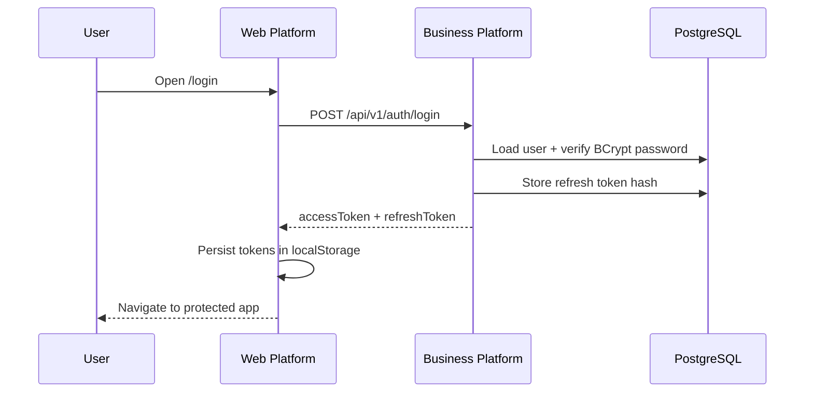
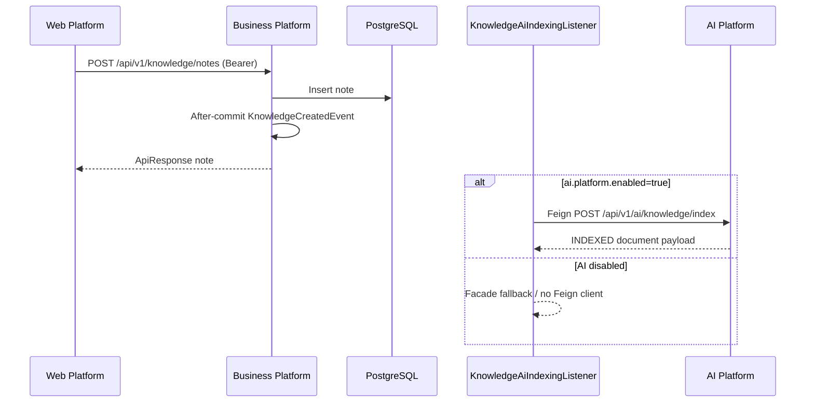
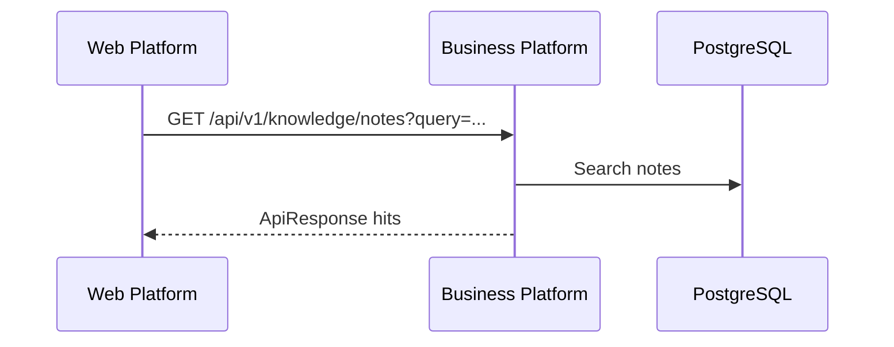
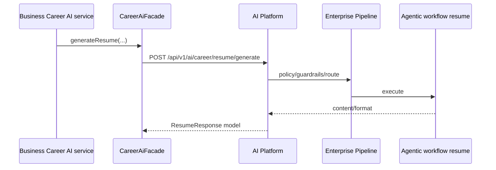
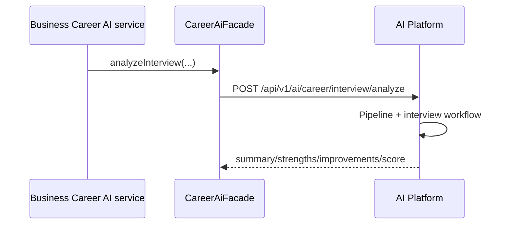
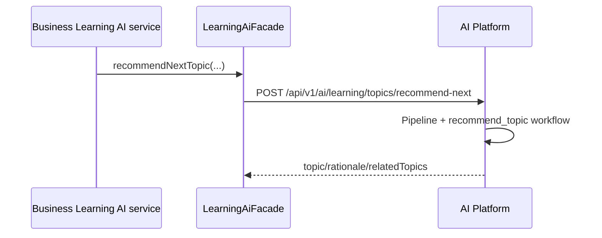
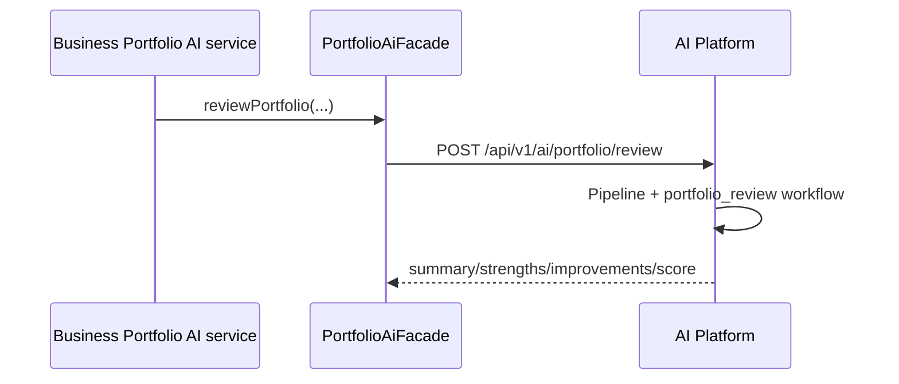

# Request Flows

Mermaid sequence diagrams for primary ACOS flows. Each diagram shows repository interactions as implemented.

---

## 1. User login



---

## 2. Create knowledge



---

## 3. Knowledge search (Business)



Vector RAG search is a separate AI API (`/api/v1/ai/knowledge/search`) used via Business AI facade paths—not the default notes list UI query.

---

## 4. AI chat

```mermaid
sequenceDiagram
  participant Web as Web Platform
  participant BP as Business Platform
  participant AI as AI Platform

  Web->>BP: POST /api/v1/integration/ai/chat/completions
  Note over Web,BP: Web client exists; Business BFF controller is largely future
  BP->>AI: (intended) proxy/Feign to /api/v1/ai/chat/completions
  AI->>AI: Enterprise pipeline + conversation workflow
  AI-->>BP: ChatCompletionResponse
  BP-->>Web: ApiResponse / BFF mapping
```

**Status:** AI Platform chat endpoint is implemented. Business Feign chat client/BFF and end-to-end Web chat backend wiring are **future enhancements** (Web currently also keeps local chat session state).

---

## 5. Resume generation



Web UI path depends on Business `/integration/ai/**` BFF completion.

---

## 6. Interview analysis



---

## 7. Learning recommendation



Related implemented AI learning endpoints: quiz generate, progress evaluate.

---

## 8. Portfolio review



Skill-gap analysis follows the same facade pattern to `/api/v1/ai/portfolio/skill-gap/analyze`.

---

## Repository interaction legend

| Participant | Repository |
| --- | --- |
| Web Platform | `architect-career-web` |
| Business Platform | `architect-career-operating-system` |
| AI Platform | `architect-career-ai-platform` |
| PostgreSQL | Business data plane |

Contracts participate at build/sync time, not in these runtime sequences.

---

## Interview discussion

### Why show “future” edges in sequence diagrams?

Interviewers must see seams that are designed but unfinished—especially Web AI BFF—without claiming production E2E AI UX.

### Alternatives

Omit incomplete flows — would hide the integration strategy.

### Trade-offs

Documentation complexity vs honesty.

### Evolution

Replace future notes with solid lines as BFF/Feign chat land; add AsyncAPI event sequences when brokered.

### Scale

Convert synchronous Feign AI assists into asynchronous job APIs for heavy resume/interview workloads; keep login/CRUD sequences short.

### Common questions

1. **Which flow never touches AI?** Login and pure Business CRUD searches.
2. **Which flow is eventually consistent?** Knowledge create → vector index.
3. **Where do contracts appear in sequences?** They don’t at runtime; they constrain AI request/response shapes used by Feign/AI handlers.
