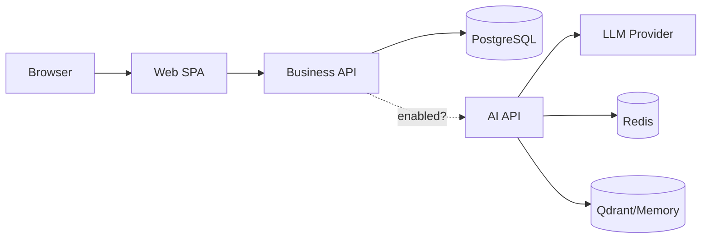
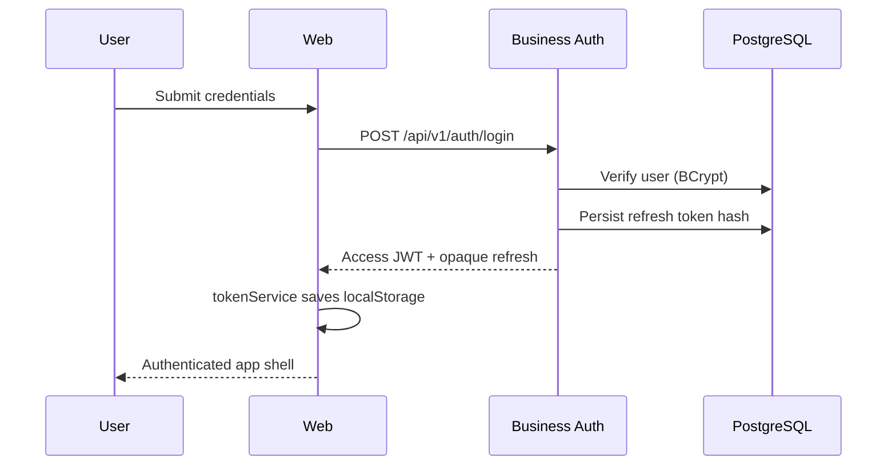
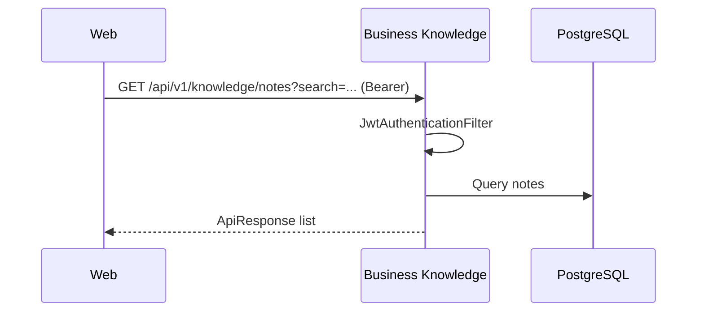
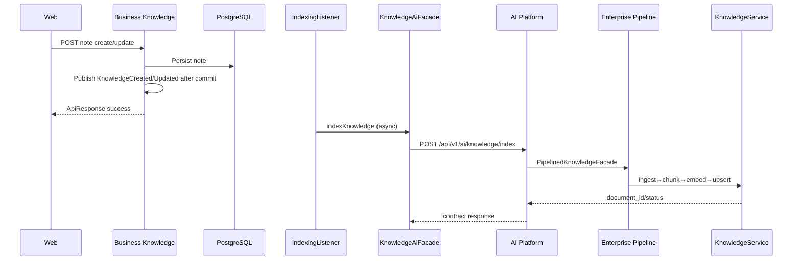
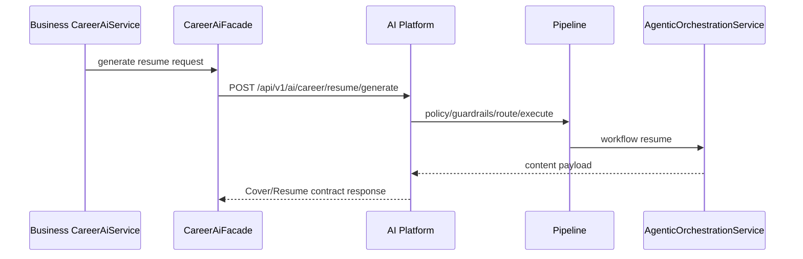
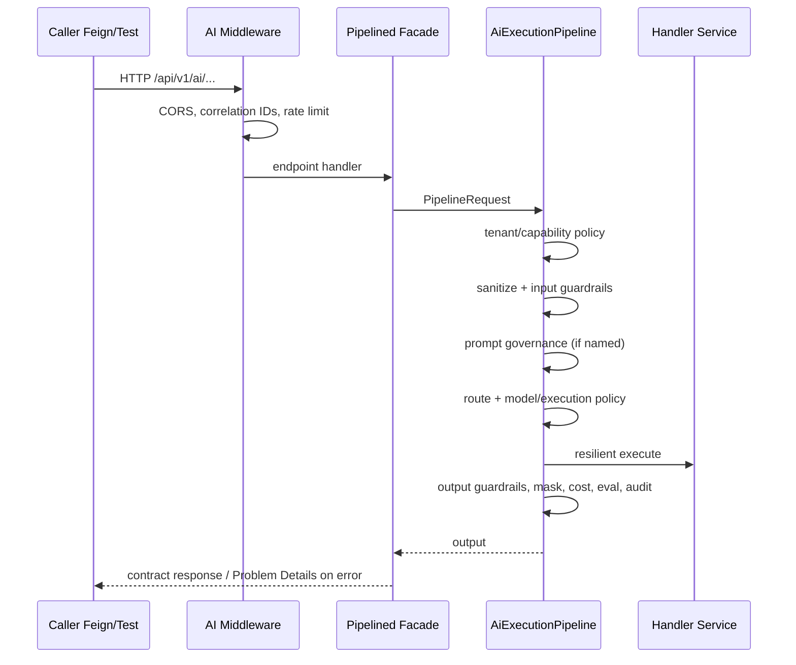
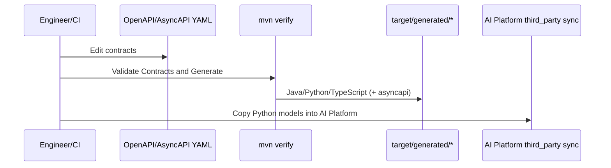

# Runtime Architecture

Runtime interactions among implemented containers and components.

## Runtime topology

---

## User login

Refresh: Web interceptor calls `POST /api/v1/auth/refresh` on 401, retries original request once.

---

## Knowledge search (product data)

This is **business search**, not vector RAG.

---

## Knowledge AI indexing (when AI enabled)

If `ai.platform.enabled=false`, Feign clients are not registered; facades use graceful fallbacks and indexing does not reach AI.

---

## Resume generation (AI path)

**Future enhancement:** Web-triggered path via Business `/integration/ai/**` BFF controllers (UI clients exist; public BFF largely missing).

---

## Interview analysis

Same pattern as resume: Business career AI service → `CareerAiFacade` → `POST /api/v1/ai/career/interview/analyze` → pipelined agentic workflow `interview`.

---

## Generic AI request (platform edge)

---

## Contract generation (build-time runtime)

Not part of user request latency.

---

## Interview discussion

### Why async indexing after commit?

Keeps note create/update responsive; AI failures should not roll back product persistence. Listener is `@Async`.

### Alternatives

Synchronous Feign in the request thread — simpler, but couples UX latency to LLM/embedding time.

### Trade-offs

Eventual consistency between notes and vector index; failure handler currently logs with future retry noted in code comments.

### Evolution

Outbox + broker + dedicated indexer workers; Web BFF for interactive AI tools.

### Scale

Separate index worker pool; rate-limit embedding calls; shard Qdrant collections per tenant.

### Common questions

1. **Does login touch AI?** No.
2. **Does knowledge list use Qdrant?** No — PostgreSQL. Qdrant is for AI RAG paths.
