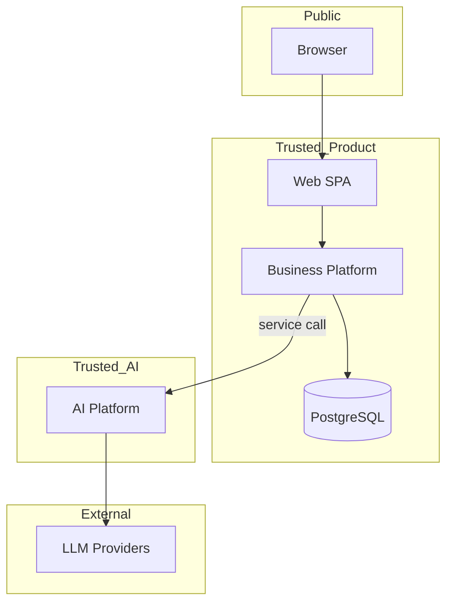
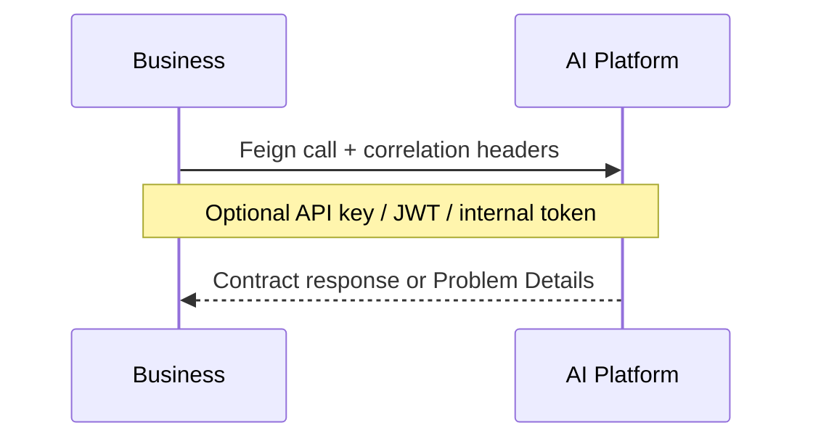

# Security Architecture

## Security boundaries

**Design intent:** browsers authenticate to Business Platform only; AI Platform is a service dependency of Business, not a public app identity plane.

---

## Authentication

### Business Platform (implemented)

| Mechanism | Detail |
| --- | --- |
| Login/Register | `POST /api/v1/auth/login`, `/register` |
| Access token | JWT (JJWT), default TTL 15m |
| Refresh token | Opaque UUID; **SHA-256 hash** stored in `acos.refresh_tokens` |
| Endpoints | `/refresh`, `/logout`, `/me` |
| Password hashing | BCrypt |
| Filter | `JwtAuthenticationFilter` before username/password filter |

Public permitAll: register/login/refresh, swagger, `/actuator/health/**`, `/actuator/info`.

### Web (implemented)

- Stores access/refresh tokens in **localStorage**
- Axios attaches Bearer token
- On 401, single-flight refresh; failure clears session and emits session-expired

**Future enhancement:** httpOnly secure cookie session (noted in Web token service comments).

### AI Platform (implemented, optional)

| Mechanism | Header | Default |
| --- | --- | --- |
| JWT bearer | `Authorization` | disabled |
| API key | `X-API-Key` | disabled |
| Internal service token | `X-Internal-Service` | empty |

When all disabled, `get_optional_principal` yields `None` and AI routes still run (local/dev). Production settings validation expects auth enabled + non-default JWT secret + non-wildcard CORS.

---

## Authorization

| Layer | Status |
| --- | --- |
| Business authenticated routes | Implemented (any authenticated user) |
| Role model USER/ADMIN | Present; seeded |
| Method security (`@PreAuthorize`) | Enabled infrastructure, **not broadly used on controllers** |
| Web role-gated routes | `ProtectedRoute` supports roles; **route table unused** |
| AI policy engine | Capability/tenant/model/execution policies in enterprise pipeline |

Fine-grained authorization is a **hardening future enhancement**.

---

## JWT

- Issued by Business Platform (`acos.jwt.*`)
- Consumed by Web and Business resource APIs
- AI may validate JWTs if enabled, but Business is the issuer/IdP for end users today

---

## API security

| Control | Business | AI |
| --- | --- | --- |
| TLS | Deployment concern (not enforced in local Compose) | Same |
| CORS | Defaults in Security config; Vite proxy avoids browser CORS in dev | `CORSMiddleware` from settings |
| Rate limiting | Not implemented as API middleware | In-memory `RateLimitMiddleware` (not multi-instance safe) |
| OpenAPI exposure | springdoc; swagger permitAll | `/docs` `/redoc` |
| Actuator | health/info public; metrics/prometheus authenticated | system metrics endpoint |

---

## Secrets

| Secret | Where configured |
| --- | --- |
| JWT signing secret | `ACOS_JWT_SECRET` / `acos.jwt.secret` |
| DB credentials | Spring datasource env |
| AI platform API key | `ai.platform.api-key` |
| LLM provider keys | AI `.env` / settings (`SecretStr` fields) |
| Qdrant API key | AI settings optional `SecretStr` |

No Vault/AWS SM integration is implemented in these repositories.

---

## Inter-service communication security

- Feign clients created only when enabled
- Resilience4j protects Business from AI instability
- Correlation ID propagated (`X-Correlation-Id`)

---

## AI security

| Control | Implementation |
| --- | --- |
| Guardrails | Heuristic PII/injection/jailbreak/moderation |
| Prompt sanitization | Control-char cleanup |
| Output masking | Regex data masker |
| Prompt governance | Versioned prompts; optional approve requirement |
| Policy engine | Max cost/tokens, allowlists, restricted prompts/tools |
| Tenant isolation flag | Soft policy when enabled |
| Enterprise pipeline audit | Success/failure audit events |

MCP/A2A are local stubs and do not introduce networked trust domains yet.

---

## Correlation Id / Trace Id

| ID | Business | Web | AI |
| --- | --- | --- | --- |
| Correlation ID | `CorrelationIdFilter` → MDC + response | Axios request header | Request context middleware |
| Request ID | — | — | Generated/propagated in AI context |
| Trace ID | — | — | Present in AI context; OTel provider optional |

Deep automatic tracing spans are **not fully instrumented** in AI application code.

---

## Security boundaries (summary)

1. **Browser trust boundary** ends at Business Platform.
2. **Product data boundary** is PostgreSQL via Business only.
3. **Model provider boundary** is AI Platform adapters.
4. **Contract boundary** defines AI request/response shapes without granting data-plane access.

---

## Interview discussion

### Why optional AI auth by default?

Local DX and testability. Production validation helpers exist to fail closed when `APP_ENV=production`.

### Alternatives

- Mutual TLS between Business and AI — stronger, not implemented
- API gateway policy centralization — future

### Trade-offs

- localStorage XSS token risk vs cookie complexity
- In-memory AI rate limits insufficient for horizontal scale
- Swagger publicly reachable on Business in current security config

### Evolution

1. Enable AI service auth in all non-dev environments.
2. Redis rate limiting + gateway WAF.
3. httpOnly cookies / BFF auth for Web.
4. Broader RBAC on career/admin operations.
5. Secret manager integration.

### Scale to millions of users

- Short-lived access tokens + scalable refresh store (DB/Redis)
- Edge rate limits before Business
- Per-tenant AI quotas in policy/cost layers
- Private networking for AI; no public model endpoints

### Common questions

1. **Where are passwords stored?** BCrypt hashes in Business DB.
2. **Are refresh tokens JWT?** No — opaque tokens with hashed persistence.
3. **Can AI impersonate users?** Only if Business forwards identity context and AI auth/policy allow; AI is not the user IdP.
