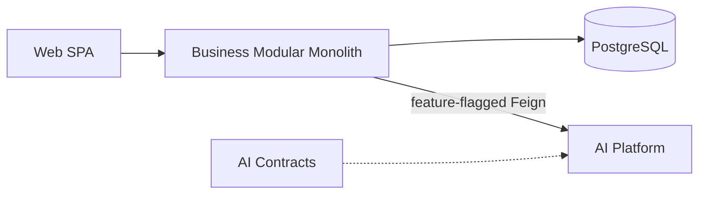

# ADR-001: Overall Architecture

# Status

Accepted

# Date

2026-08-10

# Context

ACOS must support career, knowledge, learning, portfolio, and AI-assisted workflows while remaining explainable as an enterprise architecture portfolio.

# Problem Statement

A single undifferentiated codebase would couple UI, transactional domains, and rapidly changing AI concerns, increasing blast radius and slowing delivery.

# Decision Drivers

- Maintainability
- Extensibility
- Security
- Operational Complexity
- Future AI Evolution
- Developer Experience

# Alternatives Considered

- **Single full-stack monolith including AI** — Rejected because LLM/RAG ecosystems and domain CRUD have different change rates and scaling profiles.
- **Microservices per domain from day one** — Rejected as premature distribution for tightly related career data and small team velocity.
- **Browser calling AI providers directly** — Rejected due to secret leakage and missing product authorization boundary.

# Decision

Adopt a multi-runtime architecture: React Web → Spring Boot Business Platform (modular monolith + PostgreSQL) → optional Python AI Platform, with AI Contracts as schema SoT. Web never calls AI directly.

# Architecture Diagram

# Positive Consequences

- Clear ownership boundaries across product, UI, AI, and contracts.
- Business CRUD works with AI disabled.
- AI can evolve providers without rewriting domain schemas.

# Negative Consequences

- Two application runtimes to operate (Java + Python).
- Cross-repo versioning and integration gaps (e.g., Web AI BFF incomplete).

# Trade-offs

- Higher initial structural complexity for long-term isolation and interviewability.

# Risks

- Teams may treat stubs/specs (AsyncAPI, MCP) as shipped capabilities.

# Future Evolution

- Complete Business AI BFF; brokered events; unified packaging/K8s.

# References

- `architect-career-web`
- `architect-career-operating-system`
- `architect-career-ai-platform`
- `architect-career-ai-contracts`

## Interview Discussion

### Why was this approach selected?

It separates transactional consistency from AI volatility while keeping a single product API for the browser.

### When would you choose another approach?

Choose a smaller monolith if AI is trivial or a team cannot operate two stacks.

### How would this decision change for 10x / 100x / 1000x users?

10x: scale Business/AI horizontally. 100x: add async AI workers and DB replicas. 1000x: shard data, private AI clusters, gateway policies, event backbone.

### Common Principal Architect interview questions

**Q1. Why not microservices first?**

Domains share transactions and product semantics; modular monolith defers network cost until seams prove hot.

**Q2. What is the system of record?**

PostgreSQL via Business Platform. Vectors are projections, not career SoR.

### Common follow-up questions

- How do you prevent AI outages from blocking login?
- Where do secrets live?

