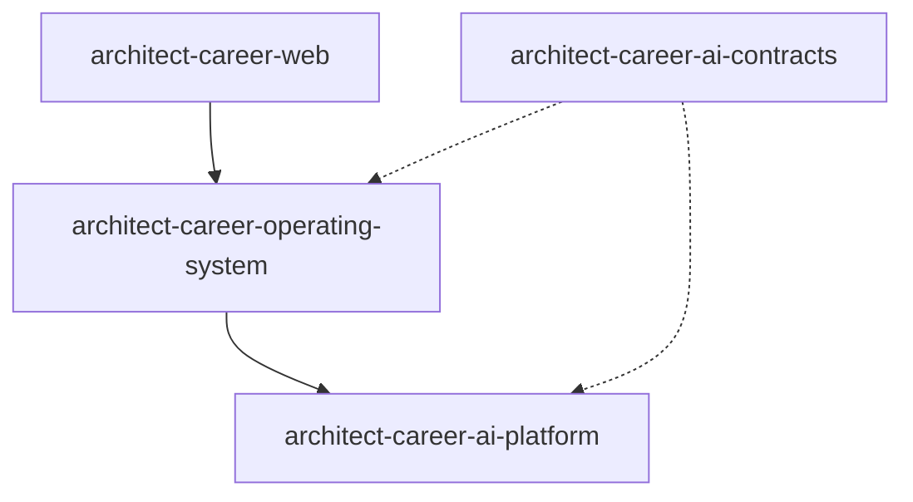

# ADR-002: Repository Strategy

# Status

Accepted

# Date

2026-08-10

# Context

ACOS spans UI, business APIs, AI runtime, and contract generation with different languages and CI needs.

# Problem Statement

A single repository would force mixed tooling and unclear ownership; too many repos would fragment delivery without clear boundaries.

# Decision Drivers

- Maintainability
- Developer Experience
- Operational Complexity
- Future AI Evolution

# Alternatives Considered

- **Monorepo for all ACOS code** — Possible, but current independent packaging/CI (especially AI + Contracts) favored multi-repo.
- **One repo per Spring domain microservice** — Rejected; Business remains a modular monolith.
- **Contracts inside AI Platform only** — Rejected; Java/Web consumers need a language-agnostic SoT.

# Decision

Use four primary repositories: operating-system (Business), web, ai-platform, ai-contracts. Sibling repos may exist but are outside the core runtime path unless wired.

# Architecture Diagram

# Positive Consequences

- Independent versioning and CI for contracts/AI.
- Matches skill boundaries (React/Java/Python).

# Negative Consequences

- Cross-repo sync overhead for contracts and BFF alignment.

# Trade-offs

- Documentation must track integration gaps honestly across repos.

# Risks

- Duplicate DTO definitions until generated SDKs are fully adopted.

# Future Evolution

- Publish SDKs to a registry; enforce contract gates on Business builds.

# References

- `architect-career-web`
- `architect-career-operating-system`
- `architect-career-ai-platform`
- `architect-career-ai-contracts`

## Interview Discussion

### Why was this approach selected?

Repositories mirror deployable/governance boundaries, not arbitrary folder splits.

### When would you choose another approach?

Use a monorepo when one CI orthodoxy and atomic cross-cutting PRs dominate.

### How would this decision change for 10x / 100x / 1000x users?

Scale does not require more repos; it requires clearer APIs and independent deployability of existing ones.

### Common Principal Architect interview questions

**Q1. How do you version across repos?**

AI contracts aggregate v1 + sync into AI Platform; Business Feign paths align by convention today.

### Common follow-up questions

- Would you merge Web and Business?
- When do you create a fifth repo?

