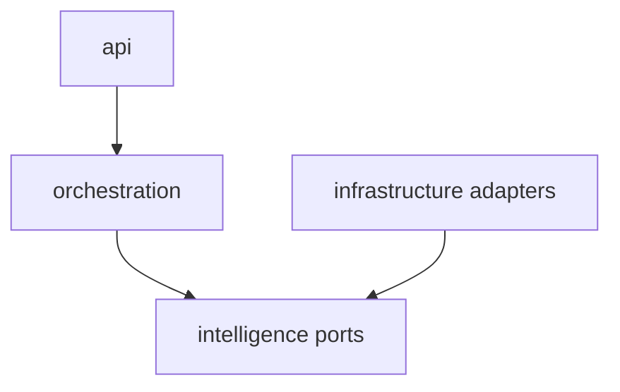

# ADR-003: Clean Architecture

# Status

Accepted (AI Platform); Partial (Business Platform)

# Date

2026-08-10

# Context

AI providers and vector stores change frequently. Business domains need fast Spring delivery.

# Problem Statement

Embedding vendor SDKs into use cases locks the system to one provider and complicates testing.

# Decision Drivers

- Maintainability
- Extensibility
- Future AI Evolution
- Developer Experience

# Alternatives Considered

- **Vendor calls directly from controllers** — Rejected for AI; creates untestable, non-swappable edges.
- **Strict hexagonal for Business Platform** — Not fully adopted; layered Spring packaging chosen for velocity.
- **No ports—only settings conditionals** — Rejected; still leaks vendor types into orchestration.

# Decision

Apply Clean/hexagonal architecture rigorously on the AI Platform (`api` → `orchestration` → `intelligence` ports ← `infrastructure` adapters). Business Platform uses pragmatic controller→service→repository layering with an AI anti-corruption layer.

# Architecture Diagram

# Positive Consequences

- AI providers swappable via factories.
- Local hashing/memory adapters enable tests without cloud keys.

# Negative Consequences

- More types/wiring in AI.
- Business is not a pure hexagonal showcase.

# Trade-offs

- Honesty over dogma: different styles per runtime based on change rate.

# Risks

- Interview narratives claiming full Clean Architecture everywhere would be inaccurate.

# Future Evolution

- Extract stricter application services in Business if domain rules thicken.

# References

- `architect-career-ai-platform/app`
- `architect-career-operating-system/src/main/java/com/acos`

## Interview Discussion

### Why was this approach selected?

Clean Architecture is applied where vendor volatility is highest (AI).

### When would you choose another approach?

Prefer classic Spring layering for CRUD-heavy modules with stable persistence models.

### How would this decision change for 10x / 100x / 1000x users?

At extreme scale, ports remain; adapters multiply (queues, sharded stores).

### Common Principal Architect interview questions

**Q1. Is ACOS Clean Architecture?**

AI yes; Business layered modular monolith—state that explicitly.

### Common follow-up questions

- Show a port and its adapter.
- How do tests avoid OpenAI?

