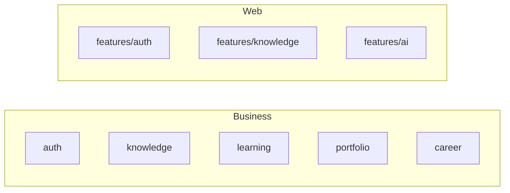

# ADR-005: Package by Feature

# Status

Accepted

# Date

2026-08-10

# Context

Both Business and Web expose multiple product pillars that evolve somewhat independently.

# Problem Statement

Technical-layer-only packaging (all controllers together) obscures feature ownership and slows navigation.

# Decision Drivers

- Maintainability
- Developer Experience
- Extensibility

# Alternatives Considered

- **Package by technical layer only** — Rejected as primary structure; harder feature ownership.
- **Micro-frontends / multi-module Maven per feature** — Rejected as heavy for current scale.

# Decision

Business Platform packages by domain under `com.acos.*`. Web uses feature-sliced `src/features/*` with thin pages. AI Platform uses architectural layers because it is capability infrastructure, not product CRUD features.

# Architecture Diagram

# Positive Consequences

- Feature teams can locate code quickly.
- Aligns UI features to backend domains.

# Negative Consequences

- Cross-cutting concerns need shared kits (`common`, `shared`).

# Trade-offs

- Some duplication of patterns across feature packages.

# Risks

- Shared utilities become a dumping ground.

# Future Evolution

- Enforce module boundaries with ArchUnit/ESLint boundaries if coupling rises.

# References

- `architect-career-operating-system/src/main/java/com/acos`
- `architect-career-web/src/features`

## Interview Discussion

### Why was this approach selected?

Features are the primary change units for product delivery.

### When would you choose another approach?

Prefer technical packaging for thin infrastructure libraries (as AI Platform does).

### How would this decision change for 10x / 100x / 1000x users?

At 1000x org scale, package-by-feature becomes bounded contexts/services—not before.

### Common Principal Architect interview questions

**Q1. Why is AI not package-by-feature?**

It is a platform; features are capabilities/workflows behind ports.

### Common follow-up questions

- How do you prevent cyclic feature deps?

