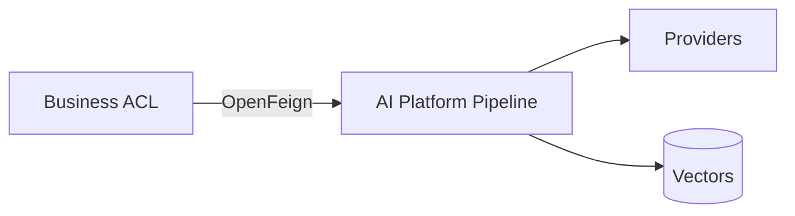

# ADR-006: Separate AI Platform

# Status

Accepted

# Date

2026-08-10

# Context

ACOS needs RAG, agent workflows, provider abstraction, and AI governance without destabilizing career CRUD.

# Problem Statement

Embedding model orchestration inside Spring couples product releases to AI experimentation and complicates Python-centric AI libraries.

# Decision Drivers

- Future AI Evolution
- Maintainability
- Scalability
- Security
- Operational Complexity

# Alternatives Considered

- **AI modules inside Business Platform** — Rejected due to ecosystem and scaling mismatch.
- **SaaS-only AI with no in-house platform** — Rejected; ACOS aims to demonstrate governed enterprise AI architecture.
- **Serverless functions per prompt** — Rejected as primary design; harder unified policy/pipeline.

# Decision

Run a dedicated FastAPI AI Platform consumed by Business via Feign, feature-flagged (`ai.platform.enabled` default false).

# Architecture Diagram

# Positive Consequences

- Independent deploy/scale.
- Business remains useful offline from AI.
- Central AI middleware.

# Negative Consequences

- Dual ops model.
- BFF completeness lag for Web AI UX.

# Trade-offs

- More moving parts for stronger isolation.

# Risks

- Teams bypass Business and call AI from Web—explicitly forbidden by architecture.

# Future Evolution

- Private networking only; worker pools for embedding/LLM.

# References

- `architect-career-ai-platform`
- `architect-career-operating-system/.../integration`

## Interview Discussion

### Why was this approach selected?

AI change velocity and dependency graph differ from transactional domains.

### When would you choose another approach?

Keep AI in-process only for tiny prototypes with one provider.

### How would this decision change for 10x / 100x / 1000x users?

Scale AI horizontally and asynchronously; keep Business thread pools shielded via bulkheads.

### Common Principal Architect interview questions

**Q1. How do you degrade?**

Facades/fallbacks when disabled; Resilience4j when enabled.

### Common follow-up questions

- Who owns prompts?
- Where do API keys live?

