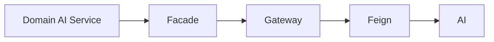

# ADR-009: OpenFeign Integration

# Status

Accepted

# Date

2026-08-10

# Context

Business Platform must call many similarly shaped AI endpoints with resilience.

# Problem Statement

Handwritten low-level HTTP for each AI route increases boilerplate and inconsistent error handling.

# Decision Drivers

- Developer Experience
- Maintainability
- Operational Complexity
- Performance

# Alternatives Considered

- **Spring WebClient only** — Viable but more verbose for large endpoint sets.
- **Apache HttpClient custom SDK** — Rejected; reinventing Feign/resilience integration.
- **Message queue for all AI calls** — Rejected for interactive request/response paths.

# Decision

Use Spring Cloud OpenFeign clients behind Facade/Gateway ACL, enabled only when `ai.platform.enabled=true`, protected by Resilience4j (`ai-platform` instance).

# Architecture Diagram

# Positive Consequences

- Declarative clients.
- Central resilience and feature flag.
- Graceful fallbacks when disabled.

# Negative Consequences

- Conditional beans complicate local mental model.
- Chat Feign client not present yet.

# Trade-offs

- Magic proxies vs explicit WebClient control.

# Risks

- Thread pool saturation if AI latency spikes without bulkheads sized correctly.

# Future Evolution

- Generated Feign interfaces from contracts; add chat client + BFF.

# References

- `architect-career-operating-system/.../integration/client`
- `architect-career-operating-system/.../integration/facade`

## Interview Discussion

### Why was this approach selected?

Feign fits many parallel AI POST contracts and Spring Cloud resilience.

### When would you choose another approach?

Prefer WebClient for streaming responses when implemented.

### How would this decision change for 10x / 100x / 1000x users?

At high fan-out, move heavy AI to async commands; keep Feign for short interactive calls.

### Common Principal Architect interview questions

**Q1. How is AI disabled?**

Property flag prevents Feign client registration; facades fallback.

### Common follow-up questions

- Which Resilience4j policies are applied?

