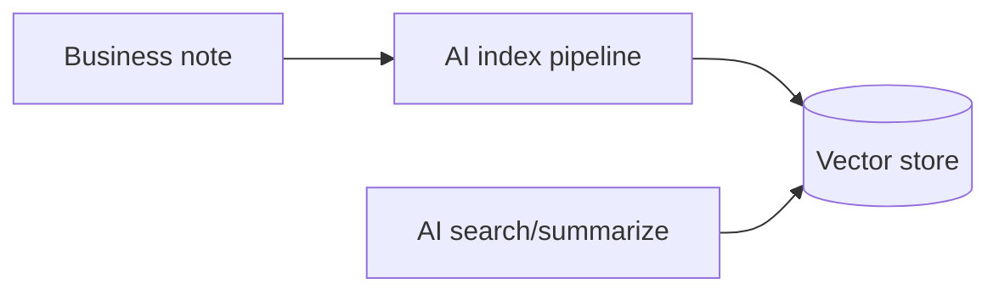

# ADR-012: Enterprise RAG

# Status

Accepted

# Date

2026-08-10

# Context

Knowledge notes must be searchable semantically and summarizable without putting vectors in the Business DB.

# Problem Statement

Keyword-only PostgreSQL search cannot support embedding-based retrieval and grounded summarization.

# Decision Drivers

- Extensibility
- Performance
- Future AI Evolution
- Maintainability

# Alternatives Considered

- **pgvector inside Business PostgreSQL** — Fewer systems, but couples AI lifecycle to OLTP schema.
- **External managed RAG SaaS only** — Less architectural control for portfolio demonstration.
- **LLM-only summarization without retrieval** — Hallucination risk; rejected as sole approach.

# Decision

Implement RAG orchestration in AI `KnowledgeService` (ingest→preprocess→chunk→embed→upsert; retrieve→rerank→respond). Business sends content via Feign; defaults use hashing embeddings + memory store; Qdrant optional.

# Architecture Diagram

# Positive Consequences

- Clear projection model.
- Local deterministic mode for tests.
- Enterprise pipeline wraps RAG calls.

# Negative Consequences

- Index lag vs note commit.
- Dual search concepts (Business SQL vs AI vector).

# Trade-offs

- Operational complexity for better AI quality and isolation.

# Risks

- Users confuse Business note search with RAG search.

# Future Evolution

- Reliable retry/outbox for indexing; tenant-partitioned collections.

# References

- `architect-career-ai-platform/app/orchestration/knowledge/service.py`
- `architect-career-operating-system/.../KnowledgeAiIndexingListener.java`

## Interview Discussion

### Why was this approach selected?

RAG is a projection pipeline owned by AI, not a Business schema concern.

### When would you choose another approach?

Use pgvector when ops cannot afford another store and retrieval needs are modest.

### How would this decision change for 10x / 100x / 1000x users?

Scale with async index workers, sharded vector DB, and cache invalidation on reindex.

### Common Principal Architect interview questions

**Q1. What is authoritative note content?**

PostgreSQL via Business Platform.

### Common follow-up questions

- Why delete_by_document before upsert?

