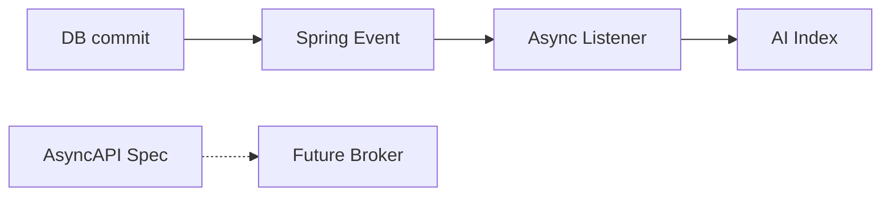

# ADR-027: Async Events Strategy

# Status

Accepted (pragmatic dual-track)

# Date

2026-08-10

# Context

Some AI work (indexing) should not block note persistence, and future cross-service events need names.

# Problem Statement

Synchronous AI in the request path harms UX; introducing Kafka immediately adds ops cost before necessity.

# Decision Drivers

- Performance
- Operational Complexity
- Future AI Evolution
- Maintainability

# Alternatives Considered

- **Always synchronous Feign in request thread** — Rejected for indexing.
- **Kafka from day one** — Rejected as mandatory dependency at current stage.
- **No events—poll DB** — Rejected for coupling/latency.

# Decision

Use in-process Spring domain events + `@Async` listeners for knowledge indexing today. Maintain AsyncAPI channel definitions for future brokered integration without implementing the bus yet.

# Architecture Diagram

# Positive Consequences

- Responsive CRUD.
- Clear future event vocabulary.
- Low ops burden now.

# Negative Consequences

- No cross-process replay.
- Listener failures need better retry story.
- Specs can outpace runtime.

# Trade-offs

- Simplicity now vs eventual consistency tooling later.

# Risks

- Assuming AsyncAPI means Kafka is live.

# Future Evolution

- Outbox + broker; wire AsyncAPI channels for indexed/failed.

# References

- `architect-career-operating-system/.../KnowledgeAiIndexingListener.java`
- `architect-career-ai-contracts/asyncapi`

## Interview Discussion

### Why was this approach selected?

Async inside the monolith first; broker when cross-service fan-out appears.

### When would you choose another approach?

Start with Kafka if multiple consumers already exist across teams.

### How would this decision change for 10x / 100x / 1000x users?

At 100x indexing volume, broker + workers become the default path.

### Common Principal Architect interview questions

**Q1. What happens if indexing fails?**

Logged; durable retry is future work.

### Common follow-up questions

- Why after-commit publishing?

