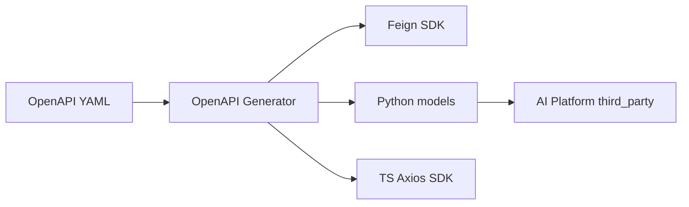

# ADR-030: Code Generation

# Status

Accepted

# Date

2026-08-10

# Context

Multiple languages consume AI schemas; hand-writing all clients does not scale.

# Problem Statement

Manual SDKs drift from OpenAPI and slow onboarding of new consumers.

# Decision Drivers

- Maintainability
- Developer Experience
- Extensibility

# Alternatives Considered

- **Handwritten SDKs only** — Rejected as end state.
- **Generate from runtime FastAPI only** — Rejected; contracts repo is SoT, not reverse engineering.
- **Shared source proto** — Not chosen; OpenAPI already adopted.

# Decision

Generate Java Feign, Python, and TypeScript artifacts from AI Contracts via OpenAPI Generator in Maven/CI. AI Platform vendors generated Python models. Business/Web adoption of generated artifacts is partial/future.

# Architecture Diagram

# Positive Consequences

- Repeatable multi-language outputs.
- CI artifact upload path exists.

# Negative Consequences

- Generated code not fully consumed by Business/Web yet.
- Registry publish still commented/future.

# Trade-offs

- Generator quirks vs drift reduction.

# Risks

- Two sources of truth if hand DTOs diverge.

# Future Evolution

- Publish packages; make Business/Web depend on generated SDKs.

# References

- `architect-career-ai-contracts/generator`
- `architect-career-ai-contracts/.github/workflows/validate-and-generate.yml`
- `architect-career-ai-platform/scripts/sync_contracts.py`

## Interview Discussion

### Why was this approach selected?

Generate from contracts outward—never reverse-engineer production as SoT.

### When would you choose another approach?

Handwrite only while spike-testing a single consumer.

### How would this decision change for 10x / 100x / 1000x users?

At many consumers, artifact registries and compatibility tests become mandatory.

### Common Principal Architect interview questions

**Q1. Where do generated files live?**

Under contracts `target/generated`; AI vendors Python copy.

### Common follow-up questions

- Why not commit generated code?

