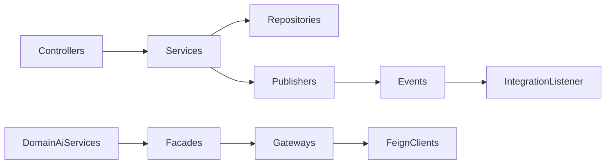

# Business Domain Architecture

This document describes each business domain as implemented under `com.acos.*`.

## Authentication

### Responsibilities

Register users, authenticate with email/password, issue JWT access + opaque refresh tokens, rotate/revoke refresh tokens, expose current user profile.

### Primary entities

| Entity | Table | Notes |
| --- | --- | --- |
| `User` | `acos.users` | Email unique; BCrypt password hash; enabled flag |
| `Role` | `acos.roles` | `RoleType` enum: `USER`, `ADMIN` |
| Join | `acos.user_roles` | Many-to-many |
| `RefreshToken` | `acos.refresh_tokens` | Stores **hash** of opaque token, expiry, user FK |

### Business services

- `AuthService` / `AuthServiceImpl` — register, login, refresh, logout, current user
- `TokenService` / `TokenServiceImpl` — access JWT + refresh lifecycle
- `JwtTokenProvider` — JJWT create/parse/validate
- `UserDetailsService` implementation loading `AcosUserDetails`

### REST APIs (`/api/v1/auth`)

| Method | Path | Auth |
| --- | --- | --- |
| POST | `/register` | Public |
| POST | `/login` | Public |
| POST | `/refresh` | Public (refresh token body) |
| GET | `/me` | Bearer JWT |
| POST | `/logout` | Bearer JWT + refresh token body |

### Dependencies

PostgreSQL; Spring Security; JWT properties `acos.jwt.*`.

### Future AI integration

None directly. Auth is prerequisite for all AI-bearing product calls.

---

## Career

### Responsibilities

Track job search: companies, recruiters, applications, interviews, offers, status history, audit logs, career dashboard aggregates, application status state machine, search/filter.

### Primary entities

| Entity | Table |
| --- | --- |
| `Company` | `career_companies` |
| `Recruiter` | `career_recruiters` |
| `JobApplication` | `career_job_applications` |
| `Interview` | `career_interviews` |
| `Offer` | `career_offers` |
| `ApplicationStatusHistory` | `career_application_status_history` |
| `CareerAuditLog` | `career_audit_logs` |

Soft-archive (`archived` / `archived_at` + `archive()`) applies across these career aggregates (not applications alone). Status transitions are governed by `ApplicationStateMachine` / `ApplicationStateValidator`: DRAFT → APPLIED → SCREENING → TECHNICAL_INTERVIEW → MANAGER_INTERVIEW → HR_INTERVIEW → OFFER → (ACCEPTED | DECLINED); REJECTED / WITHDRAWN from non-terminal statuses; ACCEPTED, DECLINED, REJECTED, WITHDRAWN are terminal.

### Business services

`CompanyService`, `RecruiterService`, `JobApplicationService`, `InterviewService`, `OfferService`, `CareerDashboardService`, `CareerAuditService`; `CareerAiService` for facade-backed AI (resume / cover letter / interview analysis) without public BFF controllers yet. `CareerAiService.recommendCareer(...)` is an **extension stub** (`Optional.empty()`).

### REST APIs

| Base path | Operations |
| --- | --- |
| `/api/v1/career/companies` | CRUD list |
| `/api/v1/career/recruiters` | CRUD list |
| `/api/v1/career/applications` | CRUD, archive listing, search, status PATCH, history, timeline |
| `/api/v1/career/applications/{id}/interviews` | Nested CRUD |
| `/api/v1/career/applications/{id}/offers` | Nested CRUD |
| `/api/v1/career/dashboard` | Aggregate career dashboard for current user |

### Dependencies

Auth principal UUID as owner; Specifications for search; domain events for status/interview/offer lifecycle.

### Future AI integration

`CareerAiClient` → resume generate, interview analyze, cover letter generate. Exposed today via integration facades/gateways and `CareerAiService`, not Web-facing BFF controllers.

---

## Knowledge

### Responsibilities

User-owned markdown notes with categories and tags; list/search; publish domain events for AI indexing after commit.

### Primary entities

| Entity | Table |
| --- | --- |
| `KnowledgeNote` | `knowledge_notes` |
| `Category` | `categories` |
| `Tag` | `tags` |
| Join | `knowledge_note_tags` |

### Business services

`KnowledgeService` / `KnowledgeServiceImpl`; `KnowledgeAiService` (search/summarize via facade).

### REST APIs (`/api/v1/knowledge/notes`)

POST create, PUT update, DELETE, GET by id, GET page, GET `/search`.

### Dependencies

Owner scoping; validators/limits from `acos.knowledge.*`; `AfterCommitEventPublisher` → `KnowledgeCreatedEvent` / `KnowledgeUpdatedEvent`.

### Future AI integration

**Implemented path:** `KnowledgeAiIndexingListener` (@Async) → `KnowledgeAiFacade.indexKnowledge`.  
**Facade-ready, no BFF yet:** semantic search and summarize.

---

## Learning

### Responsibilities

Hierarchical learning plans with milestones and topics; status transitions; completion events.

### Primary entities

| Entity | Table |
| --- | --- |
| `LearningPlan` | `learning_plans` |
| `LearningMilestone` | `learning_milestones` |
| `LearningTopic` | `learning_topics` |

### Business services

Plan/milestone/topic services; `LearningAiService` for quiz/recommend/evaluate via facade.

### REST APIs

| Base | Operations |
| --- | --- |
| `/api/v1/learning/plans` | CRUD + list |
| `/api/v1/learning/plans/{planId}/milestones` | Nested CRUD |
| `/api/v1/learning/plans/{planId}/milestones/{milestoneId}/topics` | Nested CRUD + status PATCH |

### Dependencies

Owner isolation; `acos.learning.*` page/size limits; `LearningPlanCompletedEvent`.

### Future AI integration

Feign: quiz generate, recommend next topic, evaluate progress — facade ready, BFF pending.

---

## Portfolio

### Responsibilities

Projects (with technologies), skills, certifications, achievements; project search.

### Primary entities

| Entity | Table |
| --- | --- |
| `PortfolioProject` | `portfolio_projects` |
| `Technology` | `portfolio_technologies` |
| Join | `portfolio_project_technologies` |
| `Skill` | `portfolio_skills` |
| `Certification` | `portfolio_certifications` |
| `Achievement` | `portfolio_achievements` |

### Business services

Per-resource services; `PortfolioAiService` for review/skill-gap via facade. `PortfolioAiService.generateProjectSummary(...)` is an **extension stub** (`Optional.empty()`).

### REST APIs

`/api/v1/portfolio/projects` (+ `/search`), `/skills`, `/technologies`, `/certifications`, `/achievements` — each with CRUD list patterns.

### Dependencies

Owner isolation; `acos.portfolio.*` limits; `PortfolioUpdatedEvent` on project changes.

### Future AI integration

Feign: portfolio review, skill-gap analyze — facade ready, BFF pending.

---

## Dashboard

### Responsibilities

Return a single summary payload for the authenticated user’s home dashboard.

### Primary entities

None persisted. Mapper builds response from email + `acos.dashboard.*` configuration values.

### Business services

`DashboardService` / `DashboardServiceImpl` — **explicitly does not query the database**.

### REST APIs

`GET /api/v1/dashboard`

### Dependencies

Auth principal email; `DashboardProperties`.

### Future AI integration

None. Future work is live aggregation from domain repositories (see Future Enhancements).

---

## Shared components

| Area | Package / types | Role |
| --- | --- | --- |
| API envelope | `ApiResponse`, `ApiError` | Uniform success/failure + correlationId |
| Exceptions | `BusinessException`, `ErrorCode`, resource/validation exceptions | Typed failures |
| Handler | `GlobalExceptionHandler` | Maps to HTTP + envelope |
| Persistence | `BaseEntity` | UUID id, created/updated, `@Version` |
| Events | `AfterCommitEventPublisher` | Publish only after successful commit |
| Logging | `CorrelationIdFilter` | `X-Correlation-Id` → MDC |
| Config | `com.acos.config` | Async, JPA auditing, OpenAPI, CORS, etc. |

### Analytics

`com.acos.analytics` contains only `package-info.java` — **not an implemented domain**.

---

## Cross-domain dependency rules

1. Domains depend on `common` and authenticated identity; they do **not** call sibling domain services for routine CRUD.
2. Domains may depend on `integration` facades via thin `*.ai.*AiService` classes — never on Feign clients directly (documented in Knowledge AI service Javadoc; same pattern elsewhere).
3. `integration` may listen to domain events (knowledge indexing) but must not own product tables.
4. `dashboard` must not become a hidden query god-object until explicitly redesigned for live metrics.

## Interview Discussion

### Why this architecture?

Bounded contexts map to user mental models (career vs learning vs knowledge) while sharing one database and one security model — ideal for a modular monolith.

### Alternative approaches

Separate deployables per domain; shared kernel libraries; CQRS read models for dashboard. Rejected or deferred based on current size and honesty about placeholder dashboard metrics.

### Trade-offs

Nested REST for learning/career children is explicit but verbose. Soft-archive covers the career aggregate set (`archived` / `archived_at`), while knowledge/learning/portfolio use hard delete — intentional per-domain choice, not a global soft-delete framework.

### Scaling considerations

Per-owner indexes already exist in Flyway. Cross-domain analytics will need read models or scheduled aggregations before the dashboard can leave placeholder mode.

### Principal Architect interview questions

**Q1. Is Dashboard a real aggregate?**  
API yes; analytics no — configured placeholders only.

**Q2. How is AI coupled to Knowledge?**  
After-commit domain events → async listener → facade; CRUD transaction never waits on AI.

**Q3. Where is authorization enforced?**  
Authentication at the filter chain; resource isolation by `ownerId` in services/repositories. Roles exist (`USER`/`ADMIN`) with method security enabled, but domain APIs primarily rely on ownership, not fine-grained `@PreAuthorize` rules.
