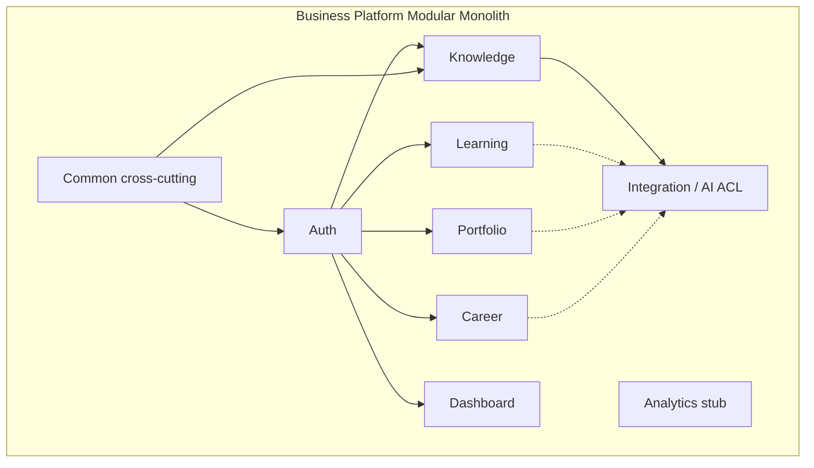

# Business Platform Overview

## Purpose

The Business Platform (`architect-career-operating-system`) is the **system of record and product API** for ACOS. It authenticates users, enforces ownership boundaries, persists career/knowledge/learning/portfolio data in PostgreSQL, and optionally calls the AI Platform through an anti-corruption layer.

It is a **modular monolith**: one Spring Boot deployable, multiple feature packages under `com.acos`.

## Responsibilities

| Responsibility | Implementation evidence |
| --- | --- |
| Product REST API for the Web SPA | Controllers under `/api/v1/**` |
| Authentication & session | JWT access tokens + opaque hashed refresh tokens |
| Multi-domain CRUD | Auth, Knowledge, Learning, Portfolio, Career |
| User isolation | `ownerId` / principal scoping on domain services |
| Schema evolution | Flyway migrations `V1`–`V12` in schema `acos` |
| AI gateway / ACL | `com.acos.integration` Feign clients, facades, gateways, Resilience4j |
| Cross-cutting API quality | `ApiResponse`, `GlobalExceptionHandler`, correlation ID |
| Operational probes | Actuator health/info/metrics/prometheus |

**Not** this platform’s responsibility: browser UI, LLM orchestration, vector stores, or OpenAPI generation for AI contracts (those live in sibling repos).

## Technology Stack

| Area | Choice (implemented) |
| --- | --- |
| Language / runtime | Java 21 |
| Framework | Spring Boot 3.5.16 |
| Web / validation | spring-boot-starter-web, validation |
| Security | Spring Security 6, JJWT 0.12.6, BCrypt passwords |
| Persistence | Spring Data JPA, Hibernate, Flyway, PostgreSQL driver |
| Mapping | MapStruct 1.6.3 |
| API docs | springdoc-openapi 2.8.x (Swagger UI) |
| Integration | Spring Cloud OpenFeign, Resilience4j |
| Observability | Actuator + Micrometer (Prometheus), MDC correlation |
| Quality gates | Spotless, Checkstyle, PMD, SpotBugs, JaCoCo (thresholds currently `0.00`) |
| Tests | JUnit 5, MockMvc/Mockito, Testcontainers PostgreSQL |

Default local port: **8080**. Default Spring profile: **local**.

## Bounded Contexts

| Context | Package | Maturity |
| --- | --- | --- |
| Authentication | `com.acos.auth` | Full CRUD/session APIs |
| Knowledge | `com.acos.knowledge` | Full note APIs + after-commit AI indexing |
| Learning | `com.acos.learning` | Full plan/milestone/topic APIs |
| Portfolio | `com.acos.portfolio` | Full project/skill/tech/cert/achievement APIs |
| Career | `com.acos.career` | Full tracker + state machine + search |
| Dashboard | `com.acos.dashboard` | API exists; metrics from config placeholders |
| Integration | `com.acos.integration` | Feign + facades; health REST only |
| Common | `com.acos.common` | Envelope, exceptions, BaseEntity, events, logging |
| Analytics | `com.acos.analytics` | Package stub only |

## Major Modules

See [Module-Architecture.md](Module-Architecture.md) for controllers, tables, and events. At a glance:

- **auth** — register/login/refresh/logout/me; users, roles, refresh tokens
- **knowledge** — notes with categories/tags; domain events drive indexing
- **learning** — hierarchical plans → milestones → topics
- **portfolio** — projects (with technologies), skills, certifications, achievements
- **career** — companies, recruiters, applications, interviews, offers, history, career dashboard aggregates
- **dashboard** — welcome + placeholder KPI payload
- **integration** — AI clients/facades/gateways/listener/metrics/health
- **config** — async, JPA auditing, OpenAPI, CORS, etc.

## Interaction with sibling systems

### Web Platform (`architect-career-web`)

- Browser talks **only** to Business Platform (`/api/v1`, proxied in Vite to `:8080`).
- JWT access token on Authorization header; refresh via `/api/v1/auth/refresh`.
- Web AI client paths under `/api/v1/integration/ai/**` are **not** fully backed by Business controllers yet (only `/health` is).

### AI Platform (`architect-career-ai-platform`)

- Called via OpenFeign when `ai.platform.enabled=true` (default **false**).
- Knowledge indexing is the primary automated path (async after commit).
- Domain `*AiService` classes wrap facades for on-demand AI (search/summarize, quiz, resume, etc.) without REST BFF exposure yet.

### AI Contracts (`architect-career-ai-contracts`)

- Feign paths and DTOs in `com.acos.integration` align with OpenAPI AI routes (e.g. `/api/v1/ai/knowledge/index`).
- Business Platform does not run the contracts Maven generators; alignment is by convention / hand-maintained DTOs today.

### Infrastructure

- Local Postgres (+ optional pgAdmin) via `infrastructure/docker/docker-compose.yml` (Postgres 17.5).
- Application itself is typically run with `./mvnw spring-boot:run` (no app image in that Compose file).

## Architectural responsibilities (summary)

1. **Own transactional truth** for career product data.
2. **Protect the browser** from AI secrets and provider volatility.
3. **Fail soft on AI** — disabled flag or Resilience4j/facade fallbacks must not break CRUD.
4. **Stay modular** — feature packages minimize cross-domain coupling beyond shared `common` and `auth` identity.

## Interview Discussion

### Why this architecture?

A modular monolith keeps strong consistency for user-owned career data while isolating AI behind a feature-flagged ACL. That matches a portfolio-scale product better than premature microservices.

### Alternative approaches

- Microservices per domain — higher ops cost; rejected for current team/product size.
- AI inside the same JVM with LangChain4j — couples LLM release cadence to domain CRUD.
- BFF-only Node layer — adds a hop without replacing Java transactional strengths.

### Trade-offs

- Dual-language ecosystem (Java + Python AI) increases operational surface.
- Incomplete AI BFF means Web AI UX cannot be end-to-end yet.
- Dashboard honesty: placeholder metrics avoid false “live analytics” claims.

### Scaling considerations

Horizontal scale of the monolith behind a load balancer works for read-heavy CRUD; write hotspots and AI fan-out eventually need async workers and DB replicas (see Performance doc).

### Principal Architect interview questions

**Q1. What is the system of record?**  
PostgreSQL via Business Platform. Vectors on the AI side are projections.

**Q2. How does AI outage affect login?**  
It does not. Auth and CRUD do not require `ai.platform.enabled`.

**Q3. Where do secrets live?**  
JWT signing secret and DB credentials in env/config; AI API key in `ai.platform.api-key` — never in the browser.

### Suggested answers / follow-ups

- Explain `ownerId` isolation as the primary multi-tenant boundary today.
- Mention Spring events + `@Async` indexing as the pragmatic async path before Kafka.
- Call out `analytics` and live dashboard aggregation as future work, not shipped.
