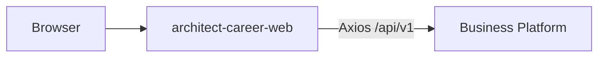
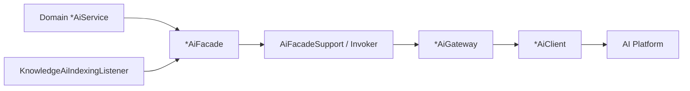

# Integration Architecture

## Web Platform



- Web never calls AI Platform directly.
- Auth tokens issued by Business Platform.
- Gap: Web AI client modules expect `/api/v1/integration/ai/**` BFF routes that are largely **not** implemented (except health).

## AI Platform

### Enablement

```yaml
ai.platform.enabled: false   # default
ai.platform.base-url: http://localhost:8090
ai.platform.api-key: ""
```

When disabled, facades short-circuit with safe fallbacks; product CRUD continues.

### REST communication (OpenFeign)

| Client | AI routes |
| --- | --- |
| `KnowledgeAiClient` | `/api/v1/ai/knowledge/index\|search\|summarize` |
| `LearningAiClient` | quiz, recommend-next, evaluate progress |
| `CareerAiClient` | resume, interview analyze, cover letter |
| `PortfolioAiClient` | review, skill-gap analyze |

Configuration: connect/read timeouts, compression, per-client logger levels; Feign circuitbreaker auto-config **disabled** because resilience is applied in `AiPlatformInvoker` (Retry, CircuitBreaker, TimeLimiter, Bulkhead via Resilience4j).

### Anti-corruption layering



- Interceptor propagates `X-Correlation-Id` and API key headers.
- Metrics: `AiPlatformMetrics` (Micrometer timers/gauges).
- Health: `AiPlatformHealthIndicator` included in readiness group when configured.
- Public REST: `GET /api/v1/integration/ai/health` only.

### Automated knowledge indexing

1. Knowledge service commits note create/update  
2. After-commit publisher emits event  
3. `@Async("aiTaskExecutor")` listener calls facade index  
4. Failures handled without failing the original request path  

## AI Contracts

- Contract repo defines OpenAPI/AsyncAPI for AI.
- Business Feign paths/DTOs are maintained to align with those routes.
- Generated Java SDK is **not** wired as the sole client in this repo today (hand-maintained integration DTOs/clients).

## Future event integration

| Today | Future |
| --- | --- |
| Spring in-process domain events | Brokered events (Kafka/Pulsar) matching AsyncAPI |
| `@Async` listener | Durable outbox + workers |
| No cross-process replay | Consumer groups, DLQ |

AsyncAPI channels exist in the contracts repository; Business Platform does not embed a message broker client for them yet.

## Interview Discussion

### Why this architecture?

Keeps AI optional and replaceable while giving domain teams a stable facade language.

### Alternative approaches

Sync Feign inside the request thread for indexing (hurts UX); shared DB with AI (rejected); browser→AI (rejected for secrets).

### Trade-offs

Dual HTTP stacks and DTO duplication risk vs contracts. Incomplete BFF blocks Web AI demos.

### Scaling considerations

Move indexing to a queue early when note write volume rises; keep facades as the only domain dependency.

### Principal Architect interview questions

**Q1. What does ai.platform.enabled=false guarantee?**  
No outbound AI calls required for core product flows; facades acknowledge fallbacks.

**Q2. Why not Feign circuitbreaker=true?**  
Centralized resilience in `AiPlatformInvoker` with explicit ignore lists for validation/auth errors.
