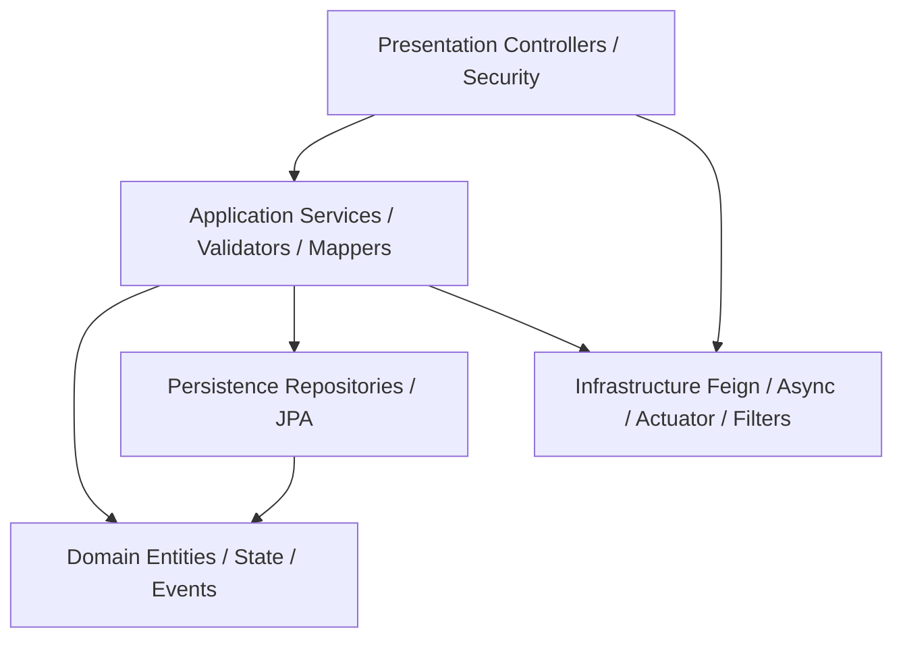
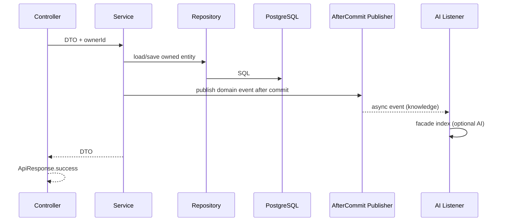
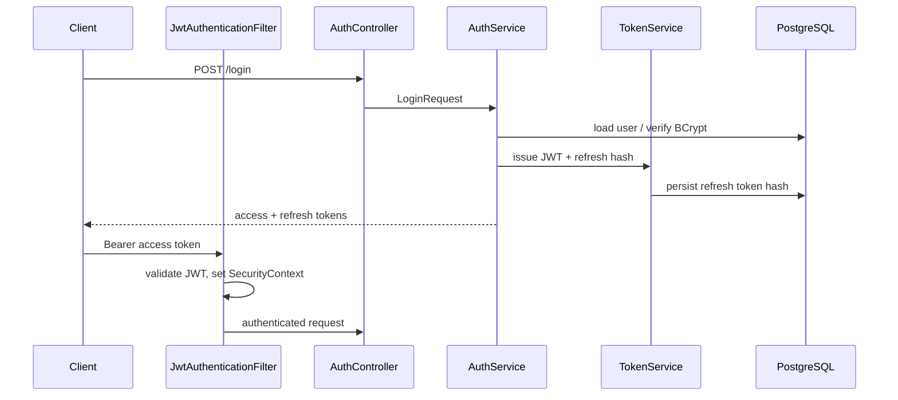

# Layered Architecture

Inside each feature package the Business Platform uses a **pragmatic layered style** (not full hexagonal everywhere).

## Layers

| Layer | Responsibility | Examples |
| --- | --- | --- |
| **Presentation** | HTTP, OpenAPI annotations, status codes, principal binding | `*Controller`, security filter chain |
| **Application** | Use-case orchestration, transactions, DTO mapping calls | `*ServiceImpl`, validators, AI services |
| **Domain** | Entities, enums, state machine, domain events, business rules | `JobApplication`, `ApplicationStateMachine`, events |
| **Persistence** | Repositories, Specifications, Flyway schema | `*Repository`, `BaseEntity` columns |
| **Infrastructure** | Cross-cutting technical adapters | Feign, Resilience4j invoker, Actuator indicators, correlation filter, async executor |

## Dependency direction

Dependencies point **inward** toward domain concepts; infrastructure is plugged at the edges.

Illegal directions (not used as design intent):

- Repository → Controller
- Entity → Feign client
- Controller → Repository (bypassing service) — avoided in feature modules

## Request flow (business CRUD)

## Authentication flow (layer view)

## Notes on purity

- Domain entities are JPA-mapped (not pure POJO domain) — accepted Spring pragmatism.
- Application services contain business rules and persistence coordination.
- Infrastructure AI is isolated under `integration` with facade/gateway/client stages.

## Interview Discussion

### Why this architecture?

Delivers Spring productivity with enough structure to prevent controller–repository spaghetti and to quarantine AI I/O.

### Alternative approaches

Full hexagonal ports for every domain; vertical slice without shared `BaseEntity`. Rejected globally for velocity; AI Platform demonstrates the stricter style where vendor volatility is higher.

### Trade-offs

JPA entities as domain models risk leaking persistence concerns; mitigated by DTO boundaries and `open-in-view: false`.

### Scaling considerations

Extract application services into separate modules before extracting databases.

### Principal Architect interview questions

**Q1. Is this Clean Architecture?**  
Pragmatic layering in Business; Clean/hexagonal is rigorous on the AI Platform (ADR-003).

**Q2. Why `open-in-view: false`?**  
Forces explicit fetch plans and keeps transactions at the service boundary.
