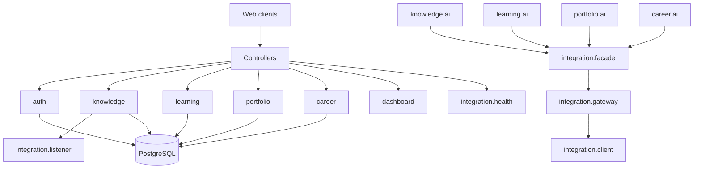

# Module Architecture

Each module below corresponds to a top-level package under `com.acos`. Dependency rule: **feature modules → common/config/auth identity; never Feign clients from domain services**.

## Module relationship diagram

---

## `auth`

| Aspect | Detail |
| --- | --- |
| Purpose | Identity, credentials, tokens, security filter wiring |
| Public APIs | `AuthController` `/api/v1/auth/*` |
| Internal services | `AuthService`, `TokenService`, `JwtTokenProvider`, user details loading |
| Repositories | `UserRepository`, `RoleRepository`, `RefreshTokenRepository` |
| Events | None domain-event publishers |
| Tables | `users`, `roles`, `user_roles`, `refresh_tokens` |
| Relationships | User ↔ Role M:N; RefreshToken → User |
| Dependency rules | May be used by all modules for principal; must not depend on product domains |

Also owns `SecurityConfiguration`, `JwtAuthenticationFilter`, JSON auth entry/denied handlers.

---

## `knowledge`

| Aspect | Detail |
| --- | --- |
| Purpose | Notes, categories, tags |
| Public APIs | `KnowledgeController` `/api/v1/knowledge/notes` |
| Internal services | `KnowledgeServiceImpl`, validators, `KnowledgeAiService` |
| Repositories | Note/category/tag repositories |
| Events | `KnowledgeCreatedEvent`, `KnowledgeUpdatedEvent` via `KnowledgeDomainEventPublisher` |
| Tables | `knowledge_notes`, `categories`, `tags`, `knowledge_note_tags` |
| Relationships | Note → Category optional; Note ↔ Tag M:N; all owner-scoped |
| Dependency rules | May publish events; AI only through facade |

---

## `learning`

| Aspect | Detail |
| --- | --- |
| Purpose | Plans hierarchy |
| Public APIs | Plan, Milestone, Topic controllers under `/api/v1/learning/...` |
| Internal services | Plan/milestone/topic service impls; `LearningAiService` |
| Repositories | Plan/milestone/topic repositories (with detail fetch methods) |
| Events | `LearningPlanCompletedEvent` |
| Tables | `learning_plans`, `learning_milestones`, `learning_topics` |
| Relationships | Plan 1→N Milestone 1→N Topic |
| Dependency rules | Nested resources validate parent ownership |

---

## `portfolio`

| Aspect | Detail |
| --- | --- |
| Purpose | Evidence of skills and projects |
| Public APIs | Projects, Skills, Technologies, Certifications, Achievements controllers |
| Internal services | Matching `*ServiceImpl`; `PortfolioAiService` (incl. stub `generateProjectSummary`) |
| Repositories | Per entity repositories |
| Events | `PortfolioUpdatedEvent` |
| Tables | `portfolio_projects`, `portfolio_technologies`, `portfolio_project_technologies`, `portfolio_skills`, `portfolio_certifications`, `portfolio_achievements` |
| Relationships | Project ↔ Technology M:N; others owner-scoped |
| Dependency rules | Technology names resolved/created per owner on project write |

---

## `career`

| Aspect | Detail |
| --- | --- |
| Purpose | Job application lifecycle |
| Public APIs | Companies, Recruiters, Applications, Interviews, Offers, CareerDashboard |
| Internal services | CRUD services; `CareerAuditService`; `ApplicationStateMachine`; Specifications for search; `CareerAiService` (incl. stub `recommendCareer`) |
| Repositories | Company, Recruiter, JobApplication, Interview, Offer, history/audit as applicable |
| Events | Submitted/status/rejected/interview/offer events via `CareerDomainEventPublisher` |
| Tables | `career_*` tables including status history and audit logs |
| Relationships | Application → Company/Recruiter; Application 1→N Interviews/Offers; soft-archive on career aggregates |
| Dependency rules | Status changes must pass state machine; company delete blocked when referenced by applications |

---

## `dashboard`

| Aspect | Detail |
| --- | --- |
| Purpose | Home summary API |
| Public APIs | `GET /api/v1/dashboard` |
| Internal services | `DashboardServiceImpl` + mapper |
| Repositories | Package exists; **service does not query DB** |
| Events | None |
| Tables | None used |
| Relationships | N/A |
| Dependency rules | Must remain honest about placeholder metrics until redesigned |

---

## `integration`

| Aspect | Detail |
| --- | --- |
| Purpose | AI anti-corruption layer |
| Public APIs | `AiPlatformHealthController` `GET /api/v1/integration/ai/health` |
| Internal services | Facades, gateways, `AiPlatformInvoker`, health service, metrics, call logger, indexing failure handler |
| Repositories | None |
| Events | Consumes knowledge created/updated (listener) |
| Tables | None |
| Relationships | Feign → AI Platform HTTP |
| Dependency rules | Domain AI services depend on facades only; Resilience4j via invoker; `ai.platform.enabled` default false |

Feign clients:

- `KnowledgeAiClient` — index, search, summarize
- `LearningAiClient` — quiz, recommend-next, evaluate progress
- `CareerAiClient` — resume, interview analyze, cover letter
- `PortfolioAiClient` — review, skill-gap

---

## `common`

| Aspect | Detail |
| --- | --- |
| Purpose | Cross-cutting primitives |
| Public APIs | None (used by controllers) |
| Types | `ApiResponse`, `ApiError`, exceptions, `GlobalExceptionHandler`, `BaseEntity`, `AfterCommitEventPublisher`, `CorrelationIdFilter` |
| Dependency rules | Must not depend on feature modules |

---

## `config`

Application-level Spring `@Configuration` (async executor, JPA auditing, OpenAPI security scheme, CORS, etc.). Not a domain.

## `analytics`

Stub package only — no module implementation.

---

## Interview Discussion

### Why this architecture?

Package-level modules keep ownership clear for a single deployable: teams can reason about career vs knowledge without network boundaries.

### Alternative approaches

Maven multi-module JARs per domain; OSGi/JPMS; microservices. Multi-module JARs are a reasonable next packaging step without changing runtime topology.

### Trade-offs

`integration` grows as the ACL; without discipline, DTOs drift from AI Contracts. Health-only public AI REST leaves Web incomplete.

### Scaling considerations

Split read-heavy modules only when independent scaling or team ownership demands it — not before.

### Principal Architect interview questions

**Q1. Can Knowledge call Career?**  
Not in the current design; share identity/common only.

**Q2. Who owns AI failure semantics?**  
Facades/invoker — graceful acknowledgement/fallback so domain commits succeed.
