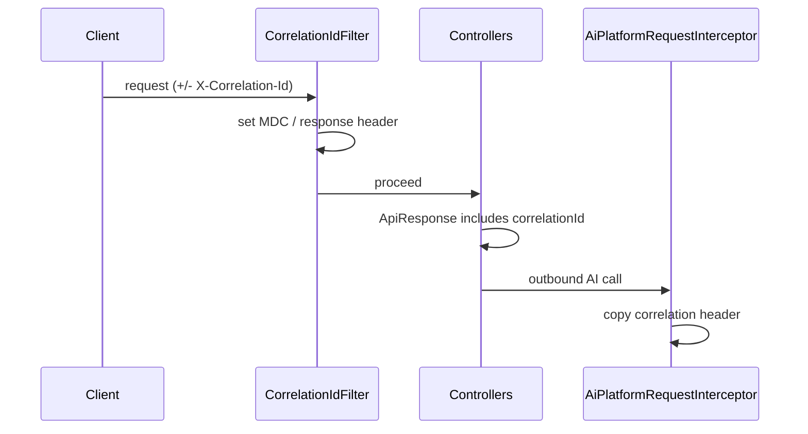

# Observability

## What is implemented

| Signal | Implementation |
| --- | --- |
| Logging | Logback via Spring Boot; console pattern includes app name + MDC `correlationId` |
| Correlation | `CorrelationIdFilter` — header `X-Correlation-Id`, MDC key, echoed in `ApiResponse` and Feign calls |
| Metrics | Actuator + Micrometer; `/actuator/metrics`, `/actuator/prometheus` |
| AI metrics | `AiPlatformMetrics` timers/gauges |
| Health | `/actuator/health` with liveness/readiness groups; readiness includes `db` + `aiPlatform` |
| Info | `/actuator/info` |
| HTTP docs timing | springdoc “display request duration” in Swagger UI |

## What is not implemented (Business Platform)

- **OpenTelemetry** SDK/tracing instrumentation is **not** a Business Platform dependency/feature today (OTel exists on the AI Platform side).
- No ELK/Datadog exporter configuration in-repo.
- No distributed tracing propagation beyond correlation id header to AI.

Document OTel under Future Enhancements for this service — do not claim Business spans.

## Structured logging

Pattern:

```text
%d{...} %5p [${spring.application.name:},%X{correlationId:-}] %logger{36} - %msg%n
```

Feign AI clients default to DEBUG in base config for troubleshooting.

Levels: root INFO; `com.acos` INFO (DEBUG in local profile).

## Correlation ID flow



## Health checks

- Liveness: `livenessState`
- Readiness: `readinessState`, `db`, `aiPlatform`
- Custom `AiPlatformHealthIndicator` bean name `aiPlatform`
- Public access to health/info; metrics require authentication

## Interview Discussion

### Why this architecture?

Correlation ids + Actuator/Prometheus cover local and early production ops without forcing a full tracing stack on the monolith first.

### Alternative approaches

Full OTel from day one; vendor APM agents only. OTel end-to-end is the intended evolution across Business + AI.

### Trade-offs

Without traces, multi-hop AI latency debugging relies on logs/metrics and correlation ids.

### Scaling considerations

Add OTel Java agent or Micrometer Tracing; sample traces; dashboards for Feign error rates and CB state.

### Principal Architect interview questions

**Q1. Is OpenTelemetry on Business Platform?**  
Not implemented in this repo today — say correlation id + Actuator instead.

**Q2. Why is aiPlatform on readiness?**  
Optional dependency awareness: orchestrators can decide readiness policy when AI is enabled; when disabled, indicator behavior follows health service implementation.
