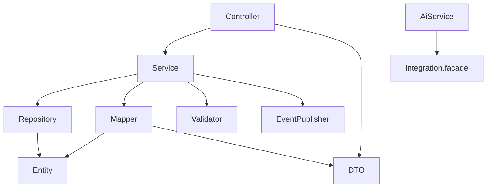

# Package Structure

## Package-by-Feature

The Business Platform organizes code **by feature/domain first**, then by technical role inside the feature:

```text
com.acos
├── auth/{controller,service,repository,entity,dto,mapper,security,token,validator,...}
├── knowledge/{controller,service,repository,entity,dto,mapper,event,ai,validator,...}
├── tutorial/{controller,service,repository,entity,dto,exception,util}
├── learning/...
├── portfolio/...
├── career/{...,specification,state,ai,event}
├── dashboard/...
├── integration/{client,facade,gateway,listener,health,metrics,config,dto,support,...}
├── common/{api,exception,handler,persistence,event,logging}
├── config/
└── analytics/          # stub
```

This is **not** a global `controllers/` / `services/` layer cake across the whole codebase.

## Why Package-by-Feature was selected

1. **Change locality** — a knowledge note change stays under `com.acos.knowledge`.
2. **Modular monolith readiness** — packages approximate future extractable services.
3. **Ownership clarity** — reviewers know where career state machine code lives (`career.state`).
4. **Interviewability** — maps cleanly to bounded contexts.

Rejected alternative: organization-by-layer (`com.acos.controller.*`) — increases cross-feature coupling and navigation cost as the monolith grows.

## Stereotypes inside a feature

| Stereotype | Role | Typical types |
| --- | --- | --- |
| **Controller** | HTTP adapter; auth principal extraction; status codes | `*Controller` |
| **Service** | Application use-cases; transactions; ownership checks | `*Service` / `*ServiceImpl` |
| **Repository** | Spring Data JPA interfaces | `*Repository` |
| **Entity** | JPA model extending `BaseEntity` | `User`, `KnowledgeNote`, … |
| **DTO** | Request/response records for API boundary | `*Request`, `*Response`, page wrappers |
| **Mapper** | MapStruct entity ↔ DTO | `*Mapper` |
| **Validator** | Domain/Bean Validation helpers beyond annotations | `*Validator` |
| **Exception** | Feature-specific `BusinessException` subclasses | `*Exception` |
| **Configuration** | Feature `@ConfigurationProperties` / beans | e.g. dashboard/knowledge props |
| **Events** | Domain event types + publishers | `*Event`, `*DomainEventPublisher` |
| **Specifications** | JPA Criteria predicates (career search) | `career.specification` |
| **State Machine** | Allowed status transitions (career) | `ApplicationStateMachine` |
| **AI** | Thin facade wrappers for future/on-demand AI | `*AiService` |
| **Security / token** | Auth-only technical packages | JWT filter, providers |

## Dependency direction within a feature



Controllers must stay thin. Services must not return entities across the HTTP boundary (MapStruct DTOs). AI services must not inject `@FeignClient` types.

## Cross-feature packages

- `common` — shared kernel for API/persistence/logging/exceptions.
- `config` — process-wide Spring configuration.
- `integration` — outbound AI ACL (technical bounded context).

## Interview Discussion

### Why this architecture?

Feature packages optimize for cognitive load and extractability while retaining a single Spring Boot classpath.

### Alternative approaches

Hexagonal per feature with ports/adapters folders; pure DDD modules with `domain`/`application`/`infra`. AI Platform uses stricter hexagonal; Business keeps pragmatic Spring layering inside features for delivery speed (see ADR-003).

### Trade-offs

Some duplication of stereotypes across features; shared kernel must stay small to avoid an anemic “common dump.”

### Scaling considerations

When a feature team forms, the package can become a Maven module without rewriting domain language.

### Principal Architect interview questions

**Q1. Where would you put a new “Mentorship” domain?**  
`com.acos.mentorship` with the same stereotypes — not under `common`.

**Q2. Why is Feign under `integration` not `knowledge.client`?**  
To keep provider HTTP concerns out of the product domain package and share resilience/metrics.
