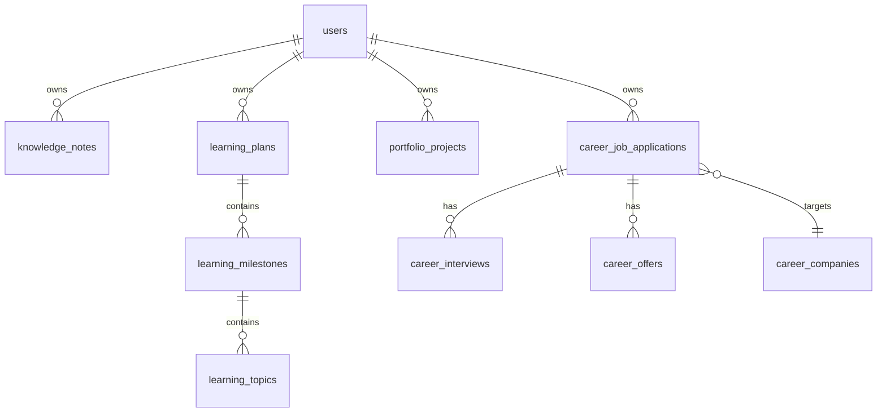

# Persistence Architecture

## PostgreSQL

- Engine used locally: **PostgreSQL 17.5** (Docker image)
- Logical schema: **`acos`**
- JDBC URL pattern (local profile): `jdbc:postgresql://host:port/db?currentSchema=acos`
- Hibernate `default_schema: acos`
- `open-in-view: false`
- `ddl-auto: validate` — schema owned by Flyway

## Flyway

| Setting | Value |
| --- | --- |
| Enabled | true |
| Locations | `classpath:db/migration` |
| Validate on migrate | true |
| Local schemas | `acos`, history table `flyway_schema_history` |

### Migrations (implemented)

| Version | Purpose |
| --- | --- |
| V1 | Initial schema bootstrap |
| V2 | Users and roles |
| V3–V4 | Refresh tokens (+ hash column alter) |
| V5 | Knowledge tables |
| V6 | Learning tables |
| V7 | Portfolio tables |
| V8–V9, V11–V12 | Career tables / enhancements / hardening |
| V10 | *(not present in tree — numbering jumps)* |

Tables include owner FKs to `users`, unique constraints per owner where needed, and indexes on `owner_id` and common lookup columns.

## JPA

- Entities extend `BaseEntity`: UUID id, `created_at`, `updated_at`, `@Version`
- `@EnableJpaAuditing` with custom date-time provider
- MapStruct for DTO mapping
- Relationships: M:N join tables for tags, project technologies, user roles

## Specifications

Career application search uses JPA **Specifications** under `career.specification` for optional filters without query-method explosion.

## Optimistic locking

`BaseEntity.version` (`@Version`) on essentially all aggregates — concurrent updates fail with optimistic lock exceptions (handled as platform errors via generic/internal mapping paths as applicable).

## Soft delete / archive

- **Not** a global `@SQLDelete` soft-delete framework on `BaseEntity`
- Career **job applications** (and related offer queries) use an **`archived`** flag / soft-archive semantics
- Knowledge/learning/portfolio deletes are standard repository deletes (hard delete) as implemented in services
- Document this honestly: “soft delete” is domain-specific, primarily career archiving

## Transactions

- Service-layer `@Transactional` boundaries (Spring defaults on service impls)
- Domain events published **after commit** via `AfterCommitEventPublisher` so AI indexing cannot roll back CRUD

## Indexes

Flyway creates indexes such as:

- `owner_id` on user-owned tables
- Title/summary composites for knowledge search aids
- Career hardening indexes in later migrations

## Auditing

| Mechanism | Scope |
| --- | --- |
| `created_at` / `updated_at` | All `BaseEntity` subtypes |
| `CareerAuditLog` entity/table | Career-specific audit trail |
| Application status history | Explicit history rows on transitions |

No Spring Data Envers entity revisioning module detected.

## Repository relationships (conceptual)

## Interview Discussion

### Why this architecture?

PostgreSQL + Flyway + JPA is the enterprise default for transactional career data with evolvable schema and strong constraints.

### Alternative approaches

NoSQL for notes; separate DB per module; jOOQ instead of JPA. Rejected for consistency and team familiarity at this stage.

### Trade-offs

JPA lazy loading requires careful fetch plans (`open-in-view: false`). Career schema evolved across multiple migrations — expect some historical duplication in V8/V11 naming.

### Scaling considerations

Read replicas, partitioning by owner, and outbox tables before multi-DB split.

### Principal Architect interview questions

**Q1. Why UUID primary keys?**  
Stable public identifiers without sequence leakage; well-suited to distributed clients.

**Q2. Is the schema the API?**  
No — DTOs are the API; schema can evolve behind Flyway with compatibility discipline.
