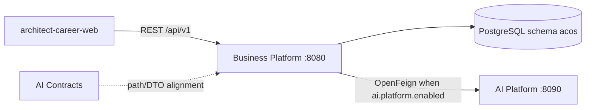

# Business Platform Architecture — Index

Chapter 04 documents the **Business Platform** implemented in `architect-career-operating-system`: the Spring Boot modular monolith that owns product domains, JWT authentication, PostgreSQL persistence, and the AI anti-corruption layer.

Audience: Principal Architects, Senior Engineers, Engineering Managers, and new team members.

Integrity rule: only behavior present in Java sources, Flyway migrations, Spring configuration, tests, or local Docker Compose is described as implemented. Gaps appear in [Future-Enhancements.md](Future-Enhancements.md).

---

## Document map

| Document | Focus |
| --- | --- |
| [Business-Platform-Overview.md](Business-Platform-Overview.md) | Purpose, stack, bounded contexts, ecosystem role |
| [Business-Domain-Architecture.md](Business-Domain-Architecture.md) | Auth, Career, Knowledge, Tutorials, Learning, Portfolio, Dashboard, shared |
| [Module-Architecture.md](Module-Architecture.md) | Per-module APIs, services, repos, events, tables |
| [Tutorials-Architecture.md](Tutorials-Architecture.md) | Hierarchical tutorials, FTS search, URLs, content types |
| [Package-Structure.md](Package-Structure.md) | Package-by-feature conventions |
| [Layered-Architecture.md](Layered-Architecture.md) | Presentation → application → domain → persistence → infrastructure |
| [API-Architecture.md](API-Architecture.md) | REST standards, envelopes, pagination, OpenAPI |
| [Security-Architecture.md](Security-Architecture.md) | Spring Security, JWT, isolation, roles |
| [Persistence-Architecture.md](Persistence-Architecture.md) | PostgreSQL, Flyway, JPA, locking, auditing |
| [Integration-Architecture.md](Integration-Architecture.md) | Web, Feign AI, contracts alignment |
| [Exception-Handling.md](Exception-Handling.md) | `BusinessException`, `ErrorCode`, global handler |
| [Validation-Strategy.md](Validation-Strategy.md) | Bean Validation, domain validators, limits |
| [Configuration-Management.md](Configuration-Management.md) | Profiles, `acos.*`, `ai.platform.*`, Resilience4j |
| [Observability.md](Observability.md) | Logging, correlation ID, Actuator, metrics |
| [Testing-Strategy.md](Testing-Strategy.md) | Unit, controller, Testcontainers, JaCoCo |
| [Performance-and-Scalability.md](Performance-and-Scalability.md) | Paging, pools, lazy loading, future scale |
| [Deployment-Considerations.md](Deployment-Considerations.md) | Local Docker Postgres, env vars, health |
| [Future-Enhancements.md](Future-Enhancements.md) | Planned / incomplete work |

Return to portfolio home: [../README.md](../README.md)

---

## Quick orientation

**Implemented product surface:** Auth, Knowledge notes, Tutorials (hierarchy + Concept/Q&A + PostgreSQL FTS), Learning plans/milestones/topics, Portfolio projects/skills/technologies/certifications/achievements, Career companies/recruiters/applications/interviews/offers/status machine, Dashboard (configured placeholders), AI health + Feign facades/gateways (feature-flagged).

**Explicit stubs / gaps:** `analytics` package-info only; Dashboard metrics not DB-backed; AI BFF controllers beyond health largely missing; no Business Platform application container image in Compose (Postgres/pgAdmin only).

---

## How to use this chapter

1. Read Overview + Domain Architecture for product shape.
2. Use Module Architecture + Package Structure when navigating `com.acos.*`.
3. Use API / Security / Persistence when designing or reviewing change requests.
4. Cross-check claims against `architect-career-operating-system` sources listed in each document.
5. Treat Interview Discussion sections as narrative aids, not as substitutes for code review.
