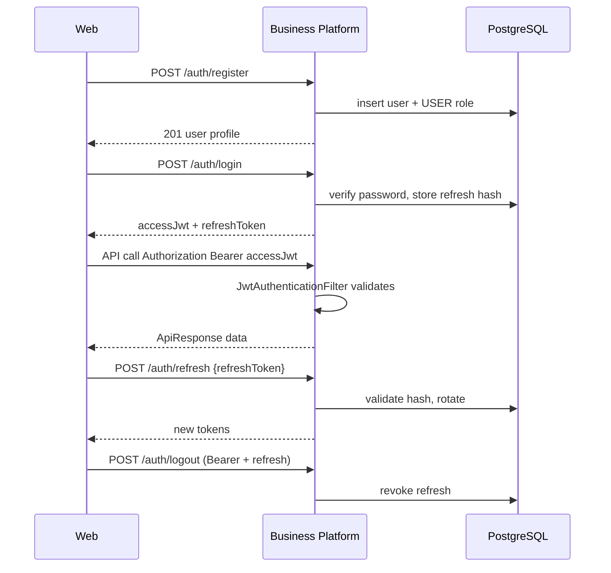

# Security Architecture

## Spring Security

Configured in `SecurityConfiguration`:

- CSRF disabled (stateless JWT API)
- CORS enabled (defaults + app CORS config)
- Session policy **STATELESS**
- `JwtAuthenticationFilter` before `UsernamePasswordAuthenticationFilter`
- JSON `AuthenticationEntryPoint` / `AccessDeniedHandler`
- `@EnableMethodSecurity` enabled

## Public vs protected

**PermitAll**

- `POST /api/v1/auth/register`
- `POST /api/v1/auth/login`
- `POST /api/v1/auth/refresh`
- `/v3/api-docs/**`, `/swagger-ui/**`, `/swagger-ui.html`
- `/actuator/health/**`, `/actuator/info`

**Authenticated**

- Everything else, including `/api/v1/auth/me`, `/logout`, product APIs, `/actuator/metrics` & prometheus (not in permit list), AI health

## JWT

| Item | Implementation |
| --- | --- |
| Library | JJWT 0.12.6 via `JwtTokenProvider` |
| Config | `acos.jwt.secret`, `issuer`, `access-token-ttl` (default 15m), `refresh-token-ttl` (default 7d) |
| Access token | Signed JWT Bearer |
| Refresh token | Opaque token; **only hash stored** in `refresh_tokens` |
| Rotation | Refresh endpoint issues new pair; logout revokes refresh |

Default secret falls back to a local placeholder — **must be overridden in real environments**.

## Authentication flow

## Authorization & user isolation

1. Security context holds `AcosUserDetails` (user id, email, `ROLE_*` authorities).
2. Controllers pass `principal.getId()` into services.
3. Repositories use `findByIdAndOwnerId` / `findByOwnerId` patterns.
4. Cross-user access returns not-found / business errors rather than leaking existence details where coded that way.

This is **row-level ownership**, not a separate tenant_id column schema.

## Role management

- `RoleType`: `USER`, `ADMIN`
- Registration assigns default **USER**
- Authorities exposed as `ROLE_USER` / `ROLE_ADMIN`
- Fine-grained admin-only product APIs are not the primary authorization model today

## Secure configuration

| Concern | Practice |
| --- | --- |
| Passwords | BCrypt |
| Refresh storage | Hash only |
| Hibernate | `ddl-auto: validate` (no prod auto-DDL) |
| Actuator | Health details `when_authorized`; probes enabled |
| AI key | `ai.platform.api-key` server-side only |
| JWT secret | Env override `ACOS_JWT_SECRET` |

## Inter-service security

- Business → AI: Feign interceptor can attach API key + correlation id (`AiPlatformRequestInterceptor`)
- No mTLS implemented between Business and AI
- AI integration disabled by default (`ai.platform.enabled=false`)

## Interview Discussion

### Why this architecture?

Stateless JWT fits a SPA + API modular monolith; opaque refresh reduces token theft impact versus long-lived JWTs alone.

### Alternative approaches

Session cookies + CSRF; OAuth2/OIDC provider; Paseto. OIDC is a natural evolution when enterprise SSO appears.

### Trade-offs

Swagger is public (convenient for portfolio demos; tighten for production). Method security is enabled but ownership checks do the real isolation work — role model is underused.

### Scaling considerations

Move to centralized IdP, short-lived tokens, refresh reuse detection, and per-route admin policies as the user base grows.

### Principal Architect interview questions

**Q1. What happens if JWT secret leaks?**  
Immediate secret rotation + revoke refresh tokens; access tokens expire with TTL.

**Q2. Does ADMIN bypass owner checks?**  
Not as a general implemented pattern on domain services — do not claim it unless coded.

**Q3. Why is refresh public?**  
Refresh tokens are secrets in the body; access token may be expired, so endpoint is permitAll but still validates the refresh credential.
