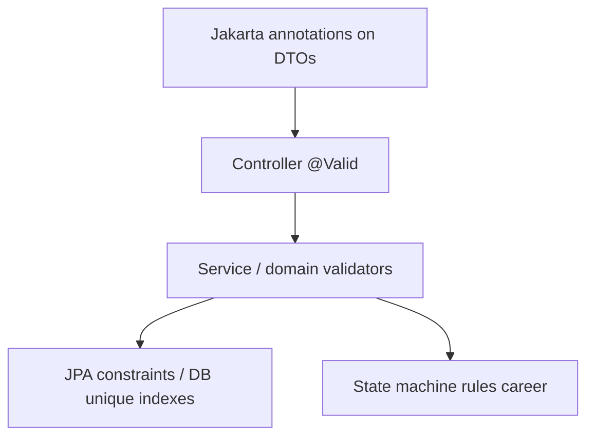

# Validation Strategy

## Layers of validation

## Bean Validation

- Request DTOs use standard constraints (`@NotBlank`, `@Email`, `@Size`, etc.)
- Triggered by `@Valid @RequestBody` on controllers
- Failures → `VALIDATION_FAILED` with per-field details

## Domain validators

Feature packages include `validator` / `validation` types for rules that annotations cannot express cleanly (examples: password policy → `WEAK_PASSWORD`; career transition legality via `ApplicationStateValidator`).

## Configuration-driven limits

From `application.yml` / properties classes:

| Domain | Examples |
| --- | --- |
| Knowledge | `max-content-length`, `max-tags-per-note`, `max-page-size` |
| Learning | `max-page-size`, `max-milestones-per-plan`, `max-topics-per-milestone` |
| Portfolio | `max-page-size`, `max-technologies-per-project`, `max-description-length` |
| Career | `max-page-size`, `max-notes-length`, `max-job-description-length` |

These protect DB and AI payload sizes.

## Persistence as last line

Unique constraints (email, per-owner names) and FKs catch races that pass service checks; translated to conflict/business errors where handled.

## What is not implemented

- No centralized validation framework beyond Jakarta + custom validators
- No JSON Schema separate from Java DTOs for Business APIs
- Cross-field validation lives in services/validators, not a rules engine

## Interview Discussion

### Why this architecture?

Cheap declarative checks at the edge, richer rules next to business logic, DB constraints for integrity — classic Spring approach.

### Alternative approaches

Validate-only in DB; client-only validation; OpenAPI-generated validators. Server-side remains authoritative.

### Trade-offs

Duplication between annotations and YAML limits must stay synchronized with Web Zod schemas manually today.

### Scaling considerations

Publish shared constraint docs or generate TS types from OpenAPI once Business API contracts are formalized like AI contracts.

### Principal Architect interview questions

**Q1. Where do you enforce max page size?**  
Service/config layer — never trust client `size` alone.

**Q2. How are illegal career transitions rejected?**  
State machine + validator → `BUSINESS_RULE_VIOLATION` (422).
