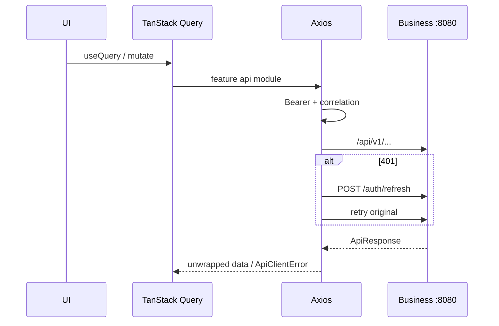

# API Integration

## Transport

- Single Axios instance: `shared/api/axios.instance.ts`
- Interceptors: correlation id (`X-Correlation-Id`), Bearer auth, 401 refresh single-flight, `ApiClientError` mapping
- `unwrapApiResponse` enforces Business `ApiResponse` envelope (`success`/`data`/`error`)
- Dev proxy: Vite `server.proxy['/api']` → `VITE_API_PROXY_TARGET` (default `http://localhost:8080`)
- `VITE_API_BASE_URL` optional absolute base (default empty = same-origin `/api`)

## Generated TypeScript SDK usage

**Not wired.** Feature modules (`knowledge.api.ts`, `career` apis, `ai.api.ts`, etc.) are hand-maintained TypeScript calling Axios. Aligns with Business paths by convention.

## Authentication on requests

See interceptors — non-public paths attach `Authorization: Bearer <access>`.

## Error handling

Failures become `ApiClientError` with `code`, `status`, `details`, `correlationId`. UI surfaces via notifications / page-level alerts.

## Retry strategy

- TanStack Query default retry: **1** (configurable in appConfig)
- Axios: **one** refresh-and-retry on 401 (not a general retry storm)
- Public auth paths excluded from refresh loop

## Loading states

Query `isLoading`/`isFetching`; shared `LoadingSpinner`, `LoadingSkeleton`; AI `AiLoadingIndicator`.

## Caching

React Query staleTime 60s; service worker marks `/api/*` as **NetworkOnly** (no offline API cache).

## AI integration paths

`aiApi` uses `appConfig.ai.integrationBasePath` = `/api/v1/integration/ai`:

| Lifecycle (`aiCapabilities.ts`) | Meaning |
| --- | --- |
| Health | `GET .../health` — treated as the live probe when the AI toggle is on |
| `planned` | UI forms + Axios POSTs ready (search, summarize, quiz, next-topic, progress, resume, interview, cover letter, portfolio review, skill-gap, chat) — activate when Business BFF controllers ship; 404/501 mapped to friendly messages |
| `coming_soon` | Catalog/UI cards only (related notes, insights, generic learning recommend, weak topics, mock interview, career recommend, portfolio tech/summary/profile variants) — **no API invoke** |

Gated by `VITE_AI_PLATFORM_ENABLED` (default **false** in `.env.development`) / `appConfig.ai.enabled`, plus health `AVAILABLE`/`DEGRADED` checks before mutations.

## Future real-time support

No WebSocket/SSE client implemented. Future: chat token streaming via Business proxy.

## Interview Discussion

### Why this architecture?

One HTTP client + envelope unwrap keeps every feature consistent with Business API standards.

### Alternative approaches

ky/fetch wrappers; OpenAPI-generated clients; tRPC. Generated clients are the natural next step once contracts stabilize for Business APIs.

### Trade-offs

Hand clients drift risk; AI UI can 404 until BFF ships.

### Scaling considerations

Generate TS SDK; shared error toast mapping; request dedupe via Query.

### How would this evolve?

OpenAPI → Orval/Axios client; typed paths; idempotency keys on writes.

### Common Frontend Architect interview questions

**Q1. Does the Web talk to port 8090?**  
No — only Business (8080 via proxy).

**Q2. How is ApiResponse handled?**  
`unwrapApiResponse` throws/returns based on `success` and payload.
