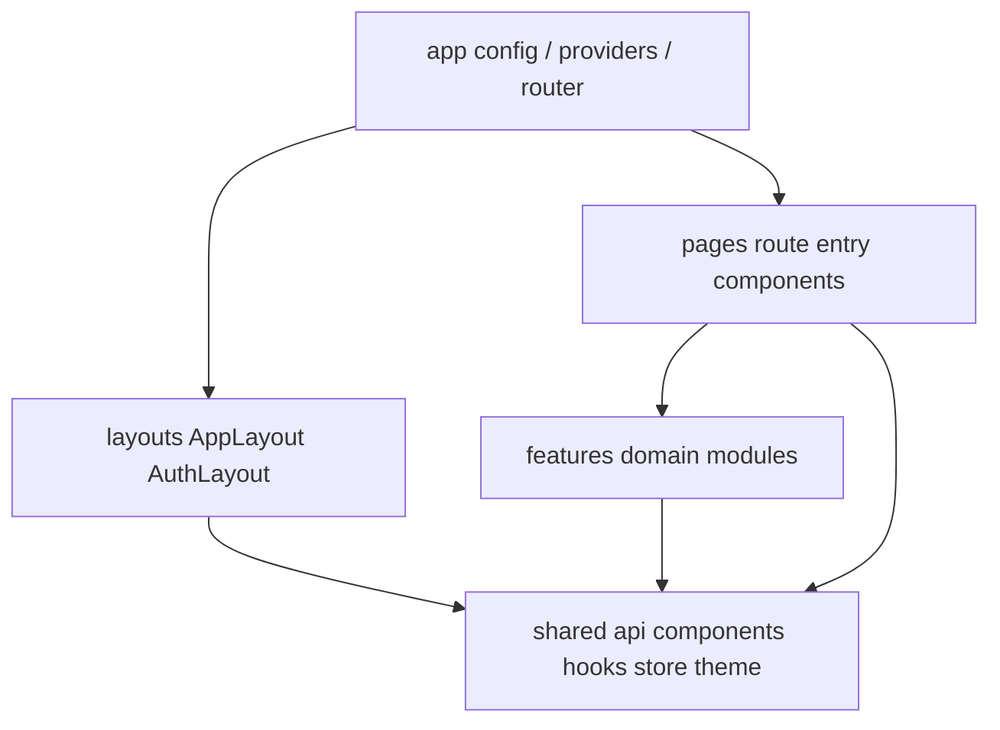

# Application Architecture

## Layers

| Layer | Role |
| --- | --- |
| `app/` | Env/config, providers (theme, query, PWA, errors), router |
| `layouts/` | Shell chrome (sidebar, auth card layout) |
| `pages/` | Route-level screens (some re-export feature pages) |
| `features/` | Domain modules: api, components, hooks, schemas, types |
| `shared/` | Cross-cutting UI, Axios, stores, theme, utils |

## Feature organization

Features: `auth`, `dashboard`, `knowledge`, `learning`, `portfolio`, `career`, `ai`.

Typical feature contents: `api/`, `components/`, `hooks/`, `schemas/`, `types/`, sometimes `layouts/`, `services/`, `store/` (auth).

## Shared components & reusable UI

`shared/components`: DataTable, FormDialog, ConfirmationDialog, ErrorBoundary, GlobalNotification, LoadingSpinner/Skeleton, MarkdownViewer, OfflineBanner, SearchBar, etc.

## Layouts

- `AuthLayout` — guest login/register
- `AppLayout` — authenticated shell with Sidebar
- Feature shells: `CareerShell`, `AiShell` for nested nav

## Dependency direction

Features may import `shared` and `app/config`. Features should not import sibling features’ internals (prefer shared or route composition). Pages may compose features. `shared` must not import `features`.

## Interview Discussion

### Why this architecture?

Feature-oriented modules mirror backend bounded contexts and keep change locality high without a monorepo of packages.

### Alternative approaches

Strict FSD (entities/processes); pages-only folders; Bit/module federation. Current hybrid (features + pages) matches team velocity.

### Trade-offs

Some pages live under `pages/` while AI pages live under `features/ai/pages` — intentional but asymmetric.

### Scaling considerations

Extract features to packages when teams specialize; keep shared API foundation stable.

### How would this evolve?

Enforce import boundaries with ESLint; align all routes under `features/*/pages`.

### Common Frontend Architect interview questions

**Q1. Where does Axios live?**  
`shared/api` — single instance + interceptors.

**Q2. Can career import knowledge?**  
Avoid; share via `shared` or backend composition.
